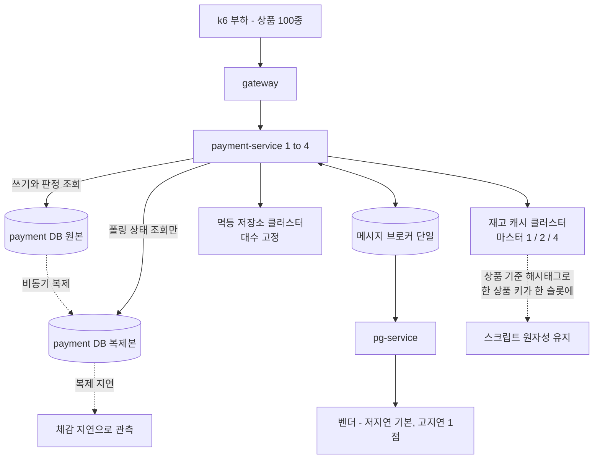
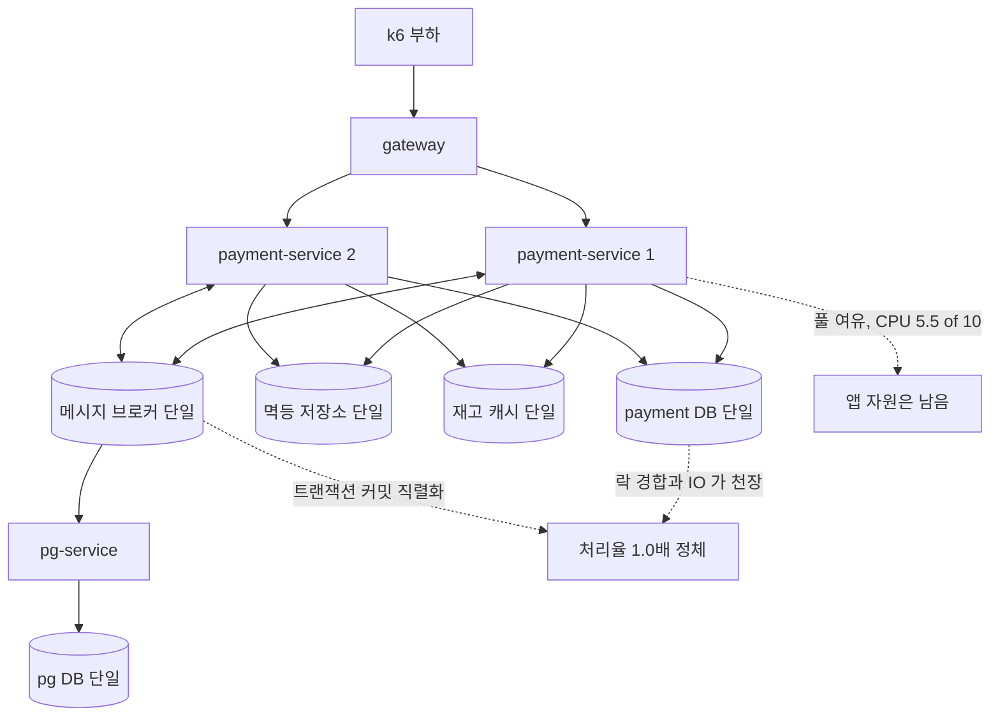

# 공유 자원 동반 스케일아웃 측정 설계

> 최종 수정: 2026-08-24
> 2026-08-15 보류 → 2026-08-24 재개. 보류 사유였던 선행 토픽(재고 게이트 상품 단위 분해)이 완료됐다. 보류 기간의 정정과 미반영 게이트 findings 는 본문에 반영했고, 경과는 문서 끝 "보류 이력" 절에 남긴다.

## 요약 브리핑

### 결정된 접근

공유 자원을 실제로 늘려 천장이 밀리는지 잰다. payment DB 에 비동기 복제본을 붙이되 **복제본을 읽는 코드는 폴링 전용 조회 포트 하나뿐**이고, 돈 경로 판정 일곱은 지금 그대로 원본을 읽는다. 재고 캐시와 멱등 저장소는 클러스터로 바꾸며, 대수를 변수로 남기는 것은 재고 캐시 하나다(마스터 1 / 2 / 4). 인스턴스는 1 / 2 / 3 / 4 로 올린다. 축마다 나머지를 고정해 사이클 아홉 개로 짰고, 합격선은 인스턴스 1 -> 2 확정 처리율 1.6배 하나만 둔다 — 상위 구간은 CPU 10 코어 고정이라 판정선을 걸면 환경 한계 때문에 의미 없는 미달이 난다.

### 변경 후 동작

### 핵심 결정

- **복제본으로 가는 조회는 폴링 전용 포트 하나** — 읽기 전용 표시로 분기하면 감싸는 트랜잭션이 없는 넷(폴링 / 확정 요청 진입 가드 / 소진 메시지 재처리 / 격리 종결)이 통째로 복제본으로 간다. 복제 지연 중 격리 종결이 낡은 상태를 읽으면 이미 승인된 결제에 비가역 재고 복원이 나간다. 안전을 호출처를 빠짐없이 세는 데 의존하지 않고, 새 포트만 복제본에 묶는 구조로 얻는다.
- **복제본은 영속성 컨텍스트를 태우지 않는다** — 폴링에 필요한 값이 셋뿐이라 질의로만 읽는다.
- **재고 캐시는 클러스터에 맡긴다** — 선행 토픽이 키를 상품 기준 해시태그로 묶어 둬 한 상품의 키가 같은 슬롯에 모인다. 슬롯 커버리지 요구는 끈다 — 복제 노드가 없어 그대로 두면 노드 하나가 죽을 때 전 상품 캐시 호출이 예외가 되고, 그것이 격리 결제 다발로 번진다.
- **대수 변수는 재고 캐시 하나** — 멱등 저장소는 나눌 준비만 하고 대수는 고정한다.
- **사이클 사이 재구성은 다섯 단계** — 부하 정지와 배출 확인, 미종결 0 안정 확인, 소비 적체 0 안정 확인, 회수 주기 정지, 그리고 두 확인을 다시 통과한 직후 비우고 재시드. 확인과 비우기 사이가 열려 있으면 낙오 확정의 캐시 차감분이 지워져 같은 재고 단위가 다음 사이클에서 또 팔린다 — 원본은 양수라 음수 가드에도 안 걸리는 조용한 초과 판매다.

### 트레이드오프와 남는 것

- **단일 머신이라는 한계는 안 없앤다.** 복제본과 캐시 노드가 디스크를 원본과 공유한다. 특히 재고 캐시가 매 쓰기마다 fsync 하므로, 대수를 늘려도 효과가 없게 나오면 단일 스레드 한계인지 디스크 공유인지 안 갈린다 — 그때는 fsync 정책을 낮춘 확인 사이클로 원인을 가른다.
- **핫 상품 쏠림에는 답하지 못한다.** 한 상품에 부하가 몰리면 노드를 늘려도 키가 한 슬롯에 있어 흩어지지 않는다. 이번 부하는 상품을 고르게 고른다.
- **인스턴스 4대에서 CPU 가 먼저 포화할 수 있다.** 그 경우 "공유 자원을 늘려도 로컬 CPU 가 막는다" 가 결론이며, 숨기지 않고 해석 범위에 적는다.
- **장애 전환은 범위 밖** — 노드 전환과 복제본 승격은 별도 토픽으로 등재한다. 이번 클러스터에 복제 노드를 두지 않는 것도 그 결정을 따른다.

---

## 사전 브리핑

### 현재 이해한 문제

payment 인스턴스를 1대에서 2대로 늘렸을 때 확정 처리율이 1.0배에 머물렀다. 앱 자원(커넥션 풀·CPU)은 여유였고, 천장은 모두가 공유하는 저장소와 메시지 커밋 직렬화였다. **그 공유 자원을 실제로 늘려서 결론이 뒤집히는지는 측정하지 않았다.**

측정을 막고 있던 것은 재고 캐시였다. 한 주문의 재고 처리가 스크립트 한 번에 묶여 있어, 캐시를 여러 노드로 나누려면 주문당 상품 하나를 전제해야 했다. 측정 편의로 결제 도메인의 보장을 깎는 순서라 멈췄다. 선행 토픽이 원자성 경계를 상품 단위로 내리고 키를 상품 기준 해시태그로 묶으면서 그 전제가 사라졌다 — 이제 한 상품에 딸린 키가 같은 슬롯에 모이고, 주문당 상품이 여럿이어도 각 상품 처리가 독립적으로 제 노드를 찾아간다.

이번 작업은 공유 자원을 실제로 늘리고, 인스턴스 수를 여러 단계로 바꿔가며 처리율 곡선이 어떻게 달라지는지 측정한다. 단일 머신 컨테이너 환경이라는 한계는 그대로 두되, 자원이 나뉜 구성을 흉내내는 데까지 간다.

### 현재 시스템 동작

직전 측정에서 확인된 사실이다.

| 항목 | 값 |
|:---:|:---:|
| 단일 인스턴스 처리 한계 | 커넥션 풀 80 기준 rate 약 450 |
| 풀 상향 효과 | 30 -> 60 -> 80 에서 꺾이는 지점 300 -> 350 -> 450 |
| 인스턴스 1 -> 2 확정 처리율 | 1.0배 (합격 기준 1.6배 미달) |
| 인스턴스 1 -> 2 전체 완료 처리율 | 1.3배 |
| 2 인스턴스 시 CPU | 10 코어 중 5.5 |
| 2 인스턴스 시 커넥션 풀 | 양쪽 합 160 포화 |

### 이번 discuss 에서 결정하려는 것

- 복제본으로 보낼 조회를 어떤 수단으로 가를지 — 읽기 전용 표시에 맡길지, 전용 경로를 낼지
- 재고 캐시를 어떤 방식으로 나눌지, 그리고 대수 효과를 어떤 비교축으로 볼지
- 멱등 저장소를 이번 범위에 넣을지
- 사이클을 몇 개로 짜야 축마다 변수가 하나만 남는지
- 무엇을 합격으로 볼지 — 절대 처리량은 로컬에서 의미가 없으므로 어떤 상대 지표로 결론을 낼지
- 단일 머신에서 나온 수치를 어디까지 해석할 수 있다고 못박을지

### 열린 질문 / 가정

- **메모리가 실질 제약이다.** 컨테이너가 현재 20개(인프라 8 + 앱 5 + 관측 7)이고, 인스턴스 4대 구간에 복제본과 캐시 노드를 얹으면 29개가 된다. 호스트가 스왑을 타면 그 자체로 측정이 오염된다.
- CPU 10 코어는 늘릴 수 없다. 인스턴스 4대 구간에서 앱 CPU 가 먼저 천장이 될 수 있고, 그 경우 "공유 자원을 늘려도 CPU 가 막는다" 가 결론이 된다.
- 복제본과 캐시 노드를 같은 머신에 띄우면 디스크를 원본과 공유한다. 자원이 나뉜 것처럼 보이지만 실제로는 같은 병목을 나눠 쓰는 상황이다.
- domain-expert 포함 — 측정 토픽이지만 조회 라우팅이 결제 판정 경로에 닿고, 사이클 사이 캐시 재구성이 진행 중 결제의 재고 정합을 건드린다. 돈 경로 판단이라 포함한다.

### 인터뷰에서 확정된 사항

| 항목 | 확정 |
|:---:|:---:|
| Docker 메모리 | 20GB 로 상향 (호스트 32GB 중). 나머지를 남겨 호스트 스왑을 피한다 |
| CPU | 10 코어 고정. 늘릴 수 없어 인스턴스 4대 구간의 실질 천장이 될 수 있다 |
| 자원 축 | payment DB 읽기 복제 + 재고 캐시 클러스터 + 멱등 저장소 클러스터. 메시지 브로커 다중화는 측정 중 병목이 관측될 때만 기록 |
| 인스턴스 단계 | payment 1 / 2 / 3 / 4 |
| 재고 캐시 대수 | 마스터 1 / 2 / 4. 전 구간을 클러스터 모드로 통일한다 |
| 프로덕션 코드 변경 | 포함. 조회 라우팅과 캐시 클러스터 연결 모두 |
| 폴링 조회 라우팅 | 복제본으로 보낸다. 복제 지연이 체감 지연에 얼마나 나타나는지가 측정 결과의 일부 |
| 측정 축 | 처리량 / 체감 지연 / 정합성 세 축 |
| 합격선 | 인스턴스 1 -> 2 구간에만 판정선(확정 처리율 1.6배). 3 / 4 대 구간은 탐색형 |
| 부하 프로필 | 상품 종류 다중화. 주문당 상품 수는 고정 |
| 벤더 지연 | 저지연이 기본. 고지연은 나머지를 고정한 별도 축 1점으로 본다 |
| 관측 스택 | 전 구간 유지. 지표가 측정의 절반이다 |
| 장애 전환 검증 | 이번 범위 밖. 별도 토픽으로 등재한다 |

### 조사로 확인한 사실

- **재고 캐시의 클러스터 전환이 성립한다.** 스크립트 5종이 전부 KEYS 로만 키에 접근하고, 한 스크립트가 잡는 키가 상품 기준 해시태그로 묶여 슬롯이 겹친다. 주문 선점 스크립트는 키가 하나뿐이라 슬롯 제약과 무관하다.
- **앱 쪽 연결은 아직 단독 노드 설정이다.** `StockRedisConfig` 와 `RedisConfig` 모두 `RedisStandaloneConfiguration` 을 쓴다. 클러스터 연결은 신규 작업이다.
- **멱등 저장소도 나눌 수 있다.** `IdempotencyStoreRedisAdapter` 가 단일 키 연산(값 읽기 / 없을 때만 쓰기 / 덮어쓰기)만 쓴다. 스크립트도 다중 키 연산도 없어 키가 저절로 흩어진다.
- **읽기 전용 표시 기반 라우팅은 쓸 수 없다.** 읽기 전용 표시가 저장소 어댑터 메서드(`PaymentEventRepositoryImpl.findByOrderId`)에 붙어 있고, 그 메서드를 **여덟 곳이 공유**한다. 그중 넷은 감싸는 트랜잭션이 없어 어댑터의 표시가 최상위가 된다. 폴링은 조회 전용이라 애초에 트랜잭션이 필요 없고, 나머지 셋(확정 요청 진입 가드 / 소진 메시지 재처리 / 격리 종결)은 외부 호출 중 커넥션을 쥐지 않으려는 의도적 설계다. 이유는 갈리지만 결과는 같다 — 표시로 분기하면 넷이 전부 복제본으로 간다.
- **회수 판정은 이 상황을 미리 막아 뒀다.** 선차감 회수 유스케이스 주석이 후행 토픽이 읽기전용 여부로 라우팅하는 데이터소스를 끼우는 순간 이 경계가 갈림길이 된다고 적어 두고, 회수 메서드를 일부러 읽기전용이 아닌 트랜잭션으로 감싸 어댑터 표시가 갈라져 나가지 않게 했다. 이번 설계가 표시 기반 분기를 버린 판단과 같은 결론이다.
- **폴링 경로는 조회를 최대 두 번 한다.** 발행 대기 상태 조회(`findActiveOutboxStatus`)가 값을 돌려주면 거기서 끝나고, 없을 때만 결제 이벤트를 읽는다. 앞은 폴링 전용이라 그대로 복제본에 묶을 수 있고, 뒤가 여덟 곳이 공유하는 그 조회다.
- **재고 캐시가 매 쓰기마다 디스크에 내린다.** 컨테이너 설정이 `appendfsync always` 다. 단일 머신에서 노드를 나눠도 fsync 가 같은 디스크로 가므로, 대수를 늘려도 효과가 없다는 결과가 나왔을 때 캐시의 단일 스레드 한계 때문인지 디스크 공유 때문인지 갈리지 않는다.
- 현재 부하는 상품 1개 고정이라 재고 키가 단 하나다. 캐시는 명령을 단일 스레드로 처리하므로, 이 상태에서는 노드를 몇 대로 늘려도 부하가 한 대에만 간다.
- payment 는 데이터소스 빈을 직접 정의하지 않고 자동 설정에 맡긴다. 복제본 데이터소스는 신규 구성이다.
- payment 컨테이너에 이름이 지정돼 있지 않아 인스턴스 수를 실행 옵션으로 바꿀 수 있다.

---

## 문제 정의

**앱만 늘리는 확장이 막힌 지점에서 멈춰 있다.** 직전 측정은 payment 를 2대로 늘려도 확정 처리율이 1.0배라는 것과, 천장이 앱 자원이 아니라 공유 저장소와 메시지 커밋 직렬화라는 것까지 규명했다. 공유 자원을 실제로 늘리면 그 천장이 밀리는지는 측정되지 않았다.

**재고 캐시는 아직 병목으로 관측된 적이 없지만 인스턴스가 늘면 다음 후보다.** 선행 토픽으로 노드를 나눌 길이 열렸으나, 현재 부하가 상품 1개 고정이라 키가 하나뿐이다. 대수별 비교를 하려면 부하 프로필부터 바꿔야 한다.

## 영향 범위

| 구분 | 대상 |
|:---:|:---:|
| 신규 (payment) | 복제본 전용 데이터소스 + 폴링 전용 조회 포트와 어댑터 |
| 변경 (payment) | 폴링 상태 조회가 기존 조회 유스케이스 대신 전용 포트를 쓰도록 교체 |
| 변경 (payment) | 재고 캐시·멱등 저장소 연결을 클러스터 모드로 전환 (설정값으로 단독 노드와 양립) |
| 변경 (인프라) | payment DB 복제본 추가, 재고 캐시·멱등 저장소 클러스터 구성, Docker 메모리 20GB |
| 변경 (측정) | 부하 스크립트 상품 종류 다중화, 측정용 시드 스크립트(`scripts/bench-seed-stock.sh` — 원본과 캐시를 같은 상수로 덮는 쪽)를 상품 100개로 확장, 정합 검증 상품별 확장, 사이클 실행 절차 |
| 신규 (문서) | 측정 리포트 — 직전 리포트 형식 연장 |
| 무관 | pg / product / user 의 저장소, 벤더 호출 경로, 메시지 브로커 수(조건부 관측만), 결제 상태 전이 규칙, 재고 게이트 로직 |

## 설계 옵션 비교

### 폴링 조회를 복제본으로 어떻게 보낼 것인가

조사에서 드러난 사실이 이 선택을 좌우한다. 결제 이벤트 조회 하나를 폴링과 돈 경로 판정 일곱이 함께 쓴다. 감싸는 트랜잭션이 없는 넷은 어댑터에 붙은 읽기 전용 표시가 그대로 최상위가 된다.

| 호출 지점 | 성격 | 감싸는 트랜잭션 |
|:---:|:---:|:---:|
| 폴링 상태 조회 | 사용자에게 결과를 보여주는 조회 | 없음 |
| 확정 요청 진입 가드 | 요청을 받아들일지 판정 | 없음 |
| 소진 메시지 재처리 | 재발행 여부 판정 | 없음 |
| 격리 종결과 그 재고 보상 | 재고 보상과 실패 확정을 좌우하는 판정 | 없음 |
| 확정 명령 발행 직전 가드 | 종결된 결제에 명령이 나가지 않게 막는 판정 | 있음 |
| 격리 진입 | 격리로 넘길 때의 판정 | 있음 |
| 벤더 확정 결과 반영 | 승인 / 실패 / 격리를 최종 확정하는 판정 | 있음 |
| 선차감 회수 판정 | 종결된 결제의 남은 차감을 되돌릴지 판정 | 있음 (읽기전용 아님, 의도적) |

- **읽기 전용 표시로 자동 분기** — 코드 변경이 가장 적다. 그런데 표시가 저장소 어댑터 메서드에 붙어 있고 감싸는 트랜잭션이 없는 넷은 그 표시가 최상위가 된다. 폴링과 함께 확정 요청 진입 가드, 소진 메시지 재처리, 격리 종결이 통째로 복제본으로 간다. 복제 지연 중 격리 종결이 낡은 상태를 읽으면 이미 승인된 결제에 비가역 재고 복원이 나간다.
- **폴링 전용 조회 경로를 새로 내고 그것만 복제본에 묶는다** — 폴링이 쓰는 두 조회를 전용 포트로 옮기고, 그 포트의 어댑터만 복제본 데이터소스를 받는다. 기존 조회 경로는 손대지 않으므로 판정 일곱은 지금 그대로 원본을 읽는다. 셈이 몇이든 새 포트만 복제본에 묶는 구조라 판정이 오염될 여지가 없다 — 호출처를 빠짐없이 세는 데 안전을 의존하지 않는다.

두 번째를 택한다. 복제로 보낼 것을 고르는 편이, 보내면 안 되는 것을 빠짐없이 빼는 편보다 안전하다. 결제 판정은 하나만 새도 돈이 새는 자리다.

### 복제본 조회를 어떤 기술로 읽을 것인가

- **영속성 컨텍스트를 하나 더 띄운다** — 복제본용 엔티티 관리자와 트랜잭션 관리자를 나눠 등록한다. 기존 통합 테스트의 데이터소스 구성을 건드릴 위험이 크고, 두 컨텍스트 중 어느 쪽이 붙었는지가 코드에서 잘 안 보인다.
- **복제본은 질의로만 읽는다** — 폴링이 필요로 하는 값은 주문번호, 상태, 승인시각 셋뿐이라 엔티티 매핑이 필요 없다. 복제본 데이터소스에 얹은 질의 템플릿으로 직접 읽으면 영속성 컨텍스트가 아예 개입하지 않는다.

두 번째를 택한다. 복제본을 읽는 코드가 영속성 컨텍스트에 절대 들어가지 않는다는 격리를 구조로 얻고, 기존 데이터소스 구성도 그대로 둘 수 있다.

### 재고 캐시를 어떻게 나눌 것인가

- **앱이 상품 번호로 노드를 고른다** — 노드 선택, 연결 관리, 차감과 보상이 같은 노드를 찾아가는지를 전부 앱이 진다. 대수를 바꿀 때마다 코드가 관여한다.
- **클러스터에 맡긴다** — 선행 토픽이 키를 상품 기준 해시태그로 묶어 뒀다. 한 상품에 딸린 키가 같은 슬롯에 모이므로 스크립트가 그대로 원자적으로 돌고, 노드 선택도 대수 변경도 클러스터가 처리한다.

두 번째를 택한다. 앱이 질 책임이 통째로 사라지고, 대수 변경이 설정으로 끝나 사이클 실행이 가벼워진다.

### 대수 효과를 어떤 비교축으로 볼 것인가

- **단독 노드 구성과 클러스터를 맞대본다** — "지금 구성 대비 얼마나 나아지나"에는 직접 답하지만, 연결 방식이 함께 바뀌어 대수 효과와 클러스터 오버헤드가 섞인 수치가 나온다.
- **전 구간을 클러스터로 통일하고 마스터 수만 바꾼다** — 마스터 하나짜리 클러스터도 성립한다(슬롯 전부를 한 노드가 소유). 오버헤드가 모든 구간에 똑같이 깔려 상수가 되고, 대수만 변수로 남는다.

두 번째를 택한다. 마스터는 1 / 2 / 4 로 간다. 매 단계가 2배라 곡선을 읽기 쉽다. 클러스터의 3마스터 권장은 장애 판정에 과반 합의가 필요해서인데, 장애 전환이 범위 밖이라 이 구성에는 걸리지 않는다.

### 멱등 저장소를 이번 범위에 넣을 것인가

- **뺀다** — 변수가 줄어 원인 분리가 깔끔하다. 대신 payment 인스턴스가 공유하는 저장소가 하나 남아, 인스턴스를 늘렸을 때 그쪽이 천장이면 원인을 모른 채 끝난다.
- **연결은 클러스터로 전환하되 대수는 고정한다** — 나눌 수 있는 상태로 만들어 두고 변수에서는 뺀다. 병목으로 관측되면 그때 대수를 늘린 사이클을 추가한다.

두 번째를 택한다. 나눌 준비는 해 두되 변수는 재고 캐시 하나로 유지한다. 멱등 저장소는 값을 읽어 없으면 선점하는 구조라 복제본 읽기 대상은 아니지만, 키가 주문마다 고유해 나누는 것 자체는 안전하다.

### 사이클을 어떻게 짤 것인가

축마다 변수가 하나만 남아야 원인이 분리된다. 세 축을 한 번에 돌리면 조합이 폭발하므로, 축별로 나머지를 고정한다.

| 축 | 고정 | 변수 | 사이클 |
|:---:|:---:|:---:|:---:|
| 재고 캐시 대수 | 인스턴스 2, 폴링 라우팅 켬 | 마스터 1 / 2 / 4 | 3 |
| 인스턴스 수 | 재고 마스터는 앞 축의 최적값, 폴링 라우팅 켬 | 1 / 2 / 3 / 4 | 3 (2대 지점은 앞 축과 조건이 같아 재사용) |
| 읽기 복제 효과 | 인스턴스 2, 재고 마스터는 앞 축의 최적값 | 폴링 라우팅 끔 | 1 (켠 쪽은 재사용) |
| 다중 상품 주문 | 인스턴스 2, 재고 마스터 4, 저지연 벤더 | 주문당 상품 3개 | 1 |
| 벤더 지연 | 인스턴스 2, 재고 마스터는 앞 축의 최적값, 주문당 상품 1개, 폴링 라우팅 켬 | 고지연 벤더 | 1 (저지연 쪽은 재사용) |

아홉 사이클이다. 다중 상품 축의 재고 마스터 4는 앞 축의 최적값과 무관하게 최댓값으로 고정한다 — 이 축의 목적이 처리율 비교가 아니라 상품 키가 여러 노드에 걸쳐도 정합이 유지되는지 확인하는 것이라, 노드가 가장 많이 갈린 구성이라야 의미가 있다. 뒤 두 축은 나머지 조건을 전부 고정해 변수를 하나만 남긴 자리다. 다중 상품 축은 선행 토픽으로 열린 것을 확인한다 — 주문당 상품이 여럿이어도 각 상품 처리가 제 노드를 찾아가는지, 캐시 왕복이 늘어난 만큼 처리율이 어떻게 깎이는지. 벤더 지연 축은 확정이 느려질 때 천장이 어디로 옮겨가는지 본다.

## 결정 사항

| 항목 | 결정 | 이유 | 기각한 대안 |
|:---:|:---:|:---:|:---:|
| 복제본 읽기 대상 | 폴링 전용 조회 포트를 신설하고 그 어댑터만 복제본에 묶는다 | 결제 이벤트 조회를 돈 경로 판정 일곱이 공유하고, 그중 넷은 감싸는 트랜잭션이 없다. 새 포트만 복제본에 묶으면 안전이 호출처를 빠짐없이 세는 데 의존하지 않는다 | 읽기 전용 표시 자동 분기 — 감싸는 트랜잭션이 없는 넷은 어댑터 표시가 최상위가 되고, 복제 지연 중 격리 종결이 낡은 상태를 읽어 승인된 결제에 비가역 재고 복원을 낸다 |
| 복제본 읽기 기술 | 복제본 데이터소스에 얹은 질의 템플릿. 영속성 컨텍스트를 태우지 않는다 | 폴링이 쓰는 값이 셋뿐이라 매핑이 불필요하고, 기존 데이터소스 구성을 건드리지 않는다 | 복제본 전용 영속성 컨텍스트 추가 — 기존 통합 테스트 구성을 흔들고 어느 컨텍스트가 붙었는지 코드에서 안 보인다 |
| 신규 코드 배치 | 포트는 `payment/application/port/out`, 복제본 어댑터와 데이터소스 설정은 `payment/infrastructure` 하위 저장소·설정 패키지 | 포트는 application, 어댑터는 infrastructure 라는 기존 계층 룰 그대로 | 조회 전용 모듈 신설 — 계층 룰에 없는 자리를 만들 이유가 없다 |
| 폴링의 복제 지연 | 그대로 두고 체감 지연으로 관측한다 | 처리량과 체감 지연의 교환 관계를 수치로 남기는 것이 이번 측정의 목적 중 하나 | 미반영 시 원본 재조회 — 종결 전 구간에서 읽기가 두 배가 되어 측정 의도와 반대로 간다 |
| 복제 방식 | 비동기 복제 1대 | 단일 머신에서 반동기는 디스크를 공유해 의미가 흐려진다 | 반동기 복제 — 지연 특성이 물리 분리 환경과 달라 해석이 어렵다 |
| 재고 캐시 분산 | 클러스터. 마스터 1 / 2 / 4, 복제 노드 없음 | 키가 이미 상품 기준 해시태그로 묶여 슬롯이 겹친다. 노드 선택과 대수 변경을 클러스터가 처리한다 | 앱 측 노드 선택 — 연결 관리와 차감·보상의 노드 일관성을 앱이 지고, 대수 변경마다 코드가 관여한다 |
| 클러스터 슬롯 커버리지 | 슬롯이 하나라도 비면 전체를 멈추는 기본 동작을 끈다 | 복제 노드가 없는 구성이라 기본값을 두면 노드 하나가 죽을 때 전 상품의 캐시 호출이 예외가 된다. 그 예외는 캐시 장애 격리로 매핑되고, 격리는 저절로 종결되지 않아 다음 사이클의 재구성 확인까지 막는다 | 기본값 유지 — 노드 하나 다운이 곧 클러스터 전체 셧다운이 되어 사이클 하나가 통째로 날아간다 |
| 대수 비교축 | 전 구간 클러스터 모드로 통일 | 클러스터 오버헤드가 모든 구간에 똑같이 깔려 상수가 되고 대수만 변수로 남는다 | 단독 노드와 클러스터 대비 — 연결 방식이 함께 바뀌어 두 효과가 섞인다 |
| 멱등 저장소 | 클러스터로 전환하되 대수는 고정. 복제본 읽기 대상에서는 제외 | 나눌 준비는 하되 변수는 재고 캐시 하나로 유지한다. 값을 읽어 없으면 선점하는 구조라 낡은 읽기가 중복 결제를 통과시킨다 | 대수까지 변수화 — 사이클이 배로 늘고 어느 저장소가 효과를 냈는지 갈리지 않는다 |
| 캐시 내구성 설정 | 프로덕션 구성(매 쓰기 fsync) 그대로 측정하되, 대수 효과가 없게 나오면 fsync 정책을 낮춘 확인 사이클을 추가한다 | 단일 머신에서 노드를 나눠도 fsync 가 같은 디스크로 간다. 정책을 안 건드리면 단일 스레드 한계와 디스크 공유가 안 갈린다 | 처음부터 낮춰서 측정 — 프로덕션과 다른 구성의 수치가 되고, 얻은 대수 효과가 실제로 존재하는지 알 수 없다 |
| 사이클 사이 재구성 절차 | 다섯 단계를 순서대로 밟는다 — (1) 부하 정지 후 배출 확인. 이 환경에서 확정 요청의 유일한 출처가 부하 도구라, 그것을 멈추면 새 요청이 들어올 경로가 없다. (2) 미종결 결제 0 과 미회수 선차감 기록 0 을 짧은 폴링 창으로 안정 확인. (3) 재고 확정 메시지의 상품 서비스 소비 적체 0 안정 확인. (4) 회수 주기 작업 정지. (5) **(2)와 (3)을 한 번 더 확인한 직후** 캐시를 비우고 상품별 상수로 재시드 — 원본과 캐시를 같은 값으로 함께 덮는다. 잔류 결제가 남으면 종결 가능한 것은 관리자 종결로 비우고 재확인하되, 원인 불문 반복해도 안 비면 그 사이클을 실패 처리한다 | (2)와 (5) 사이가 소비 적체 대기로 길어질 수 있어, 그 사이에 낙오 확정이 하나라도 끼어들면 그 건이 캐시에서 차감한 몫이 재시드로 지워진다. 같은 재고 단위가 다음 사이클에서 한 번 더 팔리고, 원본은 양수라 음수 가드에도 안 걸리는 조용한 초과 판매가 된다. 재확인은 낙오 확정만이 아니라 **그 낙오 확정의 뒤이은 소비까지** 겨냥한다 — 결제가 종결되는 시점과 그 재고 확정이 상품 서비스에 소비되는 시점은 정상 흐름에서도 항상 벌어지므로, 미종결 0 만 다시 보면 이미 종결된 낙오 건의 소비가 안 끝난 채로 통과한다. 소비가 남은 채로 재시드하면 뒤늦은 소비가 원본만 깎아 캐시가 원본보다 커진다. 회수 주기가 비우기와 겹치면 흔적이 사라진 뒤 되돌리기가 빈손으로 돌아 기록만 닫혀 회수 판정이 조용히 무의미해진다 | 확인 한 번 뒤 바로 재구성 — 창이 열려 있어 낙오 확정의 차감이 지워지고, 앞 사이클의 차감은 재배치된 슬롯에서 되돌릴 곳을 못 찾는다 |
| 부하 프로필 | 상품 종류 100개, 주문당 상품 1개 고정. 다중 상품 축에서만 주문당 3개 | 키를 흩어야 노드 대수가 의미를 갖는다. 상품 종류를 넉넉히 둬야 슬롯 배정이 한쪽으로 쏠리지 않는다 | 상품 1개 유지 — 키가 하나라 대수를 늘려도 한 노드만 쓴다 |
| 인스턴스 단계 | payment 1 / 2 / 3 / 4 | 두 점으로는 한계 지점 추정이 불안정하다 | 1 / 2 만 — 직전 측정과 같아 새 정보가 적다 |
| 합격선 | 인스턴스 1 -> 2 확정 처리율 1.6배. 3 / 4 대 구간은 판정선 없이 곡선만 낸다 | 직전 측정이 막힌 지점과 같은 잣대라야 개선 여부가 가려진다. CPU 가 고정이라 상위 구간에 목표를 걸면 환경 한계 때문에 의미 없는 미달이 난다 | 전 구간 판정선 — 로컬 단일 머신에서 상위 구간이 거의 확실히 미달로 찍힌다 |
| 지연 지표 | 폴링 응답과 전체 완료를 각각 p50 / p95 / p99 로. 복제 지연을 함께 계측 | 백분위수를 못박지 않으면 사이클 간 비교가 성립하지 않는다 | 평균만 — 꼬리 지연이 가려진다 |
| Docker 메모리 | 20GB | 호스트에 여유를 남겨 스왑을 피한다. 스왑이 걸리면 측정이 오염된다 | 최대치 할당 — 호스트가 스왑을 타면 수치를 신뢰할 수 없다 |
| 관측 스택 | 전 구간 유지 | CPU 사용률, 복제 지연, 커밋 직렬화 관측이 전부 여기서 나온다 | 상위 구간에서 일부 중단 — 구간마다 조건이 달라져 비교가 흐려진다 |
| 라이브 검증 | 사이클 자체가 라이브 검증을 겸한다. 다만 첫 사이클 전에 `docs/smoke/infra-healthcheck.md` 로 인프라와 서비스 기동을, `docs/smoke/trace-continuity-check.md` 로 트레이스 연속성을 한 번 확인한다 | 복제본과 클러스터라는 새 구성 요소가 들어오므로, 측정 수치가 나오기 전에 구성 자체가 제대로 섰는지 가려야 한다. 구성 오류를 처리율 저하로 오독하는 것이 이 측정의 가장 흔한 실패다 | 사이클만으로 대체 — 구성이 잘못 섰을 때 그 사실이 수치에 섞여 들어온다 |
| 메시지 브로커 | 단일 유지, 측정 중 커밋 직렬화가 천장으로 관측되면 그 사실만 기록 | 다중화는 미해결 항목에 이미 별도로 올라 있어 범위가 겹친다 | 이번에 다중화 — 변수가 하나 더 늘어 원인 분리가 어려워진다 |
| 벤더 지연 | 저지연을 전 사이클 기본으로 두고, 고지연은 나머지를 전부 고정한 별도 축 1점으로 본다 | 확정이 느려지면 미종결 결제가 쌓여 공유 자원에 걸리는 부하 모양이 달라진다. 조건을 하나만 바꿔야 그 차이가 벤더 지연 탓임이 가려진다 | 전 사이클을 저 / 고 두 환경으로 — 사이클이 18개가 되고 축마다 변수가 둘이 된다 |
| 결론 축 | 처리량 / 체감 지연 / 정합성 | 복제와 분산은 처리량과 지연을 맞바꾸는 일이라 둘을 같이 봐야 결론이 선다 | 처리량만 — 복제를 붙인 대가가 수치에 안 나타난다 |

## 장애 시나리오와 대응

| 시나리오 | 대응 |
|:---:|:---:|
| 복제 지연이 커져 폴링이 종결을 늦게 본다 | 막지 않는다. 체감 지연 증가로 측정에 드러나는 것이 이번 관측 대상이다. 복제 지연 자체도 함께 계측해 원인 귀속을 가능하게 한다 |
| 측정 중 복제본이 끊긴다 | 폴링 조회가 실패한다. 원본 폴백을 두면 지연 효과가 가려지므로 두지 않고, 대신 끊김을 관측해 해당 구간 측정을 무효 처리한다 |
| 캐시 노드 하나가 죽는다 | 슬롯 커버리지 요구를 꺼 두었으므로 그 슬롯이 맡은 상품의 주문만 실패한다. 재고 정합 검증을 상품별로 수행해 부분 실패가 전체 정합 판정을 통과하지 못하게 한다. **이 설정을 빠뜨리면** 전 상품의 캐시 호출이 예외가 되어 격리 결제가 무더기로 생기고, 격리는 저절로 종결되지 않아 다음 사이클의 재구성 확인까지 막는다 |
| 사이클 사이 캐시 대수를 바꾸는 중 진행 중 결제가 남아 있다 | 앞 사이클에서 차감된 주문의 보상이 재구성된 배치에서 다른 노드를 찾아가 재고가 어긋난다. 결정 사항의 재구성 절차 다섯 단계를 그대로 따른다 |
| 재구성 확인이 잔류 결제 때문에 0 이 되지 않는다 | 격리는 관리자가 건별로 종결해야 풀리고, 확정 결과 수신 중 실패로 대기에 눌러앉은 건은 강제 종결 도구조차 없다(`CONCERNS.md` L-14). 종결 가능한 것은 관리자 종결로 비우고 재확인하되, 원인을 불문하고 반복해도 안 비면 기록하고 그 사이클을 실패 처리한다. 무기한 대기하지 않는다 |
| 결제는 종결됐는데 상품 서비스가 재고 확정을 아직 소비 중이다 | 재시드가 원본과 캐시를 같은 상수로 덮은 뒤 뒤늦은 소비가 도착하면 원본만 그만큼 깎여 캐시가 원본보다 커진다. 다음 사이클이 그 차이만큼 더 통과시키고, 초과분은 벤더 승인까지 난 뒤 재고 확정 음수 가드에 걸려 격리되므로 사람이 환불을 판단해야 하는 사고가 된다. 재시드 전에 소비 적체 0 을 확인한다 |
| 회수 주기 작업이 캐시 비우기와 겹친다 | 흔적이 사라진 뒤 되돌리기가 빈손으로 돌아 기록만 닫힌다. 재고 자체는 재시드가 원본 값으로 덮어 손실이 없지만 회수 판정이 조용히 무의미해지므로, 재구성 동안 회수 주기를 멈춘다 |
| 상품 종류가 노드에 고르게 안 퍼진다 | 슬롯 배정이 한쪽으로 쏠리면 대수 효과가 과소평가된다. 사이클 시작 전 노드별 키 분포를 실측해 편차가 크면 상품 수를 늘려 다시 배치한다 |
| 부하가 특정 상품에 몰린다 | 노드를 늘려도 그 상품의 키는 한 슬롯에 있어 흩어지지 않는다. 이번 부하는 상품을 고르게 고르므로 정상 경로에서는 발생하지 않으며, 이 구성이 답하지 못하는 질문으로 해석 범위에 명시한다 |
| 캐시 대수를 늘려도 처리율이 그대로다 | 단일 스레드 한계인지 디스크 공유인지 갈리지 않는다. fsync 정책을 낮춘 확인 사이클을 돌려 원인을 가른다 |
| 메모리 압박으로 호스트가 스왑을 탄다 | 측정 시작 전 여유를 확인하고, 스왑 발생 구간의 수치는 폐기한다. 인스턴스 4대 구간에서 가장 위험하다 |
| 인스턴스 4대에서 CPU 가 먼저 포화한다 | 그 사실을 결론으로 기록한다. 공유 자원을 늘려도 로컬 CPU 가 막는다는 것이 이 환경의 한계이며, 숨기지 않고 해석 범위에 명시한다 |
| 상품 다중화로 직전 측정과 부하 프로필이 달라진다 | 직전 수치와 직접 비교하지 않는다. 이번 측정 안에서 인스턴스 1대를 기준선으로 삼아 상대비만 낸다 |

## 검증 전략

- 인스턴스 1대를 기준선으로 2 / 3 / 4 대의 확정 처리율과 전체 완료 처리율 상대비를 낸다. 1 -> 2 만 1.6배 판정선으로 가르고 나머지는 곡선으로 남긴다. 절대 수치는 해석하지 않는다.
- 재고 캐시 마스터 1 / 2 / 4 에서 같은 부하를 재어 대수 효과를 분리한다. 인스턴스 수와 상품 종류 수는 고정한다.
- 폴링 라우팅을 껐다 켠 두 점으로 읽기 복제 효과를 분리한다. 복제본은 두 점 모두에서 떠 있게 해 자원 점유를 같게 만든다.
- 체감 지연은 폴링 응답과 전체 완료를 나눠 p50 / p95 / p99 로 계측한다. 복제 지연을 함께 기록해 지연 증가분의 귀속을 가른다.
- 벤더 지연 축은 나머지를 전부 고정한 두 점으로 본다. 확정 처리율과 함께 미종결 결제 적체를 재어, 지연이 늘 때 천장이 저장소에서 다른 곳으로 옮겨가는지 확인한다.
- 정합성은 매 사이클 종료 후 상품별로 확인한다 — 재고 캐시 합이 상품 DB 값과 맞는지, 미회수 선차감 기록이 0 인지, 결제 상태와 재고 차감이 어긋난 건이 없는지. **재고 확정 메시지의 소비 적체가 0 으로 안정된 뒤에 잰다** — 소비가 남은 채로 재면 실제로는 정상인데 불일치로 찍혀 정합 축의 신뢰도가 깎인다.
- **복제본으로 가는 조회가 폴링 경로 하나뿐임을 구조 계약으로 고정한다.** 돈 경로 판정 일곱이 복제본을 읽지 않는 것이 이 설계의 안전 근거이므로, 테스트로 못박지 않으면 나중에 조용히 무너진다. 복제본 데이터소스를 주입받는 빈이 폴링 어댑터 하나뿐임을 단정한다.
- 클러스터 구성에서 스크립트 5종이 전부 정상 실행되는지, 한 상품의 키가 같은 노드에 놓이는지 확인한다. 다중 상품 주문에서도 각 상품 처리가 제 슬롯을 찾아가는지 함께 본다.
- 기존 회귀를 캐시 없이 재실행한다. 복제본 데이터소스와 클러스터 연결 도입이 기존 통합 테스트 구성을 깨지 않아야 한다.
- 첫 사이클 전에 인프라 기동 점검과 트레이스 연속성 점검을 한 번 돌려 구성이 제대로 섰는지 가른다. 구성 오류를 처리율 저하로 오독하지 않기 위해서다.
- 사이클 시작 전 절차를 리포트에 남긴다 — 스왑 여유, 컨테이너 기동 상태, 노드별 키 분포, 미종결 결제 0 과 미회수 기록 0 의 안정 확인 결과.

## 제외 범위

- **장애 전환 검증** — 캐시 노드 전환, 복제본 승격, 원본 다운 시 거동. 별도 토픽으로 다루며 미해결 항목 대장에 등재한다. 이번 클러스터 구성에 복제 노드를 두지 않는 것도 이 결정을 따른다.
- **메시지 브로커 다중화** — 미해결 항목에 이미 별도로 올라 있다. 측정 중 커밋 직렬화가 천장으로 관측되면 그 사실만 기록한다.
- **pg / product / user 저장소 확장** — 병목이 payment 쪽에서 관측됐고, 변수를 늘리면 원인 분리가 어려워진다.
- **쓰기 샤딩** — 읽기 복제와 성격이 다르고 스키마·라우팅 설계가 별도 규모다.
- **핫 상품 쏠림 부하** — 노드를 늘려도 한 슬롯에 몰리는 구성이라 이번 질문(대수 효과)에 답하지 않는다.
- **절대 처리량 목표** — 단일 머신 컨테이너 환경이라 절대 수치에 의미를 두지 않는다.
- **자동 확장** — 인스턴스 수는 수동으로 바꿔 측정한다.

## 참고

- 직전 측정: `docs/archive/capacity-and-scaleout/` (REPORT 사이클 3~7 이 측정 정본)
- 선행 토픽: `docs/archive/stock-gate-per-product/COMPLETION-BRIEFING.md`
- 후속 처방 등재: `docs/context/TODOS.md` T4-E
- 측정 자산: `scripts/k6/` , `scripts/usl-fit.py`
- 시드 스크립트 둘의 용도가 다르다 — 사이클 재시드는 `scripts/bench-seed-stock.sh`(원본과 캐시를 같은 상수로 덮어 재고 고갈을 막는다) 쪽이고, `scripts/seed-stock.sh`(원본을 읽어 캐시로 복사)는 운영용이라 이번 사이클에 쓰지 않는다
- 인프라 구성: `docker/docker-compose.infra.yml` , `docker-compose.apps.yml` , `docker-compose.benchmark.yml`
- 재고 스크립트: `payment-service/src/main/resources/lua/`

---

## 보류 이력 (2026-08-15 보류 → 2026-08-24 재개)

이 설계는 처음에 재고 캐시를 나누기 위해 주문당 상품 1개를 전제했다. 프로덕션 도메인은 주문당 상품 여러 개를 지원하므로, 측정 편의로 결제 도메인의 보장을 깎는 모양이 됐다. 순서가 뒤바뀌었다는 판단으로 보류하고 재고 게이트의 상품 단위 분해를 선행으로 세웠다.

선행 토픽이 완료되며 전제가 사라졌다. 보류 기간에 확정된 정정과 1라운드 게이트 findings 는 본문에 반영했다.

| 보류 시점 서술 | 지금 |
|:---:|:---:|
| 클러스터는 선택지가 아니다 | 채택. 키가 상품 기준 해시태그로 묶여 슬롯이 겹친다 |
| 앱이 상품 번호로 노드를 고른다 | 기각 대안으로 내렸다. 클러스터가 그 책임을 가져간다 |
| 재고 캐시 분산을 범위에서 뺀다 | 다시 넣었다. 마스터 1 / 2 / 4 |
| 멱등 저장소는 분산 대상 아님 | 클러스터 전환은 하되 대수는 고정 |
| 호출 지점을 골라 읽기 전용 표시로 분기 | 폴링 전용 조회 포트 신설로 바꿨다. 표시는 어댑터 메서드에 붙어 있어 여덟 곳이 공유한다 |
| 조회를 공유하는 호출 지점 5곳 | 8곳(판정 7 + 폴링 1). 확정 요청 진입 가드, 벤더 확정 결과 반영, 선차감 회수 판정이 빠져 있었다. 뒤 둘은 유스케이스를 거치지 않고 저장소를 직접 부른다 |
| 측정 합격선 없음 | 1 -> 2 구간 1.6배. 상위 구간은 탐색형이라고 명문화 |
| 신규 코드 배치 미정 | 포트는 application, 어댑터와 데이터소스 설정은 infrastructure |
| 사이클 사이 노드 재구성 절차 없음 | 미종결 결제 0 확인 후 캐시를 비우고 재시드 |
| 격리 복구 전용 보상 스크립트가 검증 계획에서 누락 | 스크립트 5종 전체를 클러스터 검증 대상에 넣었다 |
| 장애 전환 검증 제외가 미등재 | 제외 범위에 등재 항목으로 명시 |
