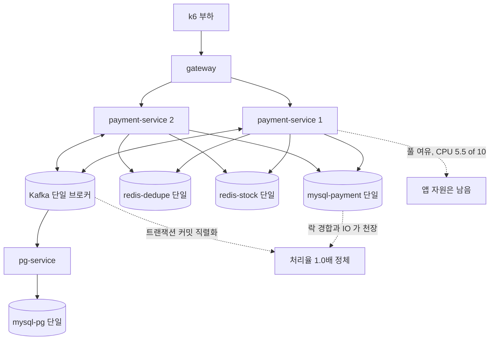

# 공유 자원 동반 스케일아웃 측정 설계

> 최종 수정: 2026-08-15
> **상태: 보류** — 재고 선차감 게이트를 상품 단위로 분해하는 선행 토픽 완료 후 재개한다. 사유와 재개 조건은 문서 끝 "보류 결정" 절 참고.

## 사전 브리핑

### 현재 이해한 문제

payment 인스턴스를 1대에서 2대로 늘렸을 때 확정 처리율이 1.0배에 머물렀다. 앱 자원(커넥션 풀·CPU)은 여유였고, 천장은 모두가 공유하는 MySQL 과 Kafka 트랜잭션 커밋 직렬화였다. 앱만 늘리는 확장은 공유 자원이 따라오지 않으면 아무것도 늘리지 못한다는 결론까지만 났고, **그 공유 자원을 실제로 늘려서 결론이 뒤집히는지는 측정하지 않았다.**

이번 작업은 공유 자원을 복제 구성으로 늘리고, 인스턴스 수를 여러 단계로 바꿔가며 처리율 곡선이 어떻게 달라지는지 측정한다. 단일 머신 Docker 라는 한계는 그대로 두되, 자원이 물리적으로 나뉜 구성을 흉내내는 데까지 간다.

### 현재 시스템 동작

측정된 사실은 다음과 같다.

| 항목 | 값 |
|:---:|:---:|
| 단일 인스턴스 처리율 꺾이는 지점 | 커넥션 풀 30 기준 약 150 req/s |
| 풀 상향 효과 | 30 -> 60 -> 80 에서 꺾이는 지점 300 -> 350 -> 450 |
| 인스턴스 1 -> 2 확정 처리율 | 1.0배 (합격 기준 1.6배 미달) |
| 인스턴스 1 -> 2 전체 완료 처리율 | 1.3배 |
| 2 인스턴스 시 CPU | 10 코어 중 5.5 |
| 2 인스턴스 시 커넥션 풀 | 양쪽 합 160 포화 |

현재 인프라는 모든 저장소가 단일 컨테이너다.

- MySQL 4대 (payment / pg / product / user) — 서비스별로 분리돼 있으나 각각은 단일 인스턴스
- Redis 2대 (dedupe / stock) — 각각 단일 인스턴스, 복제·감시 구성 없음
- Kafka 1 브로커 (KRaft) — 파티션 3

### 이번 discuss 에서 결정하려는 것

- 공유 자원을 어느 축으로 늘릴지 — MySQL 읽기 복제 / Redis 복제와 감시 / Kafka 다중 브로커 중 무엇을 이번 범위에 넣는가
- 늘린 자원을 앱이 쓰려면 프로덕션 코드가 바뀌어야 하는데(읽기 전용 라우팅 등), 그 변경을 이번 범위에 포함할지 아니면 설정만으로 되는 축에 한정할지
- 인스턴스 수를 몇 단계로 볼지, 그리고 단일 머신 자원 안에서 그 단계가 실제로 성립하는지
- 무엇을 합격으로 볼지 — 절대 처리량은 로컬에서 의미가 없으므로 어떤 상대 지표로 결론을 낼지
- 측정 중 정합이 깨지지 않는지를 어디까지 같이 검증할지

### 열린 질문 / 가정

- **메모리 천장이 이번 작업의 실질 제약이다.** 직전 측정은 로컬 메모리 7.65GB 를 근거로 인스턴스를 2대까지로 제한했다. 현재 컨테이너는 인프라 8 + 앱 5 + 관측 스택이고, 여기에 MySQL 복제본과 Redis 감시 노드를 얹으면 컨테이너가 크게 늘어난다. 인스턴스 3대 이상을 보려면 무엇을 끄고 볼지 정해야 한다.
- 읽기 복제를 붙여도 결제 확정 경로는 쓰기 중심이다. 읽기 분리로 쓰기 천장이 밀릴지 자체가 불확실하며, 효과가 없다는 결과도 유효한 결론으로 받을지 정해야 한다.
- Redis 감시 구성은 장애 전환을 위한 것이지 처리량을 늘리는 구성이 아니다. 처리량 측정에 넣을지, 아니면 장애 전환 검증으로 성격을 나눌지 판단이 필요하다.
- Kafka 다중 브로커는 미해결 항목 대장에 이미 별도 항목으로 올라 있다. 이번에 당길지 그대로 둘지 정해야 한다.
- 단일 머신에서 복제본을 띄우면 디스크와 CPU 를 원본과 공유한다. 자원이 나뉜 것처럼 보이지만 실제로는 같은 병목을 나눠 쓰는 상황이라, 측정 결과의 해석 범위를 문서에 못박아야 한다.
- domain-expert 포함 — 측정 토픽이지만 읽기 복제 라우팅이 들어가면 결제 상태 조회의 지연 반영 문제가 생긴다. 돈 경로에 닿는 판단이라 포함한다.

### 인터뷰에서 확정된 사항

| 항목 | 확정 |
|:---:|:---:|
| Docker 메모리 | 20GB 로 상향 (호스트 32GB 중). 나머지를 남겨 macOS 스왑을 피한다 — 스왑이 걸리면 그 자체가 측정 오염 |
| CPU | 10 코어 고정. Docker 설정으로 늘릴 수 없어 인스턴스 4대 구간의 실질 천장이 될 수 있다 |
| 자원 축 | payment MySQL 읽기 복제 + 재고 Redis 상품별 분산. Kafka 다중 브로커는 측정 중 병목이 관측될 때만 |
| 인스턴스 단계 | payment 1 / 2 / 3 / 4 |
| 프로덕션 코드 변경 | 포함. 읽기 라우팅과 재고 캐시 분산 모두 |
| 폴링 조회 라우팅 | 복제본으로 보낸다. 복제 지연이 체감 지연에 얼마나 나타나는지가 측정 결과의 일부 |
| 측정 축 | 처리량 / 체감 지연 / 정합성 세 축 |
| 부하 프로필 | 상품 여러 개로 변경 (현재는 상품 1개 고정) |
| 장애 전환 검증 | 이번 범위 밖. 별도 토픽에서 다룬다 |

### 조사로 확인한 사실

- 결제 상태 폴링(`GET /api/v1/payments/{orderId}/status`)은 이미 읽기 전용 트랜잭션으로 마킹돼 있다. 라우팅 데이터소스를 붙이면 별도 표시 없이 복제본으로 간다.
- payment 는 데이터소스 빈을 직접 정의하지 않고 자동 설정에 맡긴다. 읽기 라우팅은 신규 구성이다.
- 현재 부하는 상품 1개(`PRODUCT_ID=1`) 고정이라 재고 키가 단 하나다. Redis 는 명령을 단일 스레드로 처리하므로, 이 상태에서는 Redis 를 몇 대로 늘려도 부하가 한 대에만 간다.
- 재고 Lua 스크립트는 한 번에 `decrement:done:주문번호` 와 `stock:상품번호` 를 같이 다룬다. Redis Cluster 는 한 스크립트의 키가 같은 슬롯에 있어야 하므로 이 구조로는 실행이 거부된다. 키에 태그를 붙여 맞추면 재고 키가 주문마다 갈라져 재고 개념이 깨진다 — **Cluster 는 선택지가 아니다.**
- 부하 스크립트는 주문당 상품을 하나만 담는다. 상품 종류만 늘리면 한 주문의 스크립트가 상품 키 하나만 건드리므로, 상품 번호로 Redis 를 나눠도 원자성이 유지된다.
- **다만 프로덕션 도메인은 주문당 상품 여러 개를 지원한다.** 상품별 분산에서 그런 주문은 키가 여러 Redis 에 걸쳐 원자성이 깨진다. 측정 조건에서만 성립하는 구성을 프로덕션 기본으로 만들지 않는 것이 이 설계의 쟁점이다.
- 멱등 저장소는 값을 읽어 없으면 선점하는 구조라 복제본으로 보내면 중복 결제가 뚫린다. 읽기 분산 대상이 아니다.

### 참고

- 직전 측정: `docs/archive/capacity-and-scaleout/` (REPORT 사이클 3~7 이 측정 정본)
- 후속 처방 등재: `docs/context/TODOS.md` T4-E
- 측정 자산: `scripts/k6/` , `scripts/usl-fit.py`
- 인프라 구성: `docker/docker-compose.infra.yml` , `docker-compose.apps.yml` , `docker-compose.benchmark.yml`
- 재고 스크립트: `payment-service/src/main/resources/lua/stock_decrement_atomic.lua`

---

## 문제 정의

**앱만 늘리는 확장이 막힌 지점에서 멈춰 있다.** 직전 측정은 payment 를 2대로 늘려도 확정 처리율이 1.0배라는 것과, 천장이 앱 자원이 아니라 공유 MySQL 과 Kafka 커밋 직렬화라는 것까지 규명했다. 공유 자원을 실제로 늘리면 그 천장이 밀리는지는 측정되지 않았다.

**Redis 는 아직 병목으로 관측된 적이 없지만 인스턴스가 늘면 다음 후보다.** 다만 현재 부하가 상품 1개 고정이라 재고 키가 하나뿐이고, Redis 는 명령을 단일 스레드로 처리한다. 이 상태에서는 대수를 늘려도 부하가 한 대에만 몰려 아무 효과가 없다. 대수별 비교를 하려면 부하 프로필부터 바꿔야 한다.

## 영향 범위

| 구분 | 대상 |
|:---:|:---:|
| 신규 (payment) | 복제본 전용 데이터소스 + 조회 경로 라우팅 |
| 신규 (payment) | 상품 번호로 노드를 고르는 재고 캐시 어댑터 |
| 변경 (payment) | 폴링 상태 조회를 돈 경로와 다른 조회 경로로 분리 |
| 변경 (인프라) | payment MySQL 복제본 추가, 재고 Redis 다중 노드 구성, Docker 메모리 20GB |
| 변경 (측정) | 부하 스크립트 상품 다중화, 재고 시드 스크립트 상품별 확장, 인스턴스 4단계 실행 |
| 신규 (문서) | 측정 리포트 — 직전 리포트 형식 연장 |
| 무관 | pg / product / user 의 저장소, 벤더 호출 경로, Kafka 브로커 수(조건부 관측만), 결제 상태 전이 규칙 |

## 설계 옵션 비교

### 어떤 읽기를 복제본으로 보낼 것인가

조사에서 드러난 사실이 이 선택을 좌우한다. 결제 조회 메서드 하나를 폴링과 돈 경로가 함께 쓴다.

| 호출 지점 | 성격 |
|:---:|:---:|
| 폴링 상태 조회 | 사용자에게 결과를 보여주는 조회 |
| 확정 명령 발행 직전 가드 | 종결된 결제에 명령이 나가지 않게 막는 판정 |
| 격리 종결 | 재고 보상과 실패 확정을 좌우하는 판정 |
| 격리 재고 보상 | 비가역 보상 실행 전 판정 |
| 소진 메시지 재처리 | 재발행 여부 판정 |

- **읽기 전용 트랜잭션 플래그로 자동 분기** — 표준적인 구현이고 코드 변경이 가장 적다. 그런데 위 다섯이 모두 같은 플래그를 달고 있어 판정 경로까지 복제본으로 간다. 복제 지연 동안 종결된 결제가 대기로 보이면 확정 명령이 다시 나가고, 벤더가 승인하면 되돌릴 수 없는 과금이 남는다. 만료·회수 배치가 쓰는 조회도 같은 이유로 오염된다.
- **복제본으로 보낼 호출 지점을 명시적으로 고른다** — 폴링 조회를 돈 경로와 다른 조회 경로로 분리하고, 그 경로만 복제본 데이터소스에 묶는다. 나머지는 지금처럼 원본을 읽는다. 코드 변경이 더 크지만 판정이 오염될 여지가 구조적으로 없다.

두 번째를 택한다. 복제로 보낼 것을 고르는 편이, 보내면 안 되는 것을 빠짐없이 빼는 편보다 안전하다. 결제 판정은 하나만 새도 돈이 새는 자리다.

### 재고 Redis 를 어떻게 나눌 것인가

- **Redis Cluster** — 성립하지 않는다. 재고 스크립트가 주문 토큰과 상품 재고 키를 함께 다루는데 두 키가 다른 슬롯으로 흩어져 실행이 거부된다. 태그로 슬롯을 맞추면 재고 키가 주문마다 갈라져 재고 개념 자체가 깨진다.
- **상품 번호로 노드를 고르는 앱 측 분산** — 상품 재고 키와 그 주문의 토큰이 같은 노드에 놓이므로 스크립트가 그대로 원자적으로 돈다. 주문당 상품이 하나일 때만 성립한다.

두 번째만 남는다. 남는 문제는 주문당 상품이 여럿일 때다.

### 다중 상품 주문을 어떻게 다룰 것인가

프로덕션 도메인은 주문당 상품 여러 개를 지원한다. 분산 구성에서 그런 주문은 키가 여러 노드에 걸쳐 원자성이 깨진다.

- **분산 어댑터를 별도 구현으로 두고 측정 구성에서만 활성화** — 기본 동작은 지금 그대로 단일 노드다. 측정 구성에서만 분산 어댑터가 뜨고, 그 어댑터는 다중 상품 주문을 만나면 처리하지 않고 실패시킨다. 프로덕션 경로에 원자성을 깨는 코드가 기본으로 들어가지 않는다.
- **기본 어댑터를 분산으로 바꾸고 다중 상품은 단일 노드로 폴백** — 한 어댑터가 두 방식을 오가고, 폴백 조건을 잘못 잡으면 원자성이 조용히 깨진다. 측정 편의를 위해 결제 경로의 불변을 위태롭게 한다.

첫 번째를 택한다. 대신 측정 구성과 프로덕션 구성이 갈리므로, 측정 결과가 어느 구성의 수치인지 리포트에 못박는다.

### 인스턴스 단계를 어디까지 볼 것인가

직전 측정은 두 점(1대, 2대)뿐이라 회귀가 불안정했다. 네 점이면 한계 지점을 추정할 수 있다.

- **1 / 2 / 3 / 4 단계** — CPU 10 코어가 고정이라 4대 구간에서 앱 CPU 가 먼저 천장이 될 수 있다. 그 경우 "공유 자원을 늘려도 CPU 가 막는다" 가 결론이 되며, 이것도 유효한 결과다. CPU 사용률을 측정 축에 넣어 판별한다.

## 결정 사항

| 항목 | 결정 | 이유 | 기각한 대안 |
|:---:|:---:|:---:|:---:|
| 복제본 읽기 대상 | 폴링 상태 조회 경로만 명시적으로 복제본에 묶는다 | 같은 조회 메서드를 돈 경로 판정이 공유한다. 자동 분기는 판정을 오염시켜 확정 명령 재발행을 부른다 | 읽기 전용 플래그 자동 분기 — 코드는 적지만 발행 가드·격리 종결·보상 판정이 낡은 상태를 본다 |
| 폴링의 복제 지연 | 그대로 두고 체감 지연으로 관측한다 | 처리량과 체감 지연의 교환 관계를 수치로 남기는 것이 이번 측정의 목적 중 하나 | 미반영 시 원본 재조회 — 종결 전 구간에서 읽기가 두 배가 되어 측정 의도와 반대로 간다 |
| MySQL 복제 방식 | 비동기 복제 1대 | 단일 머신에서 반동기는 디스크를 공유해 의미가 흐려진다 | 반동기 복제 — 지연 특성이 물리 분리 환경과 달라 해석이 어렵다 |
| 재고 Redis 분산 | 상품 번호로 노드를 고르는 앱 측 분산 | 상품 키와 주문 토큰이 같은 노드에 놓여 스크립트 원자성이 유지된다 | Redis Cluster — 스크립트 키가 슬롯을 넘어 실행 자체가 거부된다 |
| 분산 어댑터 격리 | 별도 구현으로 두고 측정 구성에서만 활성화, 다중 상품 주문은 실패시킨다 | 프로덕션 기본 경로에 원자성을 깨는 코드를 넣지 않는다 | 기본 어댑터 교체 + 폴백 — 폴백 조건 오류가 원자성을 조용히 깬다 |
| 멱등 저장소 | 분산·복제 대상에서 제외 | 값을 읽어 없으면 선점하는 구조라 낡은 읽기가 중복 결제를 통과시킨다 | 복제본 읽기 — 중복 결제가 뚫린다 |
| 부하 프로필 | 상품 다중화. 상품 수는 노드 수와 무관하게 고정 | 노드 수만 변수로 남겨야 대수 효과가 분리된다 | 상품 1개 유지 — 키가 하나라 대수를 늘려도 한 노드만 쓴다 |
| 인스턴스 단계 | payment 1 / 2 / 3 / 4 | 두 점으로는 한계 지점 추정이 불안정하다 | 1 / 2 만 — 직전 측정과 같아 새 정보가 적다 |
| Docker 메모리 | 20GB | 호스트에 여유를 남겨 스왑을 피한다. 스왑이 걸리면 측정이 오염된다 | 최대치 할당 — 호스트가 스왑을 타면 수치를 신뢰할 수 없다 |
| Kafka 브로커 | 단일 유지, 측정 중 커밋 직렬화가 천장으로 관측되면 그 사실만 기록 | 다중 브로커는 별도 항목으로 이미 등재돼 있어 범위가 겹친다 | 이번에 다중화 — 변수가 하나 더 늘어 원인 분리가 어려워진다 |
| 결론 축 | 처리량 / 체감 지연 / 정합성 | 복제와 분산은 처리량과 지연을 맞바꾸는 일이라 둘을 같이 봐야 결론이 선다 | 처리량만 — 복제를 붙인 대가가 수치에 안 나타난다 |

## 장애 시나리오와 대응

| 시나리오 | 대응 |
|:---:|:---:|
| 복제 지연이 커져 폴링이 종결을 늦게 본다 | 막지 않는다. 체감 지연 증가로 측정에 드러나는 것이 이번 관측 대상이다. 복제 지연 자체도 함께 계측해 원인 귀속을 가능하게 한다 |
| 측정 중 복제본이 끊긴다 | 폴링 조회가 실패한다. 원본 폴백을 두면 지연 효과가 가려지므로 두지 않고, 대신 끊김을 관측해 해당 구간 측정을 무효 처리한다 |
| 분산 구성에서 한 Redis 노드가 죽는다 | 그 노드가 맡은 상품의 주문만 실패한다. 재고 정합 검증을 상품별로 수행해 부분 실패가 전체 정합 판정을 통과하지 못하게 한다 |
| 다중 상품 주문이 분산 구성에 들어온다 | 어댑터가 처리하지 않고 실패시킨다. 측정 부하는 주문당 상품 1개이므로 정상 경로에서는 발생하지 않으며, 발생 자체가 구성 오류 신호다 |
| 메모리 압박으로 호스트가 스왑을 탄다 | 측정 시작 전 여유를 확인하고, 스왑 발생 구간의 수치는 폐기한다. 인스턴스 4대 구간에서 가장 위험하다 |
| 인스턴스 4대에서 CPU 가 먼저 포화한다 | 그 사실을 결론으로 기록한다. 공유 자원을 늘려도 로컬 CPU 가 막는다는 것이 이 환경의 한계이며, 숨기지 않고 해석 범위에 명시한다 |
| 상품 다중화로 직전 측정과 부하 프로필이 달라진다 | 직전 수치와 직접 비교하지 않는다. 이번 측정 안에서 인스턴스 1대를 기준선으로 삼아 상대비만 낸다 |

## 검증 전략

- 인스턴스 1대를 기준선으로 2 / 3 / 4 대의 확정 처리율과 전체 완료 처리율 상대비를 낸다. 절대 수치는 해석하지 않는다.
- 재고 Redis 1 / 2 / 3 대에서 같은 부하를 재어 대수 효과를 분리한다. 상품 수는 고정한다.
- 체감 지연은 폴링 응답과 전체 완료를 나눠 계측한다. 복제 지연을 함께 기록해 지연 증가분의 귀속을 가른다.
- 정합성은 매 사이클 종료 후 상품별로 확인한다 — 재고 캐시 합이 상품 DB 값과 맞는지, 결제 상태와 재고 차감이 어긋난 건이 없는지.
- 복제본으로 가는 조회가 폴링 경로 하나뿐임을 구조 계약으로 고정한다. 돈 경로 판정이 복제본을 읽지 않는 것이 이 설계의 안전 근거이므로, 테스트로 못박지 않으면 나중에 조용히 무너진다.
- 분산 어댑터가 다중 상품 주문을 실패시키는지, 상품 번호로 같은 노드를 일관되게 고르는지(차감과 보상이 같은 노드를 찾아가는지) 단위로 고정한다.
- 기존 회귀를 캐시 없이 재실행한다. 라우팅 데이터소스 도입이 기존 통합 테스트의 데이터소스 구성을 깨지 않아야 한다.
- 측정 전 스왑 여유와 컨테이너 기동 상태를 확인하는 절차를 리포트에 남긴다.

## 제외 범위

- **장애 전환 검증** — Redis 주 노드 전환, MySQL 원본 다운 시 거동. 사용자 판단으로 별도 토픽에서 다룬다. 이번은 처리량과 지연 측정에 집중한다.
- **Kafka 다중 브로커** — 미해결 항목에 이미 별도로 올라 있다. 측정 중 커밋 직렬화가 천장으로 관측되면 그 사실만 기록한다.
- **pg / product / user 저장소 확장** — 병목이 payment 쪽에서 관측됐고, 변수를 늘리면 원인 분리가 어려워진다.
- **쓰기 샤딩** — 읽기 복제와 성격이 다르고 스키마·라우팅 설계가 별도 규모다.
- **절대 처리량 목표** — 단일 머신 Docker 환경이라 절대 수치에 의미를 두지 않는다.
- **자동 확장** — 인스턴스 수는 수동으로 바꿔 측정한다.
- **다중 상품 주문의 분산 지원** — 원자성을 유지하며 여러 노드에 걸치려면 별도 설계가 필요하다. 이번 구성은 주문당 상품 1개를 전제한다.

---

## 보류 결정 (2026-08-15)

### 왜 멈췄나

이 설계는 재고 캐시를 여러 노드로 나누기 위해 **주문당 상품 1개**를 전제했다. 프로덕션 도메인은 주문당 상품 여러 개를 지원하므로, 측정 편의를 위해 결제 도메인의 보장을 깎는 모양이 된다. 분산 어댑터를 측정 구성에서만 켜는 격리안을 넣었지만, 그러면 측정 결과가 프로덕션과 다른 구성의 수치가 된다.

**순서가 뒤바뀌었다는 판단으로 보류한다.** 재고 선차감 게이트를 상품 단위로 분해하는 결정이 먼저 서야, 노드 분산이 도메인을 깎지 않고 자연스럽게 열린다.

### 논의에서 확정된 정정

문서 본문은 아직 이 정정을 반영하지 않았다. 재개 시 반영한다.

| 항목 | 본문 서술 | 정정 |
|:---:|:---:|:---:|
| Redis Cluster 가능 여부 | "선택지가 아니다" | **가능하다.** 해시태그를 상품 기준으로 잡으면(`stock:{1}` / `decrement:done:{1}:주문번호`) 한 주문이 건드리는 키가 같은 슬롯에 모인다. 본문은 태그를 주문 기준으로 가정해 잘못 판단했다 |
| 분산 구현 방식 | 앱이 상품 번호로 노드를 고른다 | Cluster 가 코드 변경이 훨씬 작다. 노드 선택·연결 관리·차감과 보상의 노드 일관성 보장이 전부 불필요해지고, 대수 변경도 설정으로 끝난다. 앱 측 분산은 기각 대안으로 내린다 |
| 재고 Redis 분산 | 이번 범위에 포함 | 선행 토픽 완료 전까지 제외. 단일 노드로 두고 천장만 측정한다 |
| 멱등 저장소 Redis | 분산 대상에서 제외 | **분산 대상에 포함.** Lua 를 쓰지 않고 키가 주문마다 고유해 태그 없이 저절로 흩어진다. 도메인 보장을 건드리지 않으면서 대수 효과가 가장 확실하게 나오는 자리다 |
| 읽기 라우팅 구현 | 호출 지점을 명시적으로 고른다 | 방향은 맞으나 수단이 틀렸다. 읽기 전용 표시 기반 자동 분기를 쓰면 아래 게이트 지적대로 세 경로가 뚫린다. **복제본 전용 데이터소스에 폴링 조회 메서드만 명시적으로 바인딩**하는 방식으로 바꾼다 |

### 게이트 결과 — 재개 시 처리할 findings

1라운드 reviewer **revise**(major 3 / minor 1), domain-expert **fail**(critical 1 / major 2). 미반영 상태로 남긴다.

| severity | finding | 재개 시 처리 |
|:---:|:---:|:---:|
| critical | 읽기 전용 표시 기반 라우팅은 물리 트랜잭션을 여는 가장 바깥 `@Transactional` 을 따른다. 격리 종결·소진 메시지 재처리·확정 요청 진입 가드는 감싸는 트랜잭션이 없어(외부 호출 중 커넥션을 쥐지 않으려는 의도적 설계) 조회 메서드의 읽기 전용 표시가 최상위가 되고, 폴링과 똑같이 복제본으로 간다. 복제 지연 중 격리 종결이 낡은 상태를 읽으면 이미 승인된 결제에 비가역 재고 복원이 나간다 | 명시적 데이터소스 바인딩으로 전환. 세 경로가 원본을 읽는다는 것을 계약 테스트로 고정 |
| major | 격리 복구 전용 보상 스크립트(`compensateIfDecremented`)가 분산 검증 계획에서 빠졌다 | 재고 분산을 접으면 소멸. 선행 토픽에서 이 경로의 상품 단위 분해를 다룬다 |
| major | 사이클 사이 재고 노드 수를 바꾸면 앞 사이클에서 차감된 주문의 보상이 다른 노드를 찾아가 재고가 어긋난다 | 재고 분산을 접으면 소멸. 재개 시 분산을 다시 넣으면 노드 재구성 전 in-flight 종결 확인 절차를 검증 전략에 넣는다 |
| major | 장애 전환 검증 제외가 미해결 항목 대장에 등재되지 않았다 | `TODOS.md` 에 항목 신설 |
| major | 신규 코드의 계층·패키지 배치가 결정되지 않았다 | 복제본 조회 포트와 어댑터 위치를 결정 사항 표에 명시 |
| major | 측정 합격선이 없다. 직전 토픽은 처리율비 1.6배라는 판정선이 있었다 | 판정선을 긋거나, 탐색형 측정이라 두지 않는다는 것을 명문화. 지연 지표의 백분위수도 못박는다 |
| minor | 결제 조회를 공유하는 판정 경로가 6곳인데 표에 5곳만 있다. 확정 요청 진입점 조회가 빠졌다 | 표에 추가 |

### 재개 조건

- 재고 선차감 게이트의 상품 단위 분해가 결정되고 구현될 것
- 그 위에서 재고 Redis 분산과 멱등 저장소 분산을 다시 범위에 넣고, 위 findings 를 반영해 재게이트

### 유효한 채로 남는 부분

- 인스턴스 1 / 2 / 3 / 4 단계 측정
- payment MySQL 읽기 복제와 폴링 조회 라우팅 (수단은 명시적 바인딩으로 정정)
- Docker 메모리 20GB, CPU 10 코어 고정이라는 환경 제약과 그 해석 범위
- 처리량 / 체감 지연 / 정합성 세 축
- 부하 프로필 상품 다중화
- 장애 전환 검증 제외
