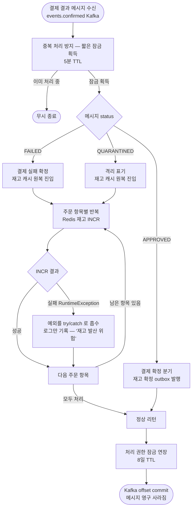
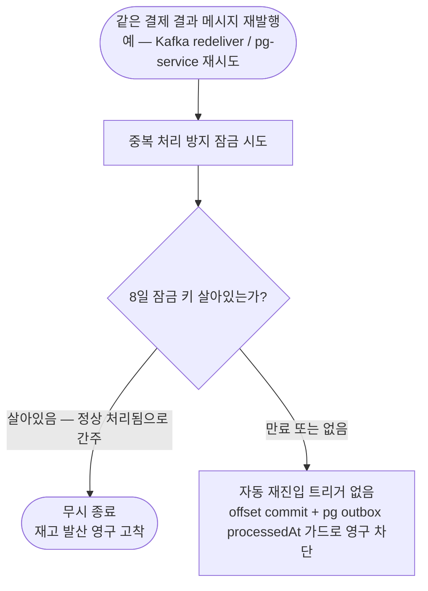
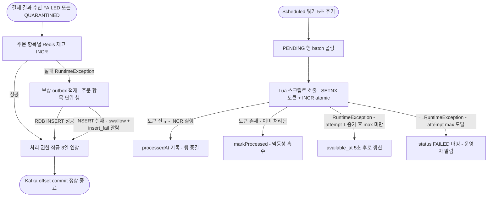
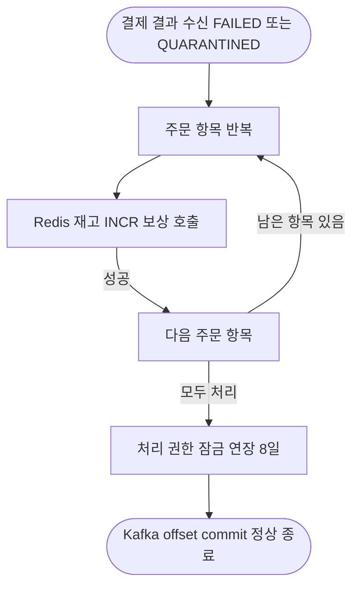
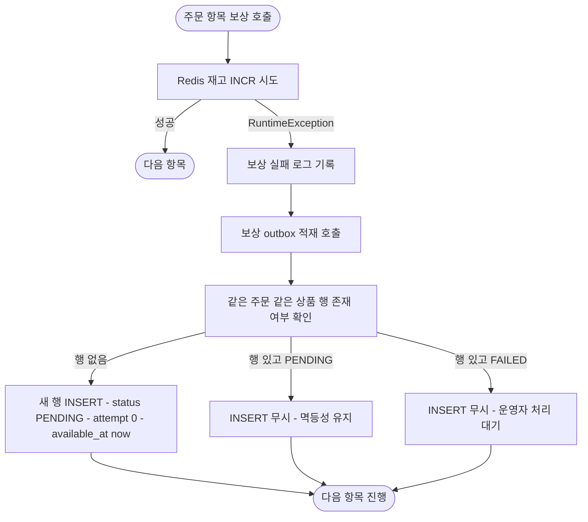
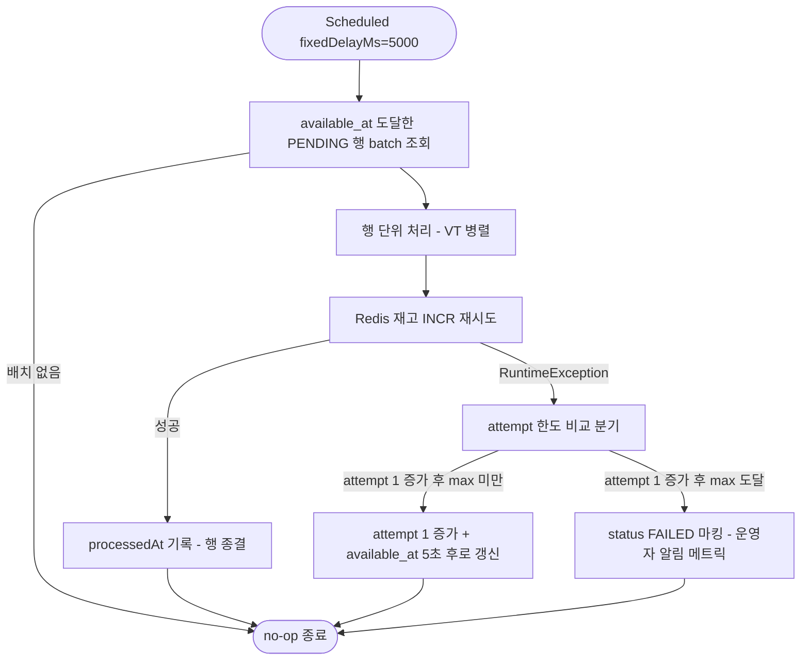

# STOCK-COMPENSATION-RECOVERY — 결제 결과 보상 실패 자동 회복 layer

> stage: discuss (사전 브리핑 작성 단계)
> 활성화 조건: `docs/STOCK-COMPENSATION-RECOVERY-PLAN.md` 생성 시 워크플로우 본격 진입

---

## 사전 브리핑

### 1. 현재 이해한 문제

결제가 실패 또는 격리(QUARANTINED) 로 결정되면 payment-service 는 결제 결과 메시지를 수신해 **선차감된 Redis 재고 캐시를 원복**해야 한다. 그런데 이 재고 원복 호출이 한 건이라도 실패하면, 현재 코드는 그 실패를 로그로만 남기고 메시지를 정상 처리한 것으로 간주한다. 그 결과 동일 결제 결과는 **8일간 중복 처리 방지 잠금** 에 갇혀 다시 들어와도 무시되고, 재고는 차감된 채로 영구 발산한다. 자동 재시도/회복 layer 가 비어 있어 운영자 수동 보정에만 의존하는 상태.

### 2. 현재 시스템 동작 (as-is)

#### 2.1. 결제 결과 메시지 수신 → 보상 분기



#### 2.2. 보상 실패 후 재수신이 막히는 이유



#### 2.3. 정리

| 단계 | 현재 동작 | 문제 |
|---|---|---|
| 보상 호출 실패 | try/catch 흡수, 로그만 | 외부에 노출 안 됨 |
| 메시지 처리 종료 | 정상 종료로 간주 | offset commit, 메시지 사라짐 |
| 처리 권한 잠금 | 8일로 연장 | 재수신해도 dedupe 로 막힘 |
| 재시도 트리거 | 없음 | 운영자 수동 개입 필요 |

### 3. 이번 discuss 에서 결정하려는 것

1. **회복 메커니즘 선택** — 후보 3가지:
   - (a) 보상 실패 시 try/catch 제거 → 예외 전파 → 처리 권한 잠금 해제 시도 → 잠금 해제 실패 시 DLQ → consumer 가 offset 미커밋 또는 DLQ 컨슈머가 재처리
   - (b) 보상 outbox 패턴 신규 도입 — 보상 실패 시 RDB 의 `stock_compensation_outbox` 테이블에 적재 + 별도 워커가 백오프 재시도
   - (c) 두 방식 조합 — 1차는 outbox 적재로 회복 보장, 한도 소진 시 DLQ 격리
2. **재고 보상 멱등성 보장 방식** — 같은 주문 항목에 대한 INCR 이 두 번 일어나지 않도록 (혹은 두 번 일어나도 안전하도록) 멱등성 키를 어디에 두는가
3. **부분 실패 처리** — 한 결제의 N개 주문 항목 중 일부만 보상 실패한 경우, 실패한 항목만 재시도 가능한 단위로 적재할 것인가 / 결제 단위로 묶어 재시도할 것인가
4. **happy path 성능 영향 한도** — outbox INSERT 가 정상 보상 경로에 추가되면 latency 가 늘어남. 정상 경로에서는 outbox 미적재 + 실패 시에만 적재로 분리할 것인지 결정
5. **재시도 한도 / 백오프 정책** — pg-service self-loop (4회 × exponential backoff) 와의 정합 vs payment-service 의 outbox 폴링 정책 (FIXED 5s) 와의 정합 중 어디에 맞출 것인지
6. **DLQ 경로 명확화** — 한도 소진 시 어디로 가는가 — 기존 `payment.events.confirmed.dlq` 재사용 vs 별도 토픽 `payment.compensation.dlq` 신설

### 4. 열린 질문 / 가정

- **Q1**: pg-service 가 events.confirmed 를 다시 발행할 가능성이 실제로 있는가? 즉 Kafka 가 redeliver 를 트리거할 시나리오가 운영 중 발생하는가? (pg-service 측은 outbox processedAt 기반이므로 한 번 발행 후 재발행은 retry/DLQ 경로뿐) — 만약 거의 없다면 **(a) Kafka redeliver 의존은 약한 회복**이 됨.
- **Q2**: Redis 가 일시 다운되었을 때 모든 PaymentOrder 의 보상이 동시에 실패할 가능성이 높음. outbox 에 동일 결제의 항목 N개가 한꺼번에 적재되는지, 결제 단위 1행으로 적재되는지 결정 필요.
- **Q3**: 격리(QUARANTINED) 메시지에서 `QuarantineCompensationHandler.handle` 는 보상 실패와 별도로 markPaymentAsQuarantined 를 호출한다. 보상 실패가 격리 마킹과 분리되어야 하는지, 격리 마킹은 항상 성공해야 하는지.
- **Q4**: Kafka 재시도 vs RDB outbox 재시도 — Kafka 의존은 broker 가용성에 묶이고 redeliver 시 다른 메시지 처리도 같이 retry 됨. RDB outbox 는 보상 실패만 격리해서 재처리 가능. **본 토픽은 후자(RDB outbox)가 자연스러워 보이지만 검증 필요**.
- **A1 (가정)**: 보상 outbox 도입 시 기존 `payment_outbox` (commands.confirm 발행용) 와 별도 테이블이 자연스럽다 — 다른 토픽, 다른 retry 정책, 다른 워커.
- **A2 (가정)**: stockCachePort.increment 자체가 멱등하지 않으므로 (같은 키에 두 번 INCR 하면 두 번 더해짐), 보상 멱등성은 outbox 행 단위 / 처리 토큰 (예: orderId+productId) 으로 보장한다.

---

## 요약 브리핑

### 결정된 접근

events.confirmed FAILED / QUARANTINED 메시지 수신 후 Redis 재고 복구 호출이 실패하면, **happy path 영향 없이** 같은 try/catch 안에서 신규 RDB 테이블 `stock_compensation_outbox` 에 행 단위로 적재한다. `@Scheduled` 워커가 5초마다 PENDING 행을 픽업해 Redis INCR 을 재시도하고, 5회 모두 실패하면 status=FAILED 로 종결해 운영자 admin 에 위임한다. 워커 크래시 후 재진입 시 INCR 이중 호출을 차단하기 위해 Redis Lua 스크립트로 `outboxId` 기반 처리 토큰(SETNX P8D) 과 INCR 을 atomic 묶음으로 호출한다. dedupe two-phase lease 는 그대로 두고 보상 회복 책임을 consumer 에서 워커로 이관한다.

### 변경 후 동작 (to-be 압축본)



### 핵심 결정 ID 목록 (§4 풀이 참조)

- **D1**: 보상 outbox 테이블 신설 — 주문 항목 단위 행, UNIQUE `(order_id, product_id)`, payload 컬럼 미보유 (Redis 작업 큐).
- **D3**: UNIQUE 충돌 시 `INSERT ... ON DUPLICATE KEY UPDATE` no-op — FAILED 행 자동 reset 안 함.
- **D4**: 워커 구조 — 단일 인스턴스 + `SELECT ... FOR UPDATE SKIP LOCKED` + Lua 처리 토큰으로 **워커 크래시 재진입 시 INCR 이중 호출 차단**.
- **D5**: 재시도 정책 — 기존 `payment.retry.base-delay-ms: 5000` (FIXED) × `max-attempts: 5` 재사용. attempt 5 도달 시 FAILED.
- **D6**: 변경은 한 줄 추가 — `compensateStockCache` 의 catch 안에서 appender 호출. happy path 영향 0.
- **D8**: 메트릭 5종 신설 — `inserted` / `retry` / `failed` / `insert_fail` (마지막 silent loss 알람) / `worker_reentry` (크래시 재진입 의심) Counter + 동명의 EventType.

### 트레이드오프 / 후속 작업

- **다중 워커 인스턴스 미지원** — 단일 인스턴스 가정. Phase 4 부하 측정 후 결정 (§7.1.1).
- **FAILED 행 자동 회복 없음** — 운영자 admin 도구는 별도 토픽. CONCERNS C-5 부분 해소.
- **다른 보상 경로 회복은 후속** — `OutboxAsyncConfirmService.compensateStock` (line 99-119) 와 `PaymentTransactionCoordinator.compensateStockCacheGuarded` (line 168-180) 의 동일 catch swallow 패턴은 본 토픽 범위 외, 후속 별도 토픽.
- **Lua 스크립트 cluster 호환** — KEYS 가 다른 hash slot 인 경우 `{...}` hash tag 로 묶기 필요 (plan 단계 task 6 에서 결정).
- **Phase 4 Toxiproxy 검증과 연결** — Redis 일시 장애 주입 시 보상 outbox 회복 사이클 검증.

---


본 토픽은 **events.confirmed FAILED / QUARANTINED 보상 경로** 의 자동 회복만 책임진다. 아래 4건은 의도적으로 범위 외다 — 상세 사유는 §7.1.

| Non-goal | 사유 |
|---|---|
| 다중 워커 인스턴스 운용 | 단일 인스턴스 + SKIP LOCKED 가정. Phase 4 부하 측정 후 결정 |
| FAILED row 자동 회복 / admin 도구 | 운영자 수동 처리. admin 도구는 별도 토픽 |
| RDB 다운 시 보상 회복 | RDB outage 는 더 큰 사건, 본 layer 책임 외 |
| 메시지 broker 자체 손실 (retention 초과) | dedupe TTL P8D + Kafka retention 7d 정렬로 별 layer 처리 |
| `OutboxAsyncConfirmService.compensateStock` / `PaymentTransactionCoordinator.compensateStockCacheGuarded` 회복 | 같은 silent loss 패턴이지만 진입 시점·도메인 의미 다름. 후속 별도 토픽 |

---

## §1. 결정 (Decisions)

본 라운드에서 확정한 결정 9건. 각 결정의 상세 근거는 §4 에 풀어 적는다.

| ID | 결정 한 줄 |
|---|---|
| **D1. 보상 outbox 테이블 스키마** | 신규 테이블 `stock_compensation_outbox` — 주문 항목 단위 N행. UNIQUE `(order_id, product_id)` + 보조 인덱스 `(status, available_at)`. payload·headersJson 같은 발행 메타는 두지 않는다 — 이 outbox 는 Kafka 발행 대상이 아닌 Redis 보상 작업 큐다. |
| **D2. status enum** | `PENDING / FAILED` 2상태. IN_FLIGHT 미도입 — 워커가 단일 인스턴스 단일 스레드로 폴링하고, 재진입 race 는 UNIQUE 키와 `processedAt IS NULL` 가드로 충분히 막힌다. |
| **D3. UNIQUE 충돌 시 정책** | `INSERT ... ON DUPLICATE KEY UPDATE attempt = attempt, available_at = available_at` (no-op upsert). 같은 (주문, 상품) 보상이 두 번 트리거되면 첫 row 만 살린다. 단 기존 row 가 `FAILED` 인 경우는 PENDING 으로 reset 하지 않고 그대로 둔다 — FAILED 는 운영자 admin 책임. |
| **D4. 워커 구조** | 기존 `StockOutbox` 패턴 (processedAt IS NULL = PENDING) 차용. payment_outbox 의 claimToInFlight CAS 패턴은 **차용하지 않는다** — 발행이 아닌 단일 INCR 호출이라 in-flight 격리가 의미 약함. 대신 `available_at <= now` + `status = PENDING` 으로 `SELECT ... FOR UPDATE SKIP LOCKED` 폴링. |
| **D5. 재시도 카운터 / FAILED 종결** | `payment.retry.max-attempts: 5` + `payment.retry.base-delay-ms: 5000` (`backoff-type: FIXED`) 재사용. `RetryPolicyProperties.getBaseDelayMs()` 를 `StockCompensationRetryService` 가 직접 주입해 `scheduleNextAttempt(delay)` 의 delay 출처로만 사용. 워커 폴링 주기는 별도 키 `scheduler.stock-compensation-worker.fixed-delay-ms: 5000`. attempt 는 적재 시 0, 워커 호출 후 attempt++. attempt 가 max-attempts (=5) 와 같아지는 시점 (즉 5회 시도 후 6번째 진입 직전) 에 status=FAILED 마킹. attempt < max 일 때만 next-attempt available_at 갱신. |
| **D6. compensateStockCache 변경 패턴** | 기존 try/catch 의 `LogFmt.error` 직후 `stockCompensationOutboxAppender.append(orderId, productId, qty, reasonCode)` 호출 추가. 정상 경로에는 INSERT 없음 (happy path 영향 0). appender 는 별도 use case 로 분리 — `compensateStockCache` 자체는 영구 분리 보존. |
| **D7. 격리 보상 (handleQuarantined) 의 outbox 적재** | FAILED 와 동일 처리 — 같은 appender, 같은 reasonCode 컬럼에 저장. 격리 마킹(`markPaymentAsQuarantined`) 자체는 보상 outbox 와 분리 — 격리 마킹이 실패하면 별 트랙 (현 dedupe 처리) 그대로. |
| **D8. payment-history audit / 메트릭 / 로깅** | `payment_history` audit 트리거 안 함 (payment 상태 전이 없음). 신규 메트릭 `stock_compensation_outbox_inserted_total` / `..._retry_total` / `..._failed_total` (Micrometer Counter). 신규 EventType: `STOCK_COMPENSATION_OUTBOX_APPENDED` / `..._RETRIED` / `..._FAILED`. |
| **D9. Flyway 마이그레이션 위치** | `payment-service/src/main/resources/db/migration/V<n>__stock_compensation_outbox.sql` — 다음 사용 가능한 V 번호로 단일 파일. 인덱스·UNIQUE 모두 동일 파일에 포함. |

---

## §2. as-is / to-be 비교

사전 브리핑 §2.1, §2.2 의 as-is 와 대비되는 to-be 플로우. 보상 실패 시 outbox 적재 분기와 워커 회복 사이클을 추가한다.

### §2.1. to-be 정상 보상 경로 (변경 없음)



happy path 에는 outbox INSERT 가 없다. 기존 코드 동작과 동일.

### §2.2. to-be 보상 실패 시 outbox 적재 분기 (신규)



INSERT 자체가 실패할 가능성은 `A3` 가정에서 제외 (RDB 살아있으면 성공).

### §2.3. to-be 워커 회복 사이클 (신규)



워커는 `payment_outbox` 의 IN_FLIGHT 타임아웃 패턴을 쓰지 않는다 — 단일 인스턴스 가정에서 `SELECT ... FOR UPDATE SKIP LOCKED` 만으로 충분.

---

## §3. 컴포넌트 / 책임 분담

신규·변경 컴포넌트를 layer 별로 정리한다. Hexagonal layer 룰 (port 는 application, 어댑터는 infrastructure) 을 그대로 따른다.

### §3.1. domain layer (신규)

| 컴포넌트 | 역할 | 위치 |
|---|---|---|
| `StockCompensationOutbox` | 보상 행 도메인 POJO. `id / orderId / productId / quantity / reasonCode / status / availableAt / processedAt / attempt / createdAt` 필드. `markProcessed(now)` / `incrementAttempt()` / `scheduleNextAttempt(delay)` / `markFailed()` 도메인 메서드. Lombok 패턴은 `StockOutbox` 동일. | `payment-service/.../domain/StockCompensationOutbox.java` |
| `StockCompensationOutboxStatus` | enum `PENDING / FAILED`. `isTerminal()` (FAILED 만 true) / `isPending()`. | `payment-service/.../domain/enums/StockCompensationOutboxStatus.java` |

### §3.2. application layer (신규 + 변경)

| 컴포넌트 | 역할 | 위치 | 신규/변경 |
|---|---|---|---|
| `StockCompensationOutboxRepository` (out port) | `appendIfAbsent(orderId, productId, qty, reasonCode, now)` / `findPendingBatch(batchSize, now)` / `save(outbox)` / `findById(id)`. | `payment-service/.../application/port/out/StockCompensationOutboxRepository.java` | 신규 |
| `StockCompensationOutboxAppender` (use case) | `compensateStockCache` 가 호출. INSERT IGNORE 의미를 use case 로 표현. RDB INSERT 자체 실패 시 `LogFmt.error` + `stock_compensation_outbox_insert_fail_total++` + `EventType.STOCK_COMPENSATION_OUTBOX_INSERT_FAILED` 발행 + 재throw 안 함 (메인 흐름 차단 금지). | `payment-service/.../application/usecase/StockCompensationOutboxAppender.java` | 신규 |
| `StockCompensationRetryService` | 워커가 호출. 한 행 처리: Redis INCR → 성공이면 markProcessed, 실패 + attempt 미도달이면 incrementAttempt + scheduleNextAttempt, 실패 + 도달이면 markFailed. `@Transactional` 로 row update 만 묶음 (Redis 호출은 TX 외부 — Hikari 점유 회피). | `payment-service/.../application/service/StockCompensationRetryService.java` | 신규 |
| `PaymentConfirmResultUseCase.compensateStockCache` | catch 분기에서 `stockCompensationOutboxAppender.append(...)` 호출 한 줄 추가. 정상 경로 영향 0. | `payment-service/.../application/usecase/PaymentConfirmResultUseCase.java` | 변경 |
| `RetryPolicyProperties` | 신규 추가 없음 — 기존 `payment.retry.*` 재사용. 단 워커가 별도 fixed-delay 를 쓰므로 `scheduler.stock-compensation-worker.*` 키 신설. | `payment-service/.../application/config/RetryPolicyProperties.java` | 재사용 |

### §3.3. infrastructure layer (신규)

| 컴포넌트 | 역할 | 위치 |
|---|---|---|
| `StockCompensationOutboxJdbcAdapter` (또는 JPA) | `StockCompensationOutboxRepository` 구현. `INSERT ... ON DUPLICATE KEY UPDATE` 로 멱등성 INSERT. `SELECT ... FOR UPDATE SKIP LOCKED` 로 배치 조회. 기존 `StockOutboxRepository` 와 동일 패턴 (JdbcTemplate 또는 JPA 어느 쪽이든 컨벤션 준수). | `payment-service/.../infrastructure/persistence/StockCompensationOutboxJdbcAdapter.java` |
| `StockCompensationWorker` | `@Scheduled(fixedDelayString="${scheduler.stock-compensation-worker.fixed-delay-ms:5000}")`. batch 조회 → VT 병렬 처리 → `StockCompensationRetryService.process(row)` 호출. 기존 `OutboxWorker` 패턴 그대로. | `payment-service/.../infrastructure/scheduler/StockCompensationWorker.java` |

### §3.4. core / 설정 (신규 키)

`application.yml` 신규:
```
scheduler:
  stock-compensation-worker:
    fixed-delay-ms: 5000
    batch-size: 50
    parallel-enabled: true
```

기존 `payment.retry.max-attempts: 5` / `payment.retry.base-delay-ms: 5000` (`backoff-type: FIXED`) 는 그대로 재사용 — `StockCompensationRetryService` 가 `RetryPolicyProperties` bean 을 직접 주입받아 `getBaseDelayMs()` 를 `scheduleNextAttempt(delay)` delay 값 출처로만 사용한다. 워커 폴링 주기 (`scheduler.stock-compensation-worker.fixed-delay-ms`) 와 retry policy delay (`payment.retry.base-delay-ms`) 는 의미가 다르므로 키도 분리해 둔다 — 폴링 주기는 워커 sleep 간격, retry delay 는 다음 시도 시 `available_at` 갱신 delta.

### §3.5. 메트릭 / 로깅 (신규)

| 메트릭 / 이벤트 | 위치 | 의미 |
|---|---|---|
| `stock_compensation_outbox_inserted_total` (Counter) | `infrastructure/metrics` | 보상 실패로 outbox 적재된 누적 건수 |
| `stock_compensation_outbox_retry_total` (Counter) | 〃 | 워커가 재시도 시도한 누적 건수 |
| `stock_compensation_outbox_failed_total` (Counter) | 〃 | attempt 한도 도달로 FAILED 마킹된 누적 건수 |
| `stock_compensation_outbox_insert_fail_total` (Counter) | 〃 | appender 가 swallow 한 RDB INSERT 실패 누적 건수 — **마지막 silent loss 경로**. 알람 임계 0 (단일 발생도 즉시 알람) |
| `stock_compensation_worker_reentry_total` (Counter) | 〃 | 워커 크래시 후 재시작으로 같은 row 가 attempt > 0 + processedAt IS NULL 상태로 재진입한 누적 건수 — INCR 이중 호출 의심 신호. 도메인 처리 토큰(D1.race) 도입 후에도 보조 가시화로 유지 |
| `EventType.STOCK_COMPENSATION_OUTBOX_APPENDED` | `core/common/log/EventType` | LogFmt 이벤트 |
| `EventType.STOCK_COMPENSATION_OUTBOX_RETRIED` | 〃 | 〃 |
| `EventType.STOCK_COMPENSATION_OUTBOX_FAILED` | 〃 | 〃 (운영 알림 임계 — Loki 필터 + Grafana 알람 트리거) |
| `EventType.STOCK_COMPENSATION_OUTBOX_INSERT_FAILED` | 〃 | appender swallow 즉시 알람 트리거 — 결제 종결되었으나 재고 미회복 + 워커도 픽업 못 함 |
| `EventType.STOCK_COMPENSATION_WORKER_REENTRY` | 〃 | 워커 재진입 의심 시 WARN 로그 |

---

## §4. 설계 결정 상세

### §4.1. D1 보상 outbox 테이블 스키마

**결정**: `stock_compensation_outbox` 테이블 신설. 컬럼:

```sql
CREATE TABLE stock_compensation_outbox (
    id            BIGINT       NOT NULL AUTO_INCREMENT,
    order_id      VARCHAR(64)  NOT NULL,
    product_id    BIGINT       NOT NULL,
    quantity      INT          NOT NULL,
    reason_code   VARCHAR(64)  NOT NULL,
    status        VARCHAR(16)  NOT NULL DEFAULT 'PENDING',
    available_at  DATETIME(6)  NOT NULL,
    processed_at  DATETIME(6)  NULL,
    attempt       INT          NOT NULL DEFAULT 0,
    created_at    DATETIME(6)  NOT NULL,
    PRIMARY KEY (id),
    UNIQUE KEY uk_order_product (order_id, product_id),
    KEY idx_status_avail (status, available_at)
);
```

**근거**: payment_outbox 와 달리 payload·topic·headersJson 컬럼은 두지 않는다. 이 outbox 는 "Kafka 메시지 발행 대기 큐" 가 아닌 "Redis INCR(productId, quantity) 작업 큐" 다. 작업 인자는 productId / quantity / reasonCode 셋이면 충분하고, 메시지 직렬화·발행 메타는 불필요. 보조 인덱스는 워커 폴링 (`status='PENDING' AND available_at <= now`) 에 직접 매칭.

**기각된 대안**:
- `payment_outbox` 와 같은 PENDING/IN_FLIGHT/DONE 4상태 + payload 컬럼 — 발행이 아니므로 payload 의미 없음. 4상태도 과설계.
- 결제 단위 1행 (orderId 만 PK) — 부분 실패 격리가 안 됨. 한 항목만 실패해도 다른 항목 재시도가 같이 일어남.

### §4.2. D2 status enum

**결정**: `PENDING / FAILED` 2상태. processedAt non-null = 완료 (=상태 enum 과 별개로 종결 표시).

**근거**: IN_FLIGHT 도입의 목적은 다중 워커 인스턴스가 같은 행을 두 번 픽업하는 race 방지인데, 본 워커는 단일 인스턴스 단일 스레드 폴링 + `SELECT ... FOR UPDATE SKIP LOCKED` 로 row lock 으로 충분히 격리된다. payment_outbox 가 IN_FLIGHT 를 둔 이유는 Kafka publish 가 외부 호출이라 timeout/crash 이후 상태가 명확하지 않아서인데, 본 워커는 Redis INCR 단일 호출이고 호출 결과만 받으면 즉시 분기 가능.

**기각된 대안**:
- `PENDING / IN_FLIGHT / DONE / FAILED` 4상태 — payment_outbox 와 일관성은 좋지만 본 도메인엔 over-engineering. processedAt 만으로 종결 판단 가능 (= `StockOutbox` 패턴 차용).
- `PENDING / RETRYING / FAILED` — RETRYING 과 PENDING 의 운영 의미 차이가 모호.

### §4.3. D3 UNIQUE 충돌 시 정책

**결정**: `INSERT ... ON DUPLICATE KEY UPDATE attempt = attempt` 형태의 no-op upsert. 충돌 시 기존 row 그대로 둔다.

**근거**: 같은 (orderId, productId) 에 보상이 두 번 트리거될 경우는 (1) 같은 events.confirmed 메시지 재수신 — 이건 dedupe lease 로 막혀 거의 발생 안 함, (2) IN_PROGRESS self-loop 로 다른 eventUuid 의 같은 orderId 결과가 두 번 도달 — 도메인 가드 (`isTerminal`) 로 막혀 보상 자체가 한 번만 호출됨. 그래도 race 가 뚫리는 case 가 있을 수 있어 UNIQUE 로 1행 보장한다. FAILED 행 reset 은 자동화 안 함 — FAILED 도달 자체가 운영자 개입 신호이므로 admin 도구가 책임.

**기각된 대안**:
- `INSERT IGNORE` — MySQL 에서 silent 하게 다른 에러도 무시되는 부작용 가능. ON DUPLICATE KEY 가 명시적.
- FAILED row 자동 reset → PENDING — FAILED 의미 (운영자 처리 대기) 가 흐려짐.

### §4.4. D4 워커 구조 + 크래시 재진입 멱등성

**결정**: 단일 인스턴스 단일 스레드 폴링 + `SELECT ... FOR UPDATE SKIP LOCKED` + VT 병렬 row 처리 + **outboxId 기반 Redis 처리 토큰** (Lua 묶음). claimToInFlight CAS 미도입.

**근거 (워커 구조)**: payment_outbox 의 CAS 는 Kafka publish 가 비동기·외부 호출이라 한 행이 publish 중 (IN_FLIGHT) 일 때 다른 워커가 같은 행을 또 publish 하지 않게 막는다. 본 워커의 작업 단위는 "Redis INCR 1회 + RDB row update 1회" 로 짧고, SKIP LOCKED 의 row lock 점유 동안 동시성 race 는 차단된다.

**근거 (크래시 재진입 race window — Domain Round 1 D1 보강)**: SKIP LOCKED 는 **동시성 race 만** 막는다. 다음 시나리오는 SKIP LOCKED 만으로는 막지 못한다:

| t | 사건 |
|---|---|
| t0 | 워커 PENDING row 픽업, `SELECT ... FOR UPDATE` 로 row lock 획득 |
| t1 | `stockCachePort.increment(productId, qty)` 호출 — Redis 측 INCR 성공 (재고 +qty) |
| t2 | 워커 프로세스 크래시 (OOM / kubectl kill / JVM crash) → row lock 자동 해제 (TX rollback) → `processedAt IS NULL` 그대로 |
| t3 | 워커 재시작 → 같은 row 재픽업 → 또 INCR (재고 +qty 두 번째) → **silent over-restore** |

본 토픽이 events.confirmed 경로의 silent under-restore (재고 미회복) 를 봉인하면서 자기 회복 layer 가 silent over-restore (재고 이중 회복) 를 도입하면 **비대칭 사고**다. 도메인 안전성 비대칭을 허용할 수 없으므로 처리 토큰을 도입한다.

**채택안 — Redis Lua 스크립트로 처리 토큰 + INCR 원자 묶기**:

```
KEYS[1] = stock:product:{productId}    -- 재고 카운터
KEYS[2] = compensation:token:{outboxId} -- 처리 토큰 (멱등성 키)
ARGV[1] = quantity
ARGV[2] = TTL_SECONDS  -- P8D = 691200

if redis.call('SET', KEYS[2], '1', 'NX', 'EX', ARGV[2]) then
    return redis.call('INCRBY', KEYS[1], ARGV[1])
else
    return 'ALREADY_PROCESSED'  -- 같은 outboxId 두 번째 진입 → no-op
end
```

같은 outboxId 로 두 번째 진입하면 SETNX 가 실패해 INCR 이 일어나지 않는다. TTL 은 dedupe lease P8D 와 정렬 — 토큰 수명 안에서는 어떤 재진입도 안전하다.

**보조 가시화 (b)**: 처리 토큰만으로는 재진입을 **차단**하지만 운영자가 재진입 빈도를 알 수 없다. 따라서 §3.5 메트릭에 추가된 `stock_compensation_worker_reentry_total` Counter + `EventType.STOCK_COMPENSATION_WORKER_REENTRY` 로 가시화. 워커가 `processedAt IS NULL && attempt > 0` row 진입 시 카운터 증가 + WARN 로그. 이 메트릭이 비정상적으로 늘면 워커 안정성 문제 신호.

**구현 영향**:
- `StockCachePort` 시그니처에 `incrementWithToken(productId, quantity, tokenKey, ttl)` 추가 또는 별도 포트 (`StockCompensationCachePort`) 신설. layer 룰 — port 는 application, Lua 스크립트 로딩 어댑터는 infrastructure.
- 다중 워커 인스턴스 도입 시 (Phase 4 이후) 처리 토큰이 그대로 멱등성 보장 — CAS 도입 별도 결정.

**기각된 대안**:
- payment_outbox 와 동일한 IN_FLIGHT CAS — 위 §4.2 에서 기각. 또한 CAS 는 RDB 측 격리만 하고 Redis 이중 호출은 못 막음.
- `@Scheduled` 없이 Redis Stream 또는 Kafka 토픽 신설 — 작은 작업에 인프라 추가 비용 과다.
- 메트릭 (b) 만 적용 + 처리 토큰 미도입 — 감지만 가능하고 차단 안 됨. 도메인 안전성 비대칭 해소 안 됨. 운영자 수동 처리 의존이 본 토픽 자동 회복 취지에 어긋남.
- (a) + (b) 동시 적용 = **채택**. (a) 가 차단, (b) 가 가시화. 복잡도 증가는 plan 단계에서 task 1건 분리로 흡수 (§8 작업 분해 힌트 8a 신설).

### §4.5. D5 재시도 카운터 / FAILED 종결

**결정**: `payment.retry.max-attempts: 5` + `payment.retry.base-delay-ms: 5000` (`backoff-type: FIXED`) 재사용. `RetryPolicyProperties.getBaseDelayMs()` 를 `StockCompensationRetryService` 가 직접 주입받아 `scheduleNextAttempt(delay)` delay 출처로만 사용.

**attempt boundary 명시 (Domain Round 1 D4 보강)**:

| 시점 | attempt 값 | status | 비고 |
|---|---|---|---|
| outbox 적재 직후 | 0 | PENDING | 실제 시도 0회 |
| 워커 1회 시도 실패 후 | 1 | PENDING | available_at = now + base-delay-ms |
| 워커 4회 시도 실패 후 | 4 | PENDING | available_at = now + base-delay-ms |
| 워커 5회 시도 실패 후 | 5 | **FAILED** | attempt == max-attempts 도달 → 운영자 처리 대기. available_at 갱신 안 함 |

즉 **총 5회 시도 후 6번째 진입 직전 종결**. 워커 처리 흐름에서 attempt 를 먼저 증가시킨 뒤 `attempt < max-attempts` 이면 next-attempt 갱신, `attempt == max-attempts` 이면 FAILED 마킹. `>` 분기는 도메인적으로 발생 불가 (UNIQUE + processedAt 가드로 행 1건만 살아 있음). plan 단계에서 attempt=4→5 전환과 attempt=5→FAILED boundary 단위 테스트로 고정.

**근거**: 사용자 결정 (Round 0). `RetryPolicyProperties` 가 이미 정의되어 있어 동일 properties bean 주입만으로 끝. 별도 `payment.stock-compensation.retry.*` 키 신설 안 함 — 정책이 동일하므로 키 분리 가치 없음. 워커 폴링 주기는 `scheduler.stock-compensation-worker.fixed-delay-ms` 별도 키로 분리 — 폴링 sleep 간격과 retry delay 는 의미가 다르다.

**기각된 대안**:
- 별도 키 (`payment.stock-compensation.retry.*`) — 향후 정책 분기 필요 시 분리하면 됨. 지금 미리 분리하면 yml 중복.
- exponential backoff — 5초 fixed 가 운영상 단순. Redis 일시 장애가 1분 안에 회복되는 경우 5회 × 5초 = 25초 안에 회복 종료 가능.
- 존재하지 않는 키 `payment.retry.fixed-delay-ms` 표기 — 실제 application.yml line 97-101 키는 `base-delay-ms` + `backoff-type: FIXED` 조합. fixed-delay-ms 표기는 silent fallback 5000ms 만 동작하는 버그 원인.

### §4.6. D6 compensateStockCache 변경 패턴 + Appender / RetryService 패키지 분리

**결정**: 기존 try/catch 의 `LogFmt.error` 호출 직후 `stockCompensationOutboxAppender.append(orderId, productId, quantity, reasonCode)` 한 줄 추가. 정상 경로에는 추가 없음.

**근거**: A1 (happy path 영향 0). appender 호출 자체가 실패하면 (RDB 다운) 그건 더 큰 outage 라 별도 알람·처리 (A3 범위 외) — 단 §3.2 책임 줄에 따라 `insert_fail_total++` 와 `STOCK_COMPENSATION_OUTBOX_INSERT_FAILED` 이벤트 발행으로 가시화한다.

**Appender / RetryService 패키지 분리 근거 (Critic Round 1 F4 보강)**:
- `StockCompensationOutboxAppender` → `application/usecase/` 배치. **1회성 INSERT use case** — `compensateStockCache` 가 직접 호출하는 단일 동작 단위. 입력은 (orderId, productId, qty, reasonCode), 출력은 INSERT 결과 (성공 / no-op / swallow). 외부에서 본 의미가 단순한 use case 라 usecase 패키지 컨벤션과 정합.
- `StockCompensationRetryService` → `application/service/` 배치. **워커가 호출하는 다회 호출 + 상태 전이 다분기 service** — 한 row 처리에서 (a) 성공 → markProcessed, (b) 실패 + attempt 미도달 → incrementAttempt + scheduleNextAttempt, (c) 실패 + 도달 → markFailed 의 3분기를 갖고, 워커 polling cycle 마다 반복 호출된다. 기존 `StockOutboxRelayService` (`application/service/`) 와 동일 패턴.

이 분리는 기존 컨벤션 (`OutboxRelayService` / `StockOutboxRelayService` 가 모두 `application/service`, 1회성 use case 는 `application/usecase`) 을 그대로 따르며, layer 룰 (port → domain → application → infrastructure) 안에서 책임 단위 차이만 패키지로 표현한다.

**기각된 대안**:
- compensateStockCache 안에서 직접 RDB INSERT — application layer 책임 분리 위반. use case 에서 다른 use case 호출이 자연스럽지만, INSERT 가 도메인적 의미 (보상 작업 적재) 를 가지므로 별도 use case 로 추출.
- AOP 로 가로채서 자동 적재 — try/catch 흡수 시점이 메서드 안쪽이라 AOP 로 잡기 어렵고, 명시적 코드가 가독성 우수.
- Appender 와 RetryService 를 같은 패키지에 두기 — 책임 단위 (1회성 vs 반복 호출 + 상태 전이) 가 다르고 기존 컨벤션과 어긋남.

### §4.7. D7 격리 보상 outbox 적재

**결정**: `handleQuarantined` 도 `compensateStockCache` 를 통과하므로 동일 경로로 outbox 적재. 격리 마킹 (`markPaymentAsQuarantined`) 자체는 별도 트랙 — 보상 outbox 와 무관.

**근거**: A2 가정 그대로. 격리 마킹 실패는 dedupe lease 처리에서 회복하고, 본 작업은 재고 보상 회복만 책임진다.

**기각된 대안**:
- 격리는 별도 outbox 테이블 — 보상 작업 의미 동일 (Redis INCR), 분리할 이유 없음.
- 격리 reasonCode 를 별도 컬럼으로 — `reason_code` 한 컬럼으로 충분, FAILED reason 과 같은 형태 (예: `STOCK_CACHE_DOWN`, `AMOUNT_MISMATCH`).

### §4.8. D8 audit / 메트릭 / 로깅

**결정**: `payment_history` audit 트리거 안 함. Micrometer Counter 3종 + EventType 3종 신설.

**근거**: 보상 outbox 적재 자체는 PaymentEvent 상태 전이가 아니다 — `payment_history` 는 `markPaymentAsDone` 등 상태 전이 메서드에만 AOP 가 걸려 있다. 보상 작업 audit 은 outbox row 자체 (status / attempt / processedAt 컬럼) 가 SoT. 별도 audit 테이블 신설은 현 단계에서 over-design.

메트릭은 운영자가 "보상 실패가 늘고 있는가? FAILED 가 누적되는가?" 를 즉시 볼 수 있어야 하므로 필수.

**기각된 대안**:
- audit 테이블 신설 — outbox 자체가 history 역할 (재시도마다 attempt 갱신, processedAt/FAILED 마킹).
- 로깅만 — 메트릭 없으면 알람 트리거 어려움.

### §4.9. D9 Flyway 위치

**결정**: `payment-service/src/main/resources/db/migration/V<n>__stock_compensation_outbox.sql` 단일 파일 (다음 V 번호 사용). DDL + 인덱스 + UNIQUE 모두 한 파일에.

**근거**: STACK.md Flyway 운영 가이드 기본 패턴 그대로. 단일 토픽 = 단일 V 파일.

---

## §5. 멱등성 / 부분 실패 / dedupe 와의 관계

### §5.1. 보상 멱등성 보장 layer

| layer | 메커니즘 |
|---|---|
| outbox INSERT 시점 | UNIQUE `(order_id, product_id)` + `INSERT ... ON DUPLICATE KEY UPDATE` no-op |
| 워커 픽업 시점 | `SELECT ... FOR UPDATE SKIP LOCKED` 로 같은 row 두 워커 동시 처리 차단 |
| 워커 처리 결과 기록 | `processedAt IS NOT NULL` 가드 — 이미 처리된 row 재진입 시 no-op |
| events.confirmed 재수신 | 기존 two-phase lease (markWithLease P5M → extendLease P8D) 가 한 번만 통과 |

### §5.2. 부분 실패 시나리오

한 결제의 N개 PaymentOrder 중 일부만 보상 실패하는 case:
- 실패한 항목만 outbox 적재 (행 단위 격리). 성공한 항목은 happy path 로 종결.
- 워커는 실패 행만 재시도 — 성공한 항목에 두 번 INCR 위험 없음.

워커 재시도 중 일부 항목만 한도 도달:
- 같은 결제 안에서 행별로 status 가 갈림 (예: 항목 A=PENDING attempt=2 / 항목 B=FAILED attempt=5).
- 운영 admin 도구는 결제 단위가 아닌 행 단위로 FAILED 조회 + 처리.

### §5.3. dedupe two-phase lease 와의 관계

**핵심**: 보상 outbox INSERT 가 성공하면 `compensateStockCache` 는 정상 종료한 것으로 간주된다 → `extendLease(P8D)` 호출 그대로 → events.confirmed 메시지가 dedupe 에 잠긴 채 ack. 기존 lease 메커니즘은 변경하지 않는다.

이것이 안전한 이유: 보상 회복 책임이 events.confirmed consumer 에서 outbox 워커로 **이관** 된다. consumer 가 다시 받지 못해도 outbox 워커가 5초마다 PENDING 행을 픽업해 재시도하므로 dedupe 잠금이 회복을 막지 않는다.

만약 outbox INSERT 자체가 실패하면 (RDB 다운, A3 범위 외):
- 현재 코드와 동일하게 try/catch 가 흡수 → extendLease 호출 → dedupe 잠금. 단 이 case 는 RDB 다운 = 더 큰 outage 이고, 원래 LogFmt.error 로 알람이 떠야 하는 시나리오. 본 작업의 범위 외.

### §5.4. IN_PROGRESS self-loop retry 와의 race

`handleFailed` / `handleQuarantined` 는 이미 `paymentEvent.getStatus().isTerminal()` 가드로 두 번째 진입을 막고 있다. self-loop retry 로 다른 eventUuid 의 같은 orderId 결과가 두 번 도착해도:
1. 첫 번째 진입: 보상 호출 → 일부 실패 → outbox 적재 → markPaymentAsFail (terminal 진입).
2. 두 번째 진입: `isTerminal()` true → no-op return → 보상 호출 안 됨 → outbox 추가 적재 안 됨.

UNIQUE 키 + isTerminal 이중 보호.

---

## §6. 테스트 전략

### §6.1. 단위 테스트 (신규)

| 대상 | 테스트 |
|---|---|
| `StockCompensationOutbox` 도메인 | `markProcessed` / `incrementAttempt` / `scheduleNextAttempt` / `markFailed` 상태 전이. `@ParameterizedTest @EnumSource(StockCompensationOutboxStatus.class)` 로 PENDING/FAILED 분기 가드 |
| `StockCompensationOutboxAppender` use case | Mockito 로 `StockCompensationOutboxRepository` mock — append 호출 시 INSERT 인자 검증, RDB 실패 시 `insert_fail_total++` + `STOCK_COMPENSATION_OUTBOX_INSERT_FAILED` 발행 + 재throw 없음 |
| `StockCompensationRetryService` 3분기 + boundary | (a) Redis INCR 성공 → markProcessed (b) 실패 + attempt 미도달 (attempt=4→5 전환은 PENDING + available_at 갱신) → incrementAttempt + scheduleNextAttempt (c) 실패 + 도달 (attempt=5 도달) → markFailed + available_at 갱신 안 함 |
| `StockCompensationCachePort` (또는 확장된 `StockCachePort`) Lua 처리 토큰 | 같은 tokenKey 두 번째 호출 시 INCR 안 일어남 + `ALREADY_PROCESSED` 반환 (단위 테스트는 mock, 통합 테스트는 Testcontainers Redis) |
| `PaymentConfirmResultUseCase.compensateStockCache` 보강 | 기존 테스트 + 신규: `stockCachePort.increment` Mockito throw → outbox appender 호출 검증 |

### §6.2. 통합 테스트 (신규)

| 대상 | 시나리오 |
|---|---|
| `StockCompensationOutboxJdbcAdapterIntegrationTest` (Testcontainers MySQL) | INSERT IGNORE / UNIQUE 충돌 / SELECT FOR UPDATE SKIP LOCKED 동작 |
| `StockCompensationWorkerIntegrationTest` (Testcontainers MySQL + Redis) | (a) 1회 실패 후 워커가 재시도해 성공 (b) 5회 모두 실패 후 FAILED 마킹 (c) 한 결제 N항목 중 일부만 적재된 상태에서 워커가 부분 처리 (d) **워커 크래시 시뮬레이션** — 같은 row 가 attempt=1, processedAt IS NULL 상태로 재진입 시 처리 토큰으로 INCR 차단 + `worker_reentry_total++` |
| end-to-end 회귀 (`PaymentConfirmResultUseCaseIntegrationTest`) | events.confirmed FAILED + Redis 일시 장애 주입 → outbox 1행 적재 → Redis 회복 → 워커 5초 후 정리 → outbox processedAt non-null |

### §6.3. 회귀 영향

- 기존 `compensateStockCache` 단위 테스트 — appender mock 추가만 필요. 정상 경로 (Redis 성공) 는 mock 호출 0회로 검증.
- 기존 `PaymentConfirmResultUseCaseTest` 전체 — 의존 mock 1개 추가, behavior 변경 없음 (보상 실패 케이스만 검증 추가).
- happy path 테스트 — 영향 0.

---

## §7. 트레이드오프 / 후속

### §7.1. 본 설계의 한계 / Non-goals

§0 Non-goals 표의 사유 상세. 각 한계는 본 토픽이 의식적으로 책임지지 않는 영역.

1. **단일 워커 인스턴스 가정**. 다중 인스턴스로 가면 SKIP LOCKED 로 격리되지만 같은 batch 안에서 row lock 점유율이 늘어나 폴링 overhead 증가. 다중 인스턴스는 Phase 4 부하 측정 후 결정. 단 §4.4 처리 토큰은 다중 인스턴스 도입 시에도 그대로 멱등성 보장.
2. **FAILED row 자동 회복 없음**. 운영자 admin 개입 필수. admin 도구 (status=FAILED 조회 / 수동 PENDING reset / 강제 종결) 는 본 토픽 범위 외 — `docs/context/CONCERNS.md` C-5 일부 해소 + 후속 admin 토픽 필요.
3. **RDB 다운 시 보상 회복 영영 불가**. A3 가정 그대로 — RDB 자체 outage 는 더 큰 사건이며 본 토픽이 회복 책임 안 진다. 단 §3.5 `stock_compensation_outbox_insert_fail_total` Counter 로 즉시 알람.
4. **메시지 손실 자체는 막지 못함**. 본 작업은 "보상 실패 후 회복" 만 책임 — events.confirmed 메시지 자체가 broker 에서 사라지는 case (retention 초과 등) 는 dedupe TTL P8D 와 Kafka retention 7d 정렬로 처리하는 별 layer.
5. **events.confirmed 경로에 한정**. `OutboxAsyncConfirmService.compensateStock` (line 99-119) / `PaymentTransactionCoordinator.compensateStockCacheGuarded` (line 168-180) 의 동일 catch swallow 패턴은 §7.2 후속 표 참조.

### §7.2. 후속 연계

| 항목 | 본 작업과의 관계 |
|---|---|
| Phase 4 Toxiproxy 시나리오 | Redis 장애 주입 시 보상 outbox 가 적재되고 Redis 회복 후 워커가 회복하는지 검증. 본 통합 테스트와 시나리오 연결 |
| DLQ 자동화 (CONCERNS C-5) | FAILED 행이 admin 인입되는 자동화는 후속. 본 작업이 RDB 마킹까지만 담당 |
| Reconciler (`PaymentReconciler`) 와의 연계 | Reconciler 는 IN_PROGRESS PaymentEvent 만 본다. FAILED PaymentEvent 의 누락된 보상은 본 outbox 가 회복 |
| admin 도구 신설 | FAILED 조회 / 수동 reset / 강제 종결 — 별도 토픽 |
| 메트릭 알람 임계 | `stock_compensation_outbox_failed_total` / `..._insert_fail_total` / `..._worker_reentry_total` 증가율 알람 — Phase 4 Grafana 대시보드 작업과 연결 |
| 다른 보상 경로 (Domain Round 1 D3) | 같은 catch swallow + LogFmt.error 패턴이 `OutboxAsyncConfirmService.compensateStock` (line 99-119) 와 `PaymentTransactionCoordinator.compensateStockCacheGuarded` (line 168-180) 에도 존재 — **본 토픽 범위 외, 후속 별도 토픽**. 진입 시점·도메인 의미가 다르므로 (confirm 직후 동기 vs events.confirmed 비동기) 같은 outbox 재사용 여부도 후속에서 결정 |
| 다중 워커 인스턴스 도입 | §4.4 처리 토큰이 멱등성 보장 그대로 — CAS 도입 별도 결정 |

---

## §8. 작업 분해 힌트 (plan 단계 입력)

planner 가 받을 layer 의존 순서. 각 단계는 RED/GREEN TDD 흐름 준수.

1. **domain layer**: `StockCompensationOutboxStatus` enum + `StockCompensationOutbox` POJO + 단위 테스트 (`@ParameterizedTest @EnumSource`).
2. **application port**: `StockCompensationOutboxRepository` (out port) 인터페이스 정의 + 단위 테스트 (스펙 검증).
3. **infrastructure adapter**: `StockCompensationOutboxJdbcAdapter` 구현 + Flyway V 파일 + Testcontainers MySQL 통합 테스트 (UNIQUE / SKIP LOCKED / no-op upsert).
4. **application use case**: `StockCompensationOutboxAppender` + 단위 테스트 (정상 INSERT / RDB 실패 swallow + `insert_fail_total++` 검증).
5. **application service**: `StockCompensationRetryService` + `RetryPolicyProperties.getBaseDelayMs()` 주입 + 단위 테스트 (3분기). **boundary 케이스**: attempt=4→5 전환은 PENDING + available_at 갱신, attempt=5 도달은 FAILED 마킹 + available_at 갱신 안 함.
6. **port 시그니처 확장 (D1 처리 토큰)**: `StockCachePort` 에 `incrementWithToken(productId, quantity, tokenKey, ttl)` 추가 또는 별도 포트 (`StockCompensationCachePort`) 신설 — application/port/out 위치. Lua 스크립트 (SETNX → INCRBY) 어댑터는 infrastructure/cache. 단위 테스트 + Testcontainers Redis 통합 테스트 (같은 tokenKey 두 번째 호출 시 `ALREADY_PROCESSED` no-op 검증).
7. **infrastructure scheduler**: `StockCompensationWorker` + `application.yml` 신규 키 (`scheduler.stock-compensation-worker.fixed-delay-ms: 5000`) + Testcontainers 통합 테스트. 워커는 6단계 포트의 `incrementWithToken(outboxId, ...)` 호출.
8. **변경 use case**: `PaymentConfirmResultUseCase.compensateStockCache` 한 줄 추가 + 기존 테스트 보강 + 신규 보상 실패 테스트.
9. **메트릭 / 로깅**: `EventType` 5종 추가 (APPENDED / RETRIED / FAILED / **INSERT_FAILED** / **WORKER_REENTRY**) + Micrometer Counter 5종 등록 (inserted / retry / failed / **insert_fail** / **worker_reentry**) + 단위 테스트 (Counter 호출 검증).
10. **end-to-end 회귀**: 기존 통합 테스트 그린 확인 + 신규 시나리오 — (a) 보상 실패 → 워커 회복, (b) 워커 크래시 시뮬레이션 (재시작 후 같은 row 재진입 시 처리 토큰으로 INCR 차단 + `worker_reentry_total++`).
11. **문서**: `docs/context/CONFIRM-FLOW.md` §11 회복 시나리오 인덱스 행 추가, `docs/context/CONCERNS.md` C-5 부분 해소 표시, `docs/context/ARCHITECTURE.md` 비동기 어댑터 표 행 추가.

각 단계는 layer 룰을 위배하지 않는다 — port 는 application 에, adapter 는 infrastructure 에, scheduler 는 infrastructure 에, Lua 스크립트는 infrastructure/cache 어댑터 안. 도메인 POJO 는 Spring 의존 없음.

---
