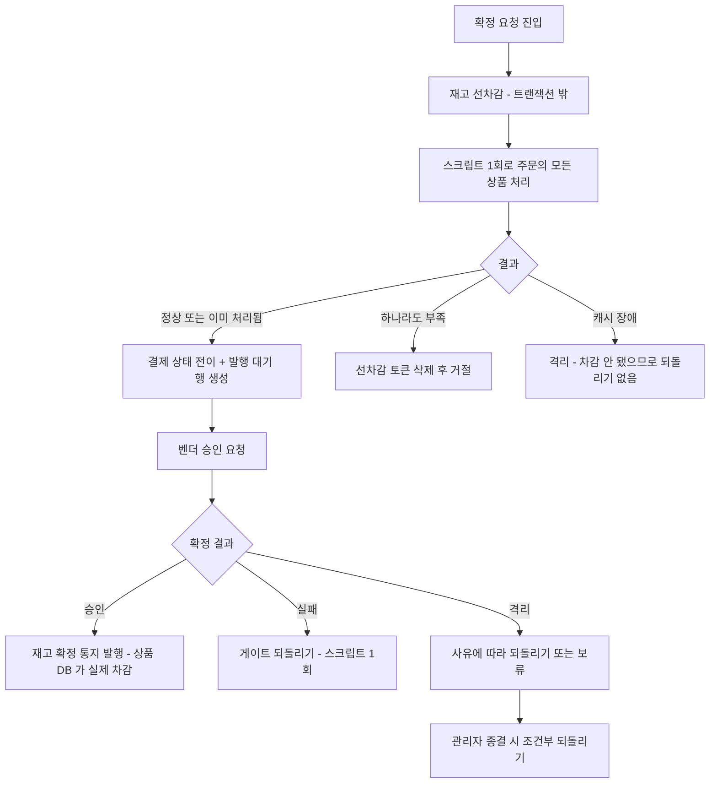
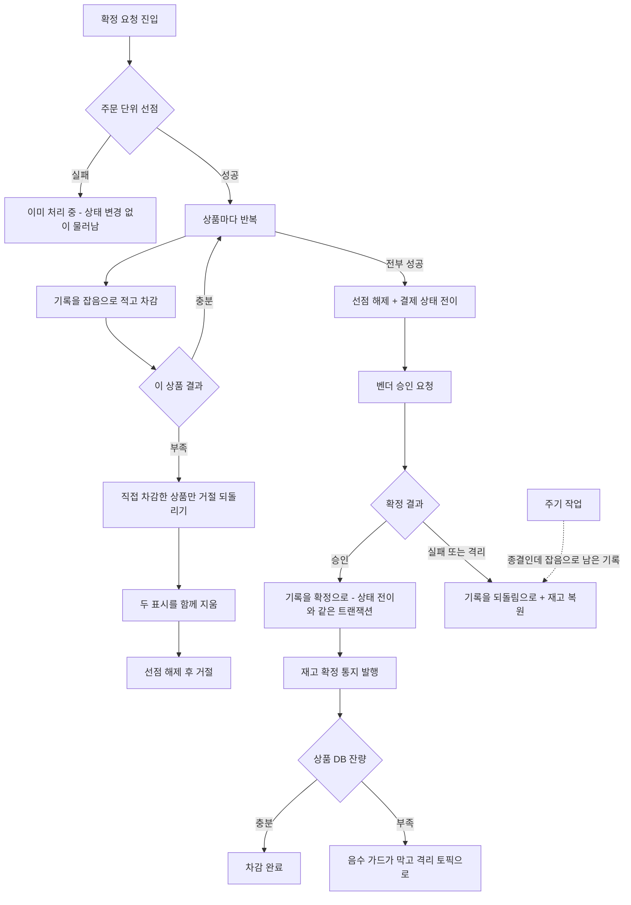
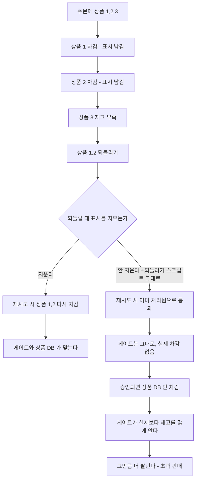
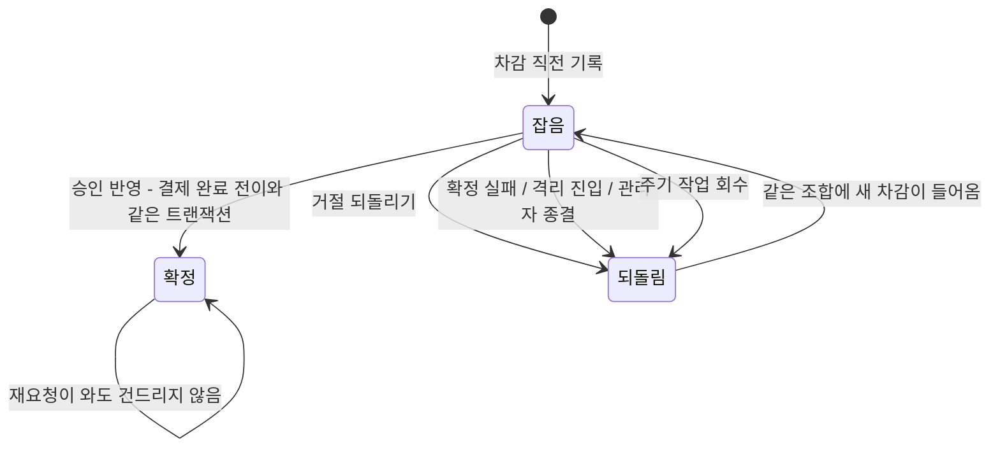
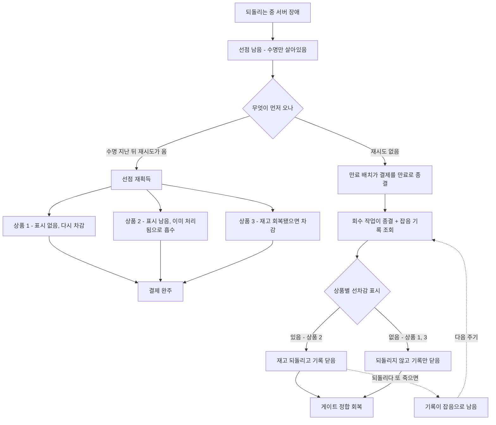

# 재고 선차감 게이트 상품 단위 분해 설계

> 최종 수정: 2026-08-15
> 후행 토픽: `SHARED-RESOURCE-SCALEOUT` (보류 중, 이 토픽 완료 후 재개)

## 사전 브리핑

### 현재 이해한 문제

재고 선차감 게이트는 한 주문의 모든 상품을 스크립트 한 번으로 묶어 차감하고 되돌린다. 이 묶음 때문에 게이트를 여러 노드로 나눌 수 없다 — 한 주문이 건드리는 키가 노드에 흩어지면 스크립트가 성립하지 않는다.

그런데 이 묶음이 지키는 것은 "여러 상품 중 일부만 차감된 상태를 만들지 않는다" 하나다. **게이트는 진짜 잔고가 아니다.** 진짜 잔고는 상품 서비스의 DB 이고 승인된 결제만 거기서 차감된다. 게이트에 일부만 차감돼 남으면 실제보다 빡빡해질 뿐, 초과 판매 방향이 아니다.

묶음을 풀고 그 되돌리기를 다른 방식으로 책임지면, 게이트를 상품 단위로 다룰 수 있다.

### 현재 시스템 동작

스크립트가 한 번에 다루는 키는 다음과 같다.

| 스크립트 | 키 구성 |
|:---:|:---:|
| 선차감 | 선차감 토큰 1개 + 상품 재고 N개 |
| 되돌리기 | 되돌리기 토큰 1개 + 상품 재고 N개 |
| 조건부 되돌리기 | 선차감 토큰 1개 + 되돌리기 토큰 1개 + 상품 재고 N개 |

토큰은 주문 단위로 하나씩이고 수명은 8일이다. 선차감 토큰이 멱등을 책임진다 — 같은 주문이 다시 들어오면 이미 처리됨으로 흡수된다.

### 이번 discuss 에서 결정하려는 것

- 상품 단위로 쪼갠 뒤, 여러 상품 중 뒤쪽이 부족할 때 앞서 차감된 것을 누가 어떻게 되돌리는가
- 그 되돌리기가 실패했을 때 게이트에 남는 차감을 무엇이 청소하는가
- 주문 단위로 하나였던 멱등 토큰을 어떻게 나누고, 부분 재진입을 어떻게 판정하는가
- 재고 부족 판정의 의미가 바뀌는 것을 어디까지 받아들이는가 — 지금은 전부 아니면 전무이고, 쪼개면 앞쪽은 이미 차감된 뒤 거절이 된다
- 되돌리기를 부르는 세 경로(확정 실패 / 격리 진입 / 관리자 종결)가 상품 단위 분해 후에도 같은 보장을 유지하는가

### 열린 질문 / 가정

- 주문에 상품이 여러 개 담기는 비중을 확인해야 한다. 실제로 대부분 하나라면 분해의 실질 위험이 작고, 흔하다면 되돌리기 설계의 무게가 커진다.
- 되돌리기 실패로 게이트가 빡빡해진 채 남는 누수를 어디까지 허용할지 정해야 한다. 이 프로젝트는 이미 같은 성격의 누수를 받아들인 이력이 있다 — 확정 진입이 실패해도 선차감 토큰을 지우지 않기로 했고, 그 차이는 재고 재동기화 쪽으로 넘겼다.
- 청소 주체 후보가 셋이다 — 수명이 다하면 저절로 풀리게 두는 방식, 미종결 차감을 훑어 되돌리는 주기 작업, 상품 DB 값으로 다시 맞추는 재동기화. 기존에 폴링 워커와 재동기화 도구가 이미 있어 어디에 얹을지 판단이 필요하다.
- 키 이름이 바뀌면 기존 캐시 데이터는 못 읽는다. 부팅 시드로 다시 심으면 되는 구조지만, 배포 중 전환을 어떻게 다룰지 정해야 한다.
- 이번 토픽을 어디까지 볼지 — 상품 단위 분해까지만 할지, 노드 분산 전환까지 이어서 할지. 후행 토픽이 분산을 다루므로 분해까지만 하는 편이 경계가 깔끔하다.
- 캐시 장애 분기는 지금 "차감이 일어나지 않았으므로 되돌리기 없음"을 전제한다. 상품 단위로 쪼개면 일부만 성공한 뒤 장애가 날 수 있어 이 전제가 깨진다.
- domain-expert 포함 — 재고 정합과 멱등이 핵심이라 도메인 검토가 필수다.

### 인터뷰에서 확정된 사항

| 항목 | 확정 |
|:---:|:---:|
| 원자성 경계 | 주문 단위에서 상품 단위로 내린다 |
| 다중 상품 주문 | 예외가 아니라 정상 경로로 제대로 다룬다 |
| 부분 차감 후 재고 부족 | 그 자리에서 되돌리고 즉시 거절한다. 지금의 즉시 거절 경험을 유지한다 |
| 되돌리기 실패 대비 | 선차감 기록을 결제 DB 에 남기고 주기 작업이 회수한다 |
| 범위 | 상품 단위 분해 + 키 이름 전환까지. 노드 분산 적용과 측정은 후행 토픽 |
| 재고 확정 음수 가드 | **이번 범위에 포함** — 재고 관리 토픽이므로 함께 다룬다 |
| 샤딩 정합 | 노드가 나뉜 구성에서도 성립해야 한다. 어느 조각도 노드 수에 의존하지 않아야 한다 |
| 키 전환 방식 | **스택을 새로 띄우며 전환한다.** 로컬 학습 환경이라 기존 캐시 데이터를 유지할 이유가 없다 — 데이터를 버리고 시드가 새 이름으로 심으면 끝난다. 진행 중 결제가 0 인 상태에서 시작하므로 이미 빠져나간 재고를 세는 계산 자체가 필요 없다 |

### 조사로 확인한 사실

- **초과 판매를 막는 장치가 게이트 하나뿐이다.** 재고 확정 차감(`StockCommitUseCase.commitToRdb`)은 현재 값에서 수량을 빼고 그대로 저장하며 음수 가드가 없다. 부족을 예외로 막는 도메인 메서드(`Product.decrementStock`)가 있으나 **프로덕션 호출처가 0이고 테스트만 부른다.**
- 재고 재동기화 도구는 관리자 수동 호출이고 진행 중 선차감을 덮어쓴다. Javadoc 이 "트래픽이 조용한 시점" 을 전제로 걸어 두었다 — 자동 청소 수단으로 쓸 수 없다.
- 선차감 흔적을 확인하고서만 되돌리는 조건부 로직(`compensateIfDecremented`)이 격리 복구용으로 이미 있다. 상품 단위 분해에서 그대로 재사용 가능하다.
- 선차감은 트랜잭션 밖에서 실행되고, 성공한 뒤에야 결제 상태 전이와 발행 대기 행 생성이 한 트랜잭션으로 묶인다.
- 토큰 수명은 8일이며 메시지 보관 기간과 정렬돼 있다.
- 되돌리기를 부르는 경로는 셋이다 — 확정 결과 실패, 격리 진입, 관리자 종결.

### 참고

- 재고 역할 분리와 알려진 한계: `docs/context/PITFALLS.md` 16
- 캐시 장애 시점 race: `docs/context/PITFALLS.md` 17
- 되돌리기 끝난 결제의 재진입: `docs/context/PITFALLS.md` 18
- 재고 재동기화 후속: `docs/context/TODOS.md` TC-3
- 후행 토픽 보류 사유: `docs/topics/SHARED-RESOURCE-SCALEOUT.md` 보류 결정 절
- 선차감 진입: `payment-service/.../application/usecase/PaymentTransactionCoordinator.java`
- 캐시 어댑터와 스크립트: `payment-service/.../infrastructure/cache/StockCacheRedisAdapter.java` , `src/main/resources/lua/`
- 재고 확정 차감: `product-service/.../application/usecase/StockCommitUseCase.java`

---

## 요약 브리핑

### 결정된 접근

재고 선차감 게이트의 원자성 경계를 주문 단위에서 상품 단위로 내린다. 스크립트 하나가 공짜로 주던 "전부 아니면 전무" 보장은 진입 경로가 지고, 되돌리다 실패한 차감은 선차감 기록과 주기 작업이 회수한다.

쪼개면서 잃는 두 가지를 따로 되살린다 — 동시 중복 요청이 하나로 수렴하게 하는 **주문 단위 선점**을 상품 반복 앞에 두고, 거절할 때 표시를 지워 재시도를 깨끗하게 만드는 기존 동작을 **거절 전용 되돌리기**로 옮긴다.

그리고 초과 판매를 막는 장치가 게이트 하나뿐이라는 사실이 조사에서 나와, 재고 확정에 음수 가드를 세우고 그 예외를 받을 격리 토픽까지 함께 만든다.

### 변경 후 동작

### 핵심 결정 목록

- 원자성 경계를 상품 단위로 내리고, 키를 상품 기준 해시태그로 묶어 노드가 나뉘어도 스크립트가 성립하게 한다
- 멱등 표시를 주문 단위 하나에서 상품별로 나눈다
- 부족을 만나면 **직접 차감한 상품만** 그 자리에서 되돌리고 거절한다. 되돌릴 때 선차감 표시와 되돌리기 표시를 **함께** 지운다
- 상품 반복 앞에 주문 단위 선점을 두고, 명시적으로 해제하되 죽는 경우를 위해 수명도 건다. 선점 실패는 결제 상태를 건드리지 않는다
- 선차감 기록을 결제 DB 에 남긴다. 상태는 잡음 / 되돌림 / 확정이고, 승인 반영 트랜잭션에서 확정으로 찍는다. 확정 행은 재요청에 훼손되지 않고 캐시 차감 호출도 건너뛴다
- 종결됐는데 잡음으로 남은 기록을 주기 작업이 회수한다. 판정은 원본 DB 를 읽는다
- 재고 확정에 음수 가드를 세우고, 상품 서비스에 격리 토픽·에러 핸들러·적체 알람을 함께 만든다
- 키 이름 전환은 스택을 새로 띄우며 한다. 캐시와 DB 볼륨을 모두 비우고 시드가 새 이름으로 심는다

### 트레이드오프 / 후속 작업

- 주문 전체의 전부-아니면-전무를 스크립트가 아니라 애플리케이션이 지므로, 되돌리기 실패가 게이트를 빡빡하게 만든다. 방향은 못 파는 쪽이라 안전하지만 회수가 없으면 쌓인다
- 되돌리는 주체가 다섯이 되어 이중 되돌리기 위험이 커진다. 상품별 되돌리기 표시가 유일한 방어라 검증에서 가장 무겁게 다룬다
- 음수 가드가 켜지면 이미 과금된 결제가 격리에 쌓일 수 있다. 자동 복구 대상이 아니라 사람이 환불이나 입고를 판단한다
- 관리자 재고 조정 때문에 발화하는 격리는 게이트 결함이 아니다. 런북에서 갈라 본다
- 노드 분산 적용과 측정은 후행 토픽(`SHARED-RESOURCE-SCALEOUT`)이 맡는다. 이번은 분산해도 성립하는 구조를 만드는 데까지다
- 캐시 왕복이 주문당 1 회에서 선점 1 + 상품 N + 해제 1 로 는다. 상품 하나짜리 주문도 3 회가 된다. 절대값은 작을 것으로 보지만 실측이 없어 측정 항목에 넣었다. 왕복을 줄이는 노드별 묶음 처리는 병목으로 드러나면 도입한다
- 선점 수명 값, 기록의 사이클 식별 값 형태, 라이브 검증 절차, 알람 임계값은 plan 에서 정한다

---

## 문제 정의

**게이트의 원자성 경계가 주문 단위라 노드로 나눌 수 없다.** 한 주문의 모든 상품 재고와 토큰을 스크립트 하나가 함께 잡는다. 키가 노드에 흩어지면 스크립트가 성립하지 않아, 게이트는 영원히 한 노드에 묶인다.

그 묶음이 지키는 것은 "여러 상품 중 일부만 차감된 상태를 만들지 않는다" 하나다. 그런데 게이트는 잔고가 아니라 확정 진입을 빠르게 거절하는 장치이고, 진짜 잔고는 상품 서비스 DB 에서 승인된 결제만 차감한다. 게이트에 일부만 차감돼 남으면 실제보다 빡빡해질 뿐 초과 판매 방향이 아니다.

**그리고 조사 중 더 무거운 사실이 나왔다 — 초과 판매를 막는 장치가 게이트 하나뿐이다.** 재고 확정 차감에 음수 가드가 없어, 게이트가 뚫리면 상품 DB 재고가 음수가 되고 아무도 모른 채 저장된다. 게이트를 손대는 이번 토픽에서 두 번째 방어선을 함께 세운다.

## 영향 범위

| 구분 | 대상 |
|:---:|:---:|
| 변경 (payment) | 재고 스크립트 3종(선차감 / 되돌리기 / 조건부 되돌리기)을 상품 단위로 재작성, 키 이름에 상품 기준 해시태그 도입 |
| 신규 (payment) | 거절 전용 되돌리기 경로 — 재고를 되돌리면서 선차감 표시와 되돌리기 표시를 함께 지운다. 기존 되돌리기는 둘 다 남기므로 재작성만으로는 얻어지지 않는 새 로직이다 |
| 신규 (payment) | 확정 진입의 주문 단위 선점 — 상품별 반복 앞에 두어 동시 중복 요청을 하나로 줄인다 |
| 변경 (payment) | 캐시 포트·어댑터를 상품 단위 호출로 재구성, 주문 단위 반복과 부분 실패 되돌리기를 진입 경로가 책임 |
| 신규 (payment) | 선차감 기록 포트 `application/port/out` + 엔티티 `infrastructure/entity` + JPA 어댑터 `infrastructure/repository` + Flyway 마이그레이션 |
| 신규 (payment) | 미회수 선차감 회수 주기 작업 `infrastructure/scheduler` + 회수 유스케이스 `application/usecase` |
| 변경 (payment) | 승인 결과 반영 경로에서 선차감 기록을 확정으로 갱신 — 결제 완료 전이·재고 확정 통지 발행과 같은 트랜잭션 |
| 변경 (product) | 재고 확정 차감에 음수 가드 |
| 신규 (product) | 소비 실패를 받는 격리 토픽 + 에러 핸들러·recoverer `infrastructure/config` — 음수 가드가 던지는 예외를 받을 곳이 없어 함께 만든다. 지금은 기본 설정이라 재시도 후 로그만 남기고 메시지가 사라진다. recoverer 는 격리 메시지에 주문번호와 상품번호로 정해지는 키를 실어 보내도록 손본다 |
| 신규 (관측) | product 격리 토픽 적체 알람 — 기존 적체 규칙에 토픽 추가 |
| 변경 (운영) | 재고 시드 스크립트의 키 이름, 격리 적체 알람 대응 분류 |
| 무관 | 벤더 호출 경로, 결제 상태 전이 규칙, 주문 접수 멱등키 저장소와 메시지 중복 판정 기록, 발행·수신 경로, 노드 분산 적용(후행 토픽) |

## 설계 옵션 비교

### 원자성 경계를 어디에 둘 것인가

- **주문 단위 유지** — 지금 구조다. 부분 차감이 구조적으로 불가능하지만 게이트가 한 노드에 묶인다. 후행 측정 토픽이 막힌 이유다.
- **상품 단위로 내린다** — 한 상품의 재고와 토큰이 같은 슬롯에 묶여 스크립트가 상품 단위로 원자적으로 돈다. 주문 전체의 전부-아니면-전무는 애플리케이션이 진다.

두 번째를 택한다. 게이트는 잔고가 아니므로 부분 차감의 대가가 못 파는 쪽이고, 그 대가를 회수 경로로 갚을 수 있다.

### 주문 단위 보장을 누가 어떻게 지는가

- **부족하면 즉시 되돌리고 거절** — 앞서 차감한 상품들을 그 자리에서 되돌린다. 재고 부족이 즉시 거절이라는 현재 경험이 유지된다. 되돌리기가 실패하면 게이트에 차감이 남는다.
- **실패 확정 경로로 넘긴다** — 거절하지 않고 결제를 실패로 종결시켜 기존 되돌리기 경로가 처리하게 한다. 새 책임을 만들지 않지만 재고 부족이 수락 후 실패로 바뀌어 사용자 경험이 달라진다.

첫 번째를 택한다. 재고 부족은 즉시 알 수 있는 조건인데 이를 비동기 실패로 미루면 사용자와 시스템 모두 손해다.

### 되돌리기 실패로 남는 차감을 무엇이 치우는가

- **감수하고 재동기화로 넘긴다** — 새로 만들 것이 없다. 그러나 재동기화는 수동이고 진행 중 선차감을 덮어쓰는 도구라 안전한 자동 청소가 아니며, 얼마나 쌓였는지 알 수단도 없다.
- **선차감 기록을 남기고 주기 작업이 회수** — 무엇을 얼마나 잡았는지 결제 DB 에 적고, 종결된 결제 중 되돌림·확정 표시가 없는 기록을 주기 작업이 되돌린다. 발행 회수·수신 회수와 같은 패턴이고 조건부 되돌리기를 재사용한다. 테이블과 작업이 하나씩 는다.
- **지표로 드러내기만** — 자동 복구를 만들지 않아 새 사고 경로가 없다. 대신 사람이 개입해야 하고 재동기화 도구의 결함이 그대로다.

두 번째를 택한다. 다중 상품 주문을 정상 경로로 다루기로 한 이상 부분 차감은 예외가 아니며, 회수가 없으면 누수가 구조적으로 쌓인다. 지표는 세 번째 안과 배타가 아니므로 함께 낸다.

### 거절할 때 선차감 표시를 어떻게 할 것인가

**되돌리기와 거절은 표시를 다르게 다뤄야 한다.** 지금 차감 스크립트는 재고가 부족하면 선차감 표시를 **지우고** 거절한다. 지우지 않으면 같은 주문이 다시 왔을 때 표시를 보고 이미 처리한 것으로 넘겨버리기 때문이다. 반면 되돌리기 스크립트는 표시를 지우지 않는다 — 결제가 끝난 뒤 되돌리는 용도라 재시도를 상정하지 않는다.

상품 단위로 쪼개면 **부분 차감을 되돌리는 자리에서 이 둘이 섞인다.** 되돌리기 스크립트를 그대로 쓰면 표시가 남고, 같은 주문번호로 재시도했을 때 그 상품은 실제 차감 없이 통과한다.

- **거절 전용 되돌리기를 따로 둔다** — 재고를 되돌리면서 선차감 표시와 되돌리기 표시를 함께 지운다. 한 사이클이 끝나면 두 표시가 같이 사라져 다음 사이클이 깨끗하게 시작한다.
- **되돌리기 스크립트를 그대로 재사용한다** — 새로 만들 것이 없지만 위 경로가 열린다.
- **선차감 표시만 지운다** — 재시도가 게이트를 지나치는 문제는 막지만, 되돌리기 표시가 8일간 남는다. 그러면 재시도가 만든 새 차감을 되돌릴 때 **조건부 되돌리기가 그 표시를 선점하지 못해 재고를 되돌리지 않고 이미 처리됨을 반환한다.** 애플리케이션은 정상 종결로 보고 기록을 닫아, 재고가 안 돌아온 채 봉인된다.

첫 번째를 택한다. 두 표시는 한 차감 사이클의 시작과 끝을 가리키므로 사이클이 무효가 되면 함께 지워져야 한다.

### 선차감 기록의 상태 전이

기록은 주문번호와 상품번호 조합마다 한 행이고 세 상태를 오간다.

회수 대상은 **결제가 종결됐는데 잡음으로 남은 행**이다. 그래서 확정 표시가 이 설계의 안전을 떠받친다 — 정상 판매된 기록이 잡음으로 남으면 주기 작업이 실제로 팔린 재고를 되돌려 게이트가 헐거워진다.

되돌림에서 잡음으로 다시 여는 전이가 필요한 이유는, 거절 후 되돌리기가 재시도를 정상 경로로 만들었기 때문이다. 닫힌 채로 두면 재시도가 만든 새 차감이 회수 대상에서 영영 빠진다.

**확정에서는 되돌아가지 않는다.** 완료된 결제에 재요청이 오는 것은 더블클릭만으로도 생기고, 그때 확정을 잡음으로 되돌리면 이미 팔린 건이 회수 대상이 된다. 결제 상태 전이가 막아 결제 자체는 진행되지 않지만, 기록은 그 전에 이미 훼손된다.

### 기록과 차감의 순서

- **기록을 먼저 적고 차감** — 차감 직후 죽어도 기록이 남아 회수 대상이 된다. 기록만 있고 차감이 없는 경우는 조건부 되돌리기가 흔적을 못 찾아 넘어가므로 무해하다.
- **차감하고 기록** — 차감 후 기록 전에 죽으면 그 차감은 회수 대상에서 사라져 영구히 묶인다.

첫 번째를 택한다. 실패 방향이 안전한 쪽으로 기운다.

### 재고 확정에서 부족을 만나면

**전제부터 정정해야 한다.** 상품 서비스에는 소비 실패를 받는 격리 토픽도 에러 핸들러도 없다. 기본 설정 그대로라 재시도를 몇 차례 한 뒤 로그만 남기고 다음 레코드로 넘어간다 — **메시지가 조용히 사라진다.** 그 메시지는 이미 벤더 승인이 나 고객이 과금된 결제의 확정 통지다.

- **예외로 멈추되 받을 곳을 함께 만든다** — 격리 토픽과 에러 핸들러를 신설하고 적체 알람을 건다. 토픽 범위가 늘지만 결제 서비스에 같은 패턴이 있어 옮겨오면 된다. 음수 가드가 제 구실을 하려면 이것이 전제다.
- **드러내기만 하고 멈추지 않는다** — 부족을 감지하면 오류 로그와 지표를 내고 차감은 진행한다. 범위가 작고 메시지 유실도 파티션 멈춤도 없지만, 재고는 여전히 음수가 된다. 막는 것이 아니라 알리는 것까지다.
- **0 으로 잘라 저장** — 음수는 막지만 얼마나 초과됐는지 흔적이 사라진다. 조용한 사고를 다른 형태로 남길 뿐이다.

첫 번째를 택한다. 초과 판매는 드러나야 하는 사고이고, 받을 곳 없이 예외만 던지면 막으려던 사고가 흔적 없이 사라진다.

### 키 이름 전환

**돌아가는 중에 바꾸려 하면 어려워진다.** 진행 중인 결제는 옛 이름으로 이미 선차감을 끝냈는데 상품 DB 에는 아직 반영되지 않았다. 상품 DB 값을 그대로 새 이름에 심으면 그 수량이 두 번 팔린다. 그래서 이미 빠져나간 몫을 세서 빼야 하는데, 그 셈이 계속 틀린다 — 승인은 났지만 상품 DB 반영이 아직인 건, 확정 통지가 격리에 갇힌 건이 양쪽 어디에도 잡히지 않는다.

- **스택을 새로 띄우며 전환한다** — 로컬 학습 환경이라 기존 캐시 데이터를 지킬 이유가 없다. 데이터를 버리고 시드가 새 이름으로 심는다. 진행 중 결제가 0 이므로 셀 것도 뺄 것도 없다.
- **돌아가는 중에 바꾼다** — 확정 진입을 막고, 확정 통지 소비를 기다리고, 미회수 선차감을 세서 뺀 값을 심는다. 무중단이 필요할 때 쓰는 방식이지만 위 사각들을 하나씩 다 막아야 하고 그 셈이 한 번만 틀려도 초과 판매가 남는다.
- **두 이름을 병행** — 두 이름이 같은 재고를 가리키는 동안 차감이 갈라져 게이트가 이중으로 헐거워진다.

첫 번째를 택한다. 무중단이 목표가 아닌 환경에서 굳이 어려운 쪽을 고를 이유가 없다.

## 결정 사항

| 항목 | 결정 | 이유 | 기각한 대안 |
|:---:|:---:|:---:|:---:|
| 원자성 경계 | 상품 단위 | 게이트는 잔고가 아니라 부분 차감의 대가가 못 파는 쪽이고, 회수로 갚을 수 있다 | 주문 단위 유지 — 게이트가 한 노드에 영구히 묶인다 |
| 키 구성 | 재고·선차감 토큰·되돌리기 토큰 모두 상품 기준 해시태그로 묶는다 | 한 상품에 속한 키가 같은 슬롯에 모여 노드가 나뉘어도 스크립트가 원자적으로 돈다 | 주문 기준 태그 — 재고 키가 주문마다 갈라져 재고 개념이 깨진다 |
| 멱등 토큰 | 주문 단위 하나에서 상품별로 나눈다 | 상품 단위 재진입을 정확히 흡수하고, 되돌리기 주체가 둘이 되는 이번 설계에서 이중 되돌리기를 막는 유일한 장치다 | 주문 단위 유지 — 상품별 부분 재진입을 판정할 수 없다 |
| 주문 전체 보장 | 부족을 만나면 앞서 차감한 상품을 즉시 되돌리고 거절한다 | 재고 부족은 즉시 알 수 있는 조건이다 | 실패 확정 경로 위임 — 즉시 거절이 수락 후 실패로 바뀐다 |
| 되돌리기 방식 | 선차감 흔적이 있을 때만 되돌린다 | 차감하지 않은 것을 되돌리면 게이트가 헐거워져 초과 판매 방향이 된다 | 무조건 되돌리기 — 유령 재고를 만든다 |
| 거절할 때의 선차감 표시 | 재고를 되돌리면서 **선차감 표시와 되돌리기 표시를 둘 다** 지우는 전용 경로를 둔다 | 선차감 표시가 남으면 재시도가 이미 처리됨으로 통과해 실제 차감 없이 승인된다. 그렇다고 선차감 표시만 지우면, 되돌리기 표시가 8일간 남아 **재시도가 만든 새 차감을 되돌릴 때 그 표시에 막혀 재고가 돌아오지 않는다** — 조건부 되돌리기는 되돌리기 표시를 선점해야 재고를 되돌리기 때문이다. 두 표시를 한 사이클로 묶어 함께 초기화한다 | 되돌리기 스크립트 재사용 — 선차감 표시가 남아 재시도가 게이트를 지나친다 / 선차감 표시만 삭제 — 다음 사이클의 되돌리기가 조용히 무력화된다 |
| 누수 회수 | 선차감 기록 + 주기 작업 | 다중 상품을 정상 경로로 다루면 부분 차감이 상시 발생하고, 회수가 없으면 누수가 구조적으로 쌓인다 | 재동기화 위임 — 수동이고 진행 중 선차감을 덮어쓰는 도구다 |
| 기록·차감 순서 | 기록을 먼저 적는다 | 차감 후 죽어도 회수 대상으로 남는다. 반대 순서는 고아 차감을 만든다 | 차감 후 기록 — 실패가 위험한 방향으로 기운다 |
| 회수 판정 기준 | 결제가 종결이고 되돌림·확정 표시가 없는 기록 | 진행 중인 결제를 되돌리면 게이트가 헐거워진다 | 나이만으로 판정 — 느린 결제를 진행 중에 되돌린다 |
| 회수 워커의 상태 읽기 | 원본 DB 를 읽는다 | 낡은 상태로 종결을 오판하면 진행 중 차감을 되돌린다. 후행 토픽의 읽기 복제 도입과 충돌하지 않도록 지금 못박는다 | 미지정 — 후행 토픽에서 복제본으로 새어 들어갈 여지가 생긴다 |
| 재고 확정 음수 가드 | 부족하면 예외로 멈춘다 | 초과 판매는 드러나야 하는 사고다. **동시성에서 안전한 이유는 재고 확정 통지가 상품번호로 나뉘어 같은 상품의 커밋이 한 줄로 처리되기 때문이다** — 읽고 빼서 저장하는 코드 자체에는 잠금이 없으므로, 나눔 기준을 바꾸면 이 가드가 막으려던 경로가 되살아난다 | 0 으로 자르기 — 초과분 흔적이 사라진다 / 로그만 남기고 진행 — 재고가 여전히 음수가 된다 |
| 상품 서비스 소비 실패 처리 | 격리 토픽과 에러 핸들러를 함께 신설하고 적체 알람을 건다 | **상품 서비스에는 지금 이것이 없다.** 기본 설정이라 재시도 후 로그만 남기고 메시지가 사라진다 — 이미 과금된 결제의 확정 통지가 그렇게 된다. 음수 가드가 제 구실을 하려면 전제 조건이다 | 가드만 넣기 — 막으려던 사고가 흔적 없이 사라진다 |
| 키 이름 전환 | 스택을 새로 띄우며 전환한다. **캐시와 DB 볼륨을 모두 비우고** 시드가 새 이름으로 심는다 | 로컬 학습 환경이라 데이터를 지킬 이유가 없다. DB 까지 비워야 진행 중 결제가 0 임이 저절로 보장되고, 이미 빠져나간 재고를 세서 빼는 계산이 필요 없어진다. 캐시만 비우면 결제 기록이 남아 in-flight 확인이 사람 몫이 된다 | 돌아가는 중에 전환 — 진입 차단·확정 통지 대기·미회수 계산을 다 갖춰야 하고 셈이 한 번만 틀려도 초과 판매가 남는다 / 캐시만 초기화 — 진행 중 결제 유무를 사람이 확인해야 한다 / 두 이름 병행 — 차감이 갈라져 게이트가 이중으로 헐거워진다 |
| 선차감 기록 쓰기 | 주문번호와 상품번호에 유일 제약을 걸고, 행이 이미 있으면 잡음으로 되돌린다. **단 확정 상태는 건드리지 않는다** | 행이 여럿 쌓이면 회수 판정이 어긋나고, 닫힌 행을 그냥 두면 새 차감이 회수 대상에서 빠진다. 그렇다고 확정까지 되돌리면 **이미 팔린 건이 회수 대상이 되어 게이트에서만 재고가 되살아난다** — 완료된 결제에 재요청이 오는 것은 더블클릭만으로도 생기는 흔한 경우다 | 무제약 삽입 — 행이 늘어 회수 판정이 무너진다 / 중복 무시 — 닫힌 행 뒤의 재차감이 고아로 남는다 / 확정까지 되돌리기 — 팔린 재고를 게이트에서 되살려 초과 판매가 된다 |
| 확정 행에 재요청이 올 때 | 기록이 확정이면 **캐시 차감 호출 자체를 건너뛴다** | 기록만 안 건드리고 차감을 부르면, 표시 수명이 다한 뒤에는 선점이 성공해 **이미 팔린 상품에 진짜 신규 차감이 일어난다.** 그 차감은 기록이 확정으로 못박혀 있어 회수 대상 조건에 영영 걸리지 않는다 — 다른 누수는 다 닫으면서 이 경로만 설계상 열어 두는 셈이다. 기록을 보고 판단하므로 표시 수명에 기대지 않는다 | 차감을 부르되 기록만 보존 — 표시가 만료된 뒤 영구 사각이 생긴다 |
| 동시 중복 요청 차단 | 상품별로 쪼개기 **전에 주문 단위 선점을 한 번 잡는다.** 못 잡으면 이미 처리 중으로 보고 물러난다 | 지금 스크립트는 재고를 보기 전에 주문 단위 표시를 먼저 선점해, 지는 쪽이 재고 판정 자체를 못 본다 — 동시 중복 요청이 "한쪽 거절, 한쪽 성공" 으로 갈리는 것이 구조적으로 불가능했다. 상품별로 쪼개면 그 보장이 사라져 **상품마다 승자가 갈리고, 거절된 쪽이 되돌린 재고를 진행 중인 쪽이 여전히 필요로 한다.** 선점을 앞에 두면 그 보장이 되살아난다 | 선점 없이 진행 — 클라이언트가 거절을 받았는데 다른 요청이 승인돼 과금되거나, 풀린 재고를 제3의 주문이 가져가 둘이 같은 재고를 각자 확보했다고 믿는다 |
| 선점 해제 방식 | 상품 반복이 끝나면 **명시적으로 푼다.** 그 사이 프로세스가 죽는 경우에 대비해 수명도 함께 걸되, 그것은 회수용 backup 이지 주 해제 수단이 아니다 | 선점이 이제 여러 호출에 걸친 구간이라 수명만으로 잡으면 처리가 그 시간을 넘길 때 두 번째 요청이 재획득해 **같은 주문의 상품 반복이 둘 돌게 된다** — 이번에 막으려던 레이스가 그대로 돌아온다. 발행 대기 행 선점이 이미 명시적 해제와 타임아웃 회수를 함께 쓰는 것과 같은 형태다. 수명 값은 plan 에서 정한다 | 수명만으로 해제 — 처리가 길어지면 재획득이 일어나 레이스가 재발한다 / 명시적 해제만 — 프로세스가 죽으면 그 주문이 영영 막힌다 |
| 선점 실패 시 응답 | **결제 상태를 건드리지 않고 물러난다.** 재고 부족이나 캐시 장애와 다른 분기다 | 진 쪽이 재고 부족과 같은 취급을 받으면 진행 중인 이긴 쪽의 결제를 실패로 덮어쓴다. 동시 발행에서 진 쪽을 상태 변경 없이 물러나게 하는 기존 처리와 대칭이다 | 재고 부족 분기로 흡수 — 승자의 결제를 진 쪽이 실패로 만든다 |
| 되돌리기 후보 판정 | 이번 요청이 **직접 차감에 성공한 상품만** 되돌린다. 이미 처리됨을 받은 상품은 대상에서 뺀다 | 주문 단위 선점이 동시 요청을 막지만, 선점이 풀린 뒤의 재시도나 회수 경로에서는 여전히 남의 흔적을 볼 수 있다. 흔적 유무만 보는 판정으로는 내 것과 남의 것을 구분할 수 없다 | 흔적만 보고 되돌리기 — 남의 차감을 되돌려 게이트가 헐거워진다 |
| 기록 닫기 경합 | 되돌린 주체가 자기 사이클의 행만 닫는다. **그 판별을 위해 기록에 사이클을 식별하는 값을 둔다** | 캐시 되돌리기와 기록 닫기 사이에 새 차감이 들어와 행이 잡음으로 되살아났는데, 뒤늦은 닫기가 그걸 덮으면 새 차감이 회수 대상에서 사라진다. 상태값만으로는 "내가 연 잡음" 과 "그사이 새로 열린 잡음" 을 구분할 수 없어 결국 덮어쓰기와 같아진다. 값의 형태는 plan 에서 정하되 필요하다는 것은 여기서 못박는다 | 상태값만으로 조건부 갱신 — 두 잡음을 구분하지 못해 뒤늦은 닫기가 새 차감을 지운다 |
| 격리 적재 중복 제거 | 격리 메시지에 주문번호와 상품번호로 정해지는 키를 실어 같은 사고가 한 건으로 보이게 한다 | 음수 가드가 예외를 던지면 중복 판정 기록도 함께 롤백돼 재전송마다 새 이벤트로 처리된다. 결제 쪽 재발행까지 겹치면 같은 사고가 여러 건으로 쌓여 환불·입고가 이중 실행될 수 있다 | 메시지 단위 처리 — 같은 초과 판매 1 건에 조치가 두 번 나간다 |
| 음수 가드 예외 분류 | 재고 부족 예외를 재시도 대상에서 제외해 곧바로 격리로 보낸다 | 재고 부족은 재시도로 풀리지 않는다. 재시도 대상에 두면 격리 도달이 늦어지고 로그만 늘어난다 | 기본 분류 — 풀리지 않을 재시도를 반복한다 |
| 격리 알람 분류 | 관리자 재고 조정 직후 발화한 건을 구분할 기준을 런북에 명시한다 | 관리자가 재고를 조정하면 게이트와 상품 DB 가 갈라지는 것은 이미 받아들인 정상 경로이고, 그것이 초과 판매로 이어지면 새 가드가 똑같이 발화한다. 구분이 없으면 반복 무시되어 진짜 사고를 놓친다 | 단일 알람 — 경보 피로로 이번에 확보한 가시성이 무력해진다 |
| 캐시 장애 판정 | 상품 중 하나라도 차감에 성공한 뒤 장애가 나면 되돌리기를 시도하고, 실패해도 격리로 보낸다 | 현재 전제("차감이 일어나지 않았으므로 되돌릴 것 없음")가 상품 단위에서 깨진다 | 현재 전제 유지 — 부분 차감이 회수되지 않고 남는다 |
| 선차감 기록 단위 | 주문번호와 상품번호의 조합을 키로 상품마다 한 행 | 되돌리기와 회수가 상품 단위로 일어나므로 기록도 같은 단위여야 부분 회수를 표현할 수 있다 | 주문 단위 한 행 — 어느 상품이 회수됐는지 표현할 수 없어 부분 실패를 다루지 못한다 |
| 선차감 기록 상태값 | 잡음 / 되돌림 / 확정 세 가지 | 회수 대상은 종결된 결제의 "잡음" 행이다. 되돌림과 확정을 하나로 묶으면 되돌린 건과 실제 팔린 건이 구분되지 않아 회수 판정과 정합 확인이 흐려진다 | 두 값(잡음·완료) — 되돌린 것과 팔린 것이 섞인다 |
| 확정 표시 시점 | 벤더 승인 결과를 반영해 결제를 완료로 전이시키고 재고 확정 통지를 발행하는 **그 트랜잭션 안에서** 기록을 확정으로 갱신한다 | 이것이 없으면 정상 판매된 기록이 잡음으로 남아 **주기 작업이 실제로 팔린 재고를 되돌린다** — 게이트가 헐거워져 초과 판매가 된다. 종결 전이와 같은 트랜잭션이라 회수 작업이 종결을 본 시점에는 확정도 이미 커밋돼 있어 경합이 없다 | 상품 서비스 반영 확인 후 표시 — 반영을 확인할 채널이 없다 / 별도 트랜잭션 — 종결과 확정 표시가 갈라져 그 사이에 회수가 끼어든다 |
| 신규 컴포넌트 배치 | 기록 포트는 `application/port/out`, 엔티티는 `infrastructure/entity`, JPA 어댑터는 `infrastructure/repository`, 주기 작업은 `infrastructure/scheduler`, 회수 판정은 `application/usecase` | 기존 결제 이벤트·발행 대기 행이 엔티티와 어댑터를 나눠 두는 관례를 그대로 따른다 | 미결정으로 두기 — 구현 단계에서 임의 배치된다 / 엔티티를 어댑터와 같은 패키지에 두기 — 기존 관례와 어긋난다 |
| 라이브 검증 | 범위에 포함한다 | 키 이름 전환은 통합 테스트로 잡히지 않는다 — 테스트는 새 이름으로 심고 새 이름으로 읽어 항상 통과하지만, 실제 스택에서 시드가 옛 이름으로 심으면 게이트가 재고를 0 으로 보고 전부 거절한다 | 통합 테스트만 — 배포 구성 결함이 드러나지 않는다 |

## 장애 시나리오와 대응

### 되돌리는 중 서버가 죽으면

표 한 줄로는 흐름이 보이지 않아 따로 그린다. 상품 1·2·3 을 차감하다 3 이 부족해 1·2 를 되돌리는데, 1 을 되돌린 뒤 2 를 되돌리다 죽었다고 하자.

| | 재고 | 선차감 표시 | 기록 |
|:---:|:---:|:---:|:---:|
| 상품 1 | 복원됨 | 지워짐 | 되돌림 (닫기 직전이면 잡음) |
| 상품 2 | 차감된 채 | 남음 | 잡음 |
| 상품 3 | 그대로 | 없음 | 잡음 |

결제는 대기, 주문은 시작 전이다 — 상품 반복이 다 끝나야 상태가 바뀐다. 선점은 명시적 해제를 못 했으니 수명이 다할 때까지 남는다.

**기록을 차감보다 먼저 적기 때문에 어느 시점에 죽든 기록이 남고, 그것이 회수의 근거가 된다.**

두 갈래 모두 안전한 방향으로 수렴한다.

- 재시도가 오는 쪽이 빠르다. 만료를 기다리지 않고 그 자리에서 완주한다
- 재시도가 없으면 만료 뒤 회수가 정리한다. 그동안 상품 2 가 게이트에 묶여 있을 뿐 초과 판매 방향이 아니다
- 되돌린 직후 기록을 닫기 전에 죽어도 무해하다 — 그 기록은 잡음으로 남아 회수 대상이 되는데, 표시가 이미 지워졌으니 회수가 재고를 건드리지 않고 기록만 닫는다. 이중 복원이 나지 않는다
- 회수가 되돌리다 또 죽어도 기록이 잡음 그대로라 다음 주기에 다시 집는다

| 시나리오 | 대응 |
|:---:|:---:|
| 부분 차감 후 되돌리기 중 캐시가 죽는다 | 게이트에 차감이 남는다. 기록이 이미 있으므로 주기 작업이 회수한다. 회수 전까지는 게이트가 빡빡할 뿐 초과 판매 방향이 아니다 |
| 확정 결과 경로와 주기 작업이 같은 차감을 동시에 되돌린다 | 상품별 되돌리기 토큰을 먼저 선점한 쪽만 성공한다. **이 설계 전체의 안전이 걸린 지점이라 동시 실행 테스트로 고정한다** |
| 주기 작업이 진행 중 결제를 종결로 오판한다 | 원본 DB 를 읽어 판정한다. 종결 상태만 대상으로 삼고, 판정과 되돌리기 사이 경합은 조건부 되돌리기가 흡수한다 |
| 기록만 있고 차감이 없다 | 조건부 되돌리기가 선차감 흔적을 못 찾아 되돌리지 않는다. 기록은 되돌림으로 표시하고 종료한다 — 되돌릴 것이 없었다는 뜻이지 팔렸다는 뜻이 아니므로 확정과 구분한다 |
| 상품 중간에 캐시 장애가 난다 | 이미 차감된 상품을 되돌리려 시도하고, 실패해도 격리로 보낸다. 기록이 남아 있어 회수된다 |
| 노드가 나뉜 구성에서 일부 노드가 죽는다 | 그 노드가 맡은 상품의 차감·되돌리기만 실패한다. 다른 상품은 정상이며, 실패한 상품은 기록에 남아 회수 대상이 된다 |
| 재고 확정에서 부족을 만난다 | 예외로 멈추고 재시도 없이 곧바로 이번에 신설하는 격리 토픽으로 간다. 재시도로 풀릴 조건이 아니다. 적체 알람으로 드러나고 사람이 환불·입고를 판단한다 |
| 부분 차감을 되돌린 뒤 같은 주문번호로 재시도가 온다 | 거절 경로가 선차감 표시와 되돌리기 표시를 함께 지웠으므로 그 상품은 다시 차감되고, 그 차감을 나중에 되돌릴 수도 있다. 선차감 표시를 남기면 이미 처리됨으로 통과해 실제 차감 없이 승인되고, 되돌리기 표시를 남기면 다음 사이클의 되돌리기가 재고를 못 돌린다 — 둘 다 초과 판매 방향이라 검증에서 무겁게 고정한다 |
| 키 전환 시점에 진행 중 결제나 격리 건이 남아 있다 | 스택을 새로 띄우며 전환하므로 진행 중 건이 0 이다. 기존 캐시 데이터는 버리고 시드가 새 이름으로 심는다 |
| 선점을 잡은 뒤 상품 반복 도중 프로세스가 죽는다 | 명시적 해제가 실행되지 못하므로 선점이 남는다. 함께 걸어 둔 수명이 지나면 풀려 재시도가 가능해진다 — 그때까지 그 주문의 확정은 물러난다. 남은 차감은 기록에 있어 회수 대상이 된다 |
| 상품 루프 도중 프로세스가 죽는다 | 캐시 장애와 다른 경우다. 애플리케이션이 되돌리기를 시도할 기회조차 없다. 주문은 루프 전체가 끝난 뒤에야 실행 중으로 바뀌므로 시작 전 상태에 머물고, 기존 만료 경로가 결제를 종결시킨 뒤 회수 워커가 남은 상품별 기록을 정리한다. **주문 상태를 상품별로 부분 전이시키면 이 수렴이 깨지므로 구현에서 금지한다** |
| 같은 초과 판매가 격리 토픽에 여러 번 쌓인다 | 격리 메시지에 주문번호와 상품번호로 정해지는 키를 실어 한 건으로 묶어 본다. 관리자 조치가 같은 사고에 두 번 나가지 않게 한다 |
| 관리자 재고 조정 때문에 음수 가드가 발화한다 | 기존에 받아들인 발산 경로이지 게이트 결함이 아니다. 런북에 분류 기준을 두어 이 경우와 게이트 자체 결함을 갈라 본다 |
| 되돌리기 토큰 수명이 다한 뒤 같은 주문이 재진입한다 | 기존 한계와 성격이 같다. 상품 단위로 쪼개도 판정 구조가 동일하므로 새 위험이 생기지 않는다 |
| 주기 작업이 아예 돌지 않는다 | 누수가 쌓이지만 방향은 못 파는 쪽이다. 작업 실행 여부와 미회수 건수를 지표로 내보내 침묵을 탐지한다 |
| 기록은 확정인데 재고 확정 통지가 유실됐다 | 상품 DB 에 반영되지 않은 채 게이트 차감만 남는다. 회수 대상이 아니므로 게이트가 그만큼 빡빡한 채로 간다 — 방향은 안전하다. 통지 유실 자체는 기존 격리 토픽과 재주입 경로가 다루는 문제다 |

## 검증 전략

- **이중 되돌리기 방지를 최우선으로 고정한다.** 되돌리는 주체는 다섯이다 — 확정 결과 실패, 격리 진입, 관리자 종결, 신설 주기 작업, 그리고 이번에 만드는 거절 전용 되돌리기. **다섯 주체의 모든 짝**에 대해 같은 선차감을 동시에 되돌리려 할 때 재고가 정확히 한 번만 복원되는지 반복 실행으로 확인한다. 일부 조합만 검증하면 나머지가 구현에서 누락된다.
- 같은 주문번호로 확정 요청이 동시에 둘 들어와 같은 상품에서 동시에 거절 후 되돌리기를 시도해도 재고가 한 번만 복원되는지 확인한다. 거절 경로가 흔적 확인을 거쳐 되돌리는 구조여야 성립하므로, 그 구조를 계약으로 고정한다.
- 부분 차감 후 재고 부족에서 앞서 차감한 상품이 모두 되돌아오고 거절이 반환되는지 고정한다.
- **정상 승인되어 종결된 결제의 기록이 확정으로 남아 회수 대상에서 빠지는지 고정한다.** 확정 표시가 없으면 주기 작업이 실제로 팔린 재고를 되돌려 게이트가 헐거워진다 — 회수 메커니즘 전체가 이 표시 위에 서 있다.
- 되돌리기가 실패한 상태를 만들고, 주기 작업이 그 기록을 찾아 회수하는지 확인한다. 회수 후 기록이 되돌림으로 표시되어 두 번 회수되지 않는 것까지 본다.
- 기록만 있고 차감이 없는 경우 되돌리기가 일어나지 않는지 확인한다.
- 상품별 멱등을 고정한다 — 같은 주문의 같은 상품이 다시 들어와도 차감이 한 번만 일어난다.
- 재고 확정 음수 가드가 부족을 예외로 막고, **그 메시지가 신설 격리 토픽에 실제로 도달하는지** 확인한다. 받을 곳이 없으면 가드가 사고를 막는 것이 아니라 지우므로, 가드와 격리 도달을 한 검증으로 묶는다.
- 상품 서비스 소비가 반복 실패해도 그 파티션의 뒤따르는 정상 메시지가 계속 처리되는지 확인한다.
- **부분 차감을 되돌린 뒤 같은 주문번호로 재시도했을 때 그 상품이 다시 차감되는지 고정한다.** 거절 경로가 선차감 표시를 지우지 않으면 이미 처리됨으로 통과해 게이트만 안 줄어든다 — 초과 판매 방향이라 이 항목을 이중 되돌리기 다음으로 무겁게 둔다.
- 확정 진입 재시도로 같은 주문과 상품 조합이 여러 번 들어와도 선차감 기록이 한 행만 남는지 확인한다. 행이 늘면 미회수 합산이 부풀어 회수 판정이 어긋난다.
- **거절 후 되돌린 결제에 늦은 확정 요청이 들어와 재고를 다시 차감하는 흐름을 끝까지 태운다.** 기록이 다시 열리는 것만 보지 말고, **그 두 번째 차감이 실제로 재고까지 되돌아오는지**를 단정한다. 되돌리기 표시가 앞 사이클에서 남아 있으면 되돌리기가 이미 처리됨을 반환하고 재고는 그대로인데, 기록만 확인하는 테스트는 그 상태에서도 통과한다.
- 캐시 되돌리기는 끝났는데 기록 닫기 전인 창에 새 차감이 들어오는 경우를 만들어, 뒤늦은 닫기가 그 차감을 덮지 않는지 확인한다.
- **완료된 결제에 재확정 요청이 들어와도 기록이 확정으로 남는지 단정한다.** 행 개수만 세는 검증은 확정이 잡음으로 훼손된 상태에서도 통과한다.
- **같은 주문번호로 확정 요청을 동시에 둘 보내 하나만 진행되는지 고정한다.** 주문 단위 선점이 없으면 상품마다 승자가 갈려, 거절된 쪽이 되돌린 재고를 진행 중인 쪽이 여전히 필요로 하는 상태가 된다. 진 쪽이 결제 상태를 바꾸지 않는 것까지 단정한다 — 바꾸면 승자의 결제를 덮어쓴다.
- 상품 반복이 끝나면 선점이 실제로 풀려 다음 요청이 진행할 수 있는지 확인한다. 반복 도중 강제 종료시킨 뒤에는 수명이 지나야 풀리는지도 본다.
- 선점이 풀린 뒤의 재시도나 회수 경로에서, 되돌리기가 이번 요청이 직접 차감한 상품만 대상으로 삼는지 확인한다.
- 완료된 결제에 재확정 요청이 들어올 때 **캐시 차감 호출 자체가 일어나지 않는지** 단정한다. 표시 수명이 다한 뒤에도 마찬가지여야 한다 — 호출되면 선점이 성공해 이미 팔린 상품에 새 차감이 생기고, 그 차감은 회수 대상에 영영 걸리지 않는다.
- **상품 루프 도중 프로세스를 강제 종료시키고 수렴을 확인한다** — 주문이 시작 전 상태에 머물러 기존 만료 경로로 종결되고, 회수 워커가 남은 상품별 기록을 정리하는 체인 전체를 태운다. 주문 상태가 상품별로 부분 전이되지 않는 것까지 단정한다.
- 같은 초과 판매가 재전송으로 여러 번 격리에 쌓여도 주문번호와 상품번호로 한 건으로 묶여 보이는지 확인한다.
- 노드가 나뉜 구성에서 위 검증이 동일하게 통과하는지 확인한다. 노드 수를 바꿔도 결과가 같아야 한다 — 이것이 후행 토픽의 전제다.
- **분해 전후로 확정 요청 지연을 재서 남긴다.** 캐시 왕복이 주문당 1 회에서 선점 1 + 상품 N + 해제 1 로 늘어난다. 상품이 하나뿐인 주문도 3 회가 된다. 절대값은 작을 것으로 보지만 실측한 적이 없고, 후행 측정 토픽이 이 경로를 다시 재므로 기준선이 된다.
- 여러 상품이 담긴 주문으로 정상 흐름과 부분 실패 흐름을 모두 태운다. 주문당 상품 1개만 검증하면 이번 분해의 핵심이 검증되지 않는다.
- 재고 정합을 상품별로 확인한다. 게이트 값과 상품 DB 값의 차이가 진행 중 선차감 합과 일치해야 한다.
- 전체 회귀를 캐시 없이 재실행한다.
- **라이브 검증** — 스택을 실제로 띄워 다음을 확인한다. 통합 테스트가 구조적으로 놓치는 구간이다.
    - 재고 시드 스크립트가 새 키 이름으로 심고, 게이트가 그 값을 읽어 정상 통과시키는지. 시드와 조회가 서로 다른 이름을 쓰면 게이트가 재고를 0 으로 보고 전부 거절하는데, 테스트는 양쪽 다 새 이름을 쓰므로 항상 통과한다
    - 여러 상품이 담긴 주문으로 결제를 끝까지 태워 상품별 차감과 재고 확정이 맞는지
    - 회수 주기 작업이 실제로 기동해 도는지. 스케줄러가 활성화되지 않아 작업이 영영 실행되지 않은 선례가 있다
    - 재고 확정 음수 가드에 걸린 메시지가 격리 토픽까지 도달하는지

## 제외 범위

- **노드 분산 적용과 측정** — 후행 토픽(`SHARED-RESOURCE-SCALEOUT`)이 맡는다. 이번은 분산해도 성립하는 구조를 만드는 데까지다.
- **재고 재동기화 도구의 진행 중 선차감 가드** — 미해결 항목에 이미 올라 있고, 상품별 격리 조회가 선결이라 범위가 다르다.
- **예약 모델 전환** — 차감 대신 수명 있는 예약을 걸고 가용을 계산하는 방식. 게이트 판정 구조를 통째로 바꾸는 규모다.
- **상품 DB 의 입고·관리자 변경 경로** — 게이트와 잔고가 발산하는 다른 축이고 재동기화 정책 쪽 문제다.
- **되돌리기 토큰 수명 이후 재진입 차단** — 기존 한계이며 이번 분해가 성격을 바꾸지 않는다.
- **격리 복구 경로의 되살리기** — 별도 토픽으로 이미 분리돼 있다.
- **돌아가는 중의 키 전환** — 스택을 새로 띄우며 바꾼다. 무중단이 목표가 아닌 환경이고 전환은 한 번뿐이라, 진입 차단과 미회수 계산을 갖출 이유가 없다. 운영 중 전환이 필요해지면 그때 별도 설계가 필요하다.
- **저절로 종결되지 않는 결제의 해소** — 격리 백로그와 대기 잔류는 이번 범위 밖이다. 새로 띄우며 전환하므로 이 토픽의 전제에 걸리지 않는다.
- **상품 서비스 격리 토픽의 자동 재주입** — 이번에는 받아서 쌓고 알리는 데까지다. 이미 과금된 결제의 재고 부족은 환불이든 입고든 사람이 판단할 문제라 자동 복구 대상이 아니다.
- **노드별 묶음 처리** — 상품 기준 해시태그를 쓰면 **같은 노드에 떨어진 상품들은 한 스크립트로 묶을 수 있다.** 그러면 왕복이 상품 수가 아니라 노드 수에 비례해, 상품 10개짜리 주문도 노드 3대면 최대 3회다. 이번에는 상품마다 한 번씩 부르는 단순한 형태로 만들고, 왕복이 실제로 병목으로 드러나면 그때 도입한다 — 미리 넣으면 원자성이 그룹 안에서만 성립하는 구조가 더해져 복잡도만 올라간다.
