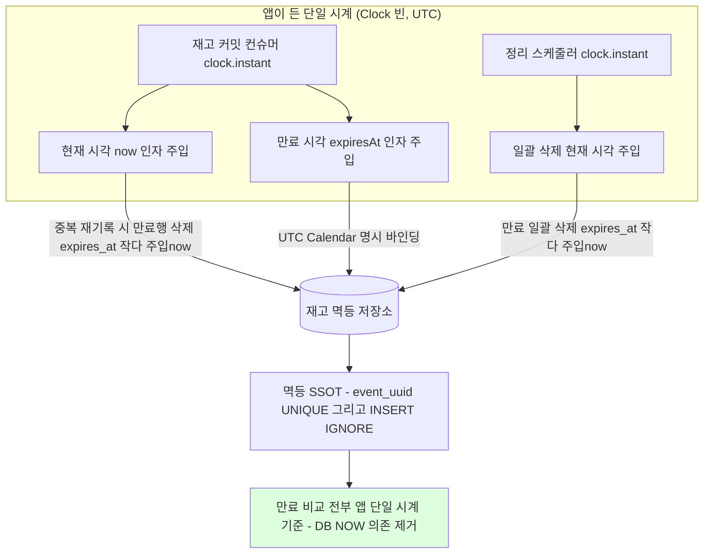
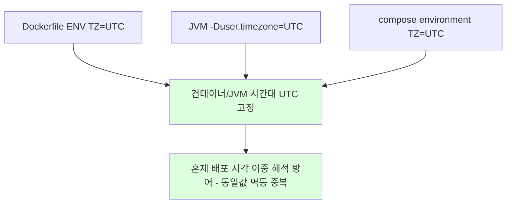
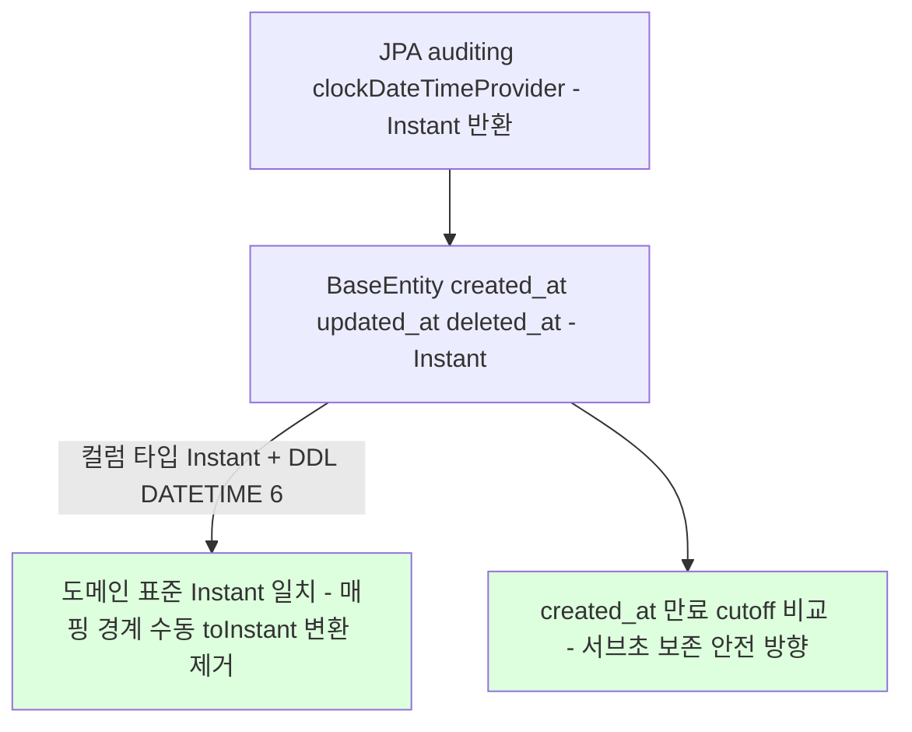
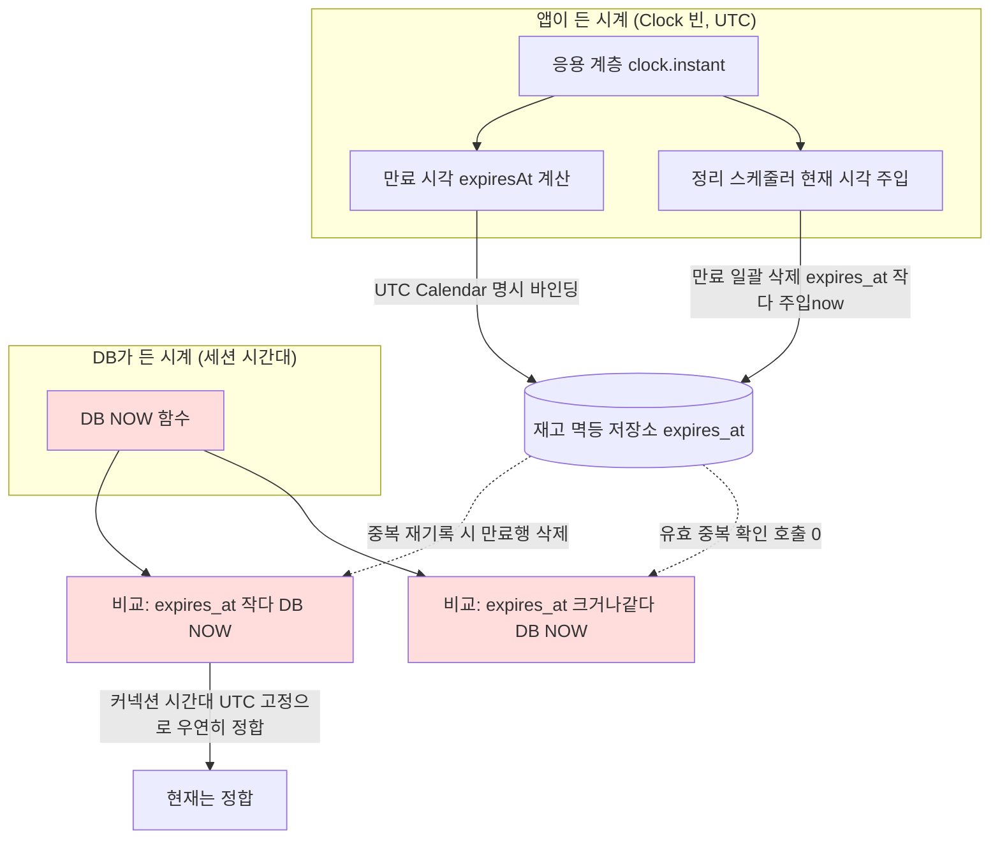
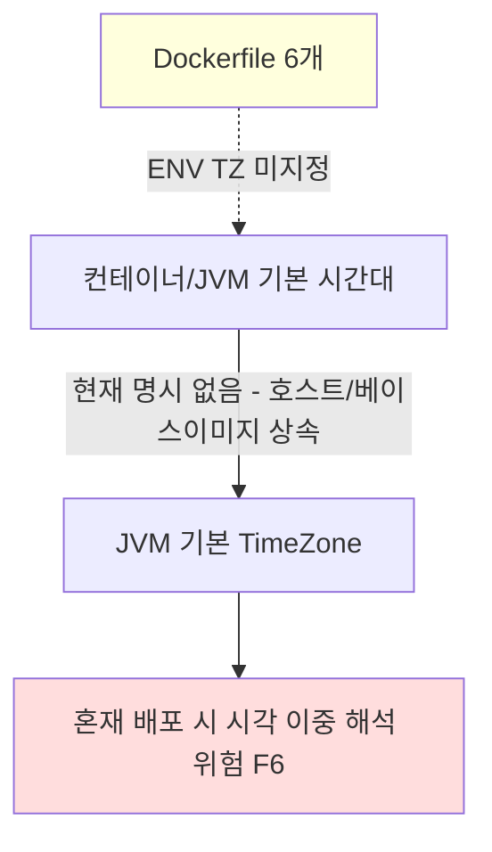
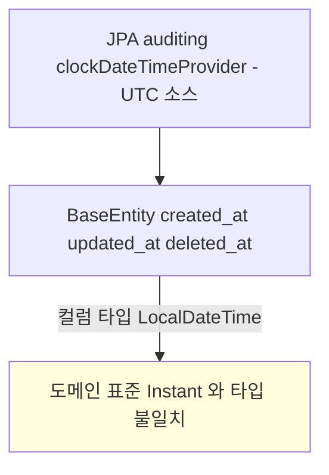

# TIME-MODEL-FOLLOWUP

> 직전 봉인 TIME-MODEL-AND-EXPIRY(이슈/브랜치 #83)의 이연 후속 3건 묶음.
> 근거: `docs/context/TODOS.md` [TIME-PRODUCT-NOW-UNIFY] / [TZ-UTC-BACKSTOP] / [BASEENTITY-AUDIT-SOURCE].

## 요약 브리핑

### 결정된 접근

직전 시간 모델 표준화의 잔여 누수 3건을 한 PR로 닫는다. (1) 상품 재고 멱등 저장소의 만료행 삭제가 DB 시계(`NOW()`)에 의존하던 것을 앱이 든 동일 시계(`Clock` 빈, UTC)에서 주입한 `Instant`로 통일해 "앱 시계 vs DB 시계" 이원화를 만료 비교 경로에서 제거한다. (2) 6개 서비스의 컨테이너/JVM/compose 시간대를 UTC로 3겹 명시해 비-UTC 배포 1차 방어를 코드 밖 설정으로 명문화한다. (3) 결제 감사 시각 컬럼을 `LocalDateTime` → `Instant`로 바꾸고 DDL을 `DATETIME(6)`로 승급해 도메인 표준과 일치시킨다. 실사용 0건인 유효 중복 확인 메서드는 함께 제거한다.

### 변경 후 동작 (to-be)

#### 시각 소스 단일 시계 수렴

#### 비-UTC 시간대 3겹 backstop

#### 감사 시각 컬럼 타입 일치

### 핵심 결정 ID

- **D1** — product `recordIfAbsent` 만료 삭제 `NOW()` → 앱 주입 `Instant` 통일 (포트에 `now` 인자 주입, 헥사고날 D2 원칙 정합)
- **D2** — `existsValid` 포트·구현·Fake·Contract·AC8·Cleanup 전건 제거 (`SQL_EXISTS_VALID` 포함, 라이브 0건)
- **D3** — TZ backstop 3겹 (Dockerfile + JVM + compose), 동일값 멱등 중복 = defense-in-depth
- **D4** — payment `BaseEntity` `LocalDateTime` → `Instant` + Flyway `DATETIME` → `DATETIME(6)` 승급, `clockDateTimeProvider` 반환 타입 동반 전환
- **D5** — product `connectionTimeZone=UTC` 존치 (raw-JDBC Timestamp 바인딩 backstop)
- **D6** — AC8 round-trip → `recordIfAbsent` 만료 DELETE 경계 검증으로 갈아끼움
- **D7** — 세 항목 단일 PR, TDD 커밋 흐름

### 알려진 트레이드오프 / 후속

- **DATETIME(6) 승급** — 기존 `DATETIME`(초 절삭) 행과 신규 `DATETIME(6)` 행 혼재 가능성은 운영 데이터 0(학습 프로젝트) 전제로 무해. 승급은 만료 cutoff를 서브초만큼 늦추는 안전 방향(READY 조기 만료 없음).
- **TZ 3겹 중복** — 동일값(UTC) 멱등이라 충돌 없음. 어느 경로로 기동해도 UTC 보장이 목적.
- **`clockDateTimeProvider` auditing wiring 회귀** — 직전 토픽이 review 2라운드에서 "dateTimeProviderRef 누락 회귀 가드 무력"으로 major를 맞은 전례. provider `Instant` 반환 후에도 `@CreatedDate`가 채워지는지 빈 계약 + 실제 채움 단위 테스트를 plan에서 유지(§4 권고).
- **eureka compose TZ 위치** — eureka가 `docker-compose.infra.yml` 소속이면 compose 3겹 적용 위치가 plan에서 확정 대상.

---

## 사전 브리핑

### 현재 이해한 문제

직전 작업에서 시간 표준을 `Clock`+`Instant`로 통일하고 UTC 저장 일관을 박았지만, **만료 판정의 시각 비교가 한 곳에서 여전히 DB 시계(`NOW()`)에 의존**한다(상품 재고 멱등 저장소). 현재는 DB 커넥션 시간대를 UTC로 고정해 앱 시계와 우연히 일치하지만, "앱이 든 시계 vs DB가 든 시계" 이원화 자체는 남아 있어 설정 하나가 어긋나면 만료가 틀어진다. 또한 비-UTC 컨테이너에서의 1차 방어가 코드 밖 설정(컨테이너/JVM 시간대)으로 명시돼 있지 않고 암묵 의존 상태이며, 결제 서비스 감사 시각 컬럼의 타입(`LocalDateTime`)이 도메인 표준(`Instant`)과 어긋난 채 남아 있다.

### 현재 시스템 동작 (as-is)

#### 만료 판정의 시각 소스 이원화

- 재고 멱등 저장소(`JdbcEventDedupeStore`)의 **중복 재기록 경로**가 만료행을 지울 때 `expires_at < NOW()`(DB 시계) 비교를 쓴다 — 이 경로는 실제 호출됨(`recordIfAbsent`).
- **유효 중복 확인**(`existsValid`, `expires_at >= NOW()`)도 DB 시계를 쓰나, 응용 계층 호출처가 0건으로 보인다(데드 의심 — 확인 필요).
- 결제 멱등 저장소(`JdbcPaymentEventDedupeStore`)는 이미 `NOW()`를 안 쓰고 주입 `Instant`만 쓴다 — 대상 아님.
- DB `NOW()`가 앱 `Instant`와 일치하는 근거는 오직 `connectionTimeZone=UTC` 한 줄. 이 단일 설정 의존을 제거하면 만료 비교가 전부 앱이 든 동일 시계 기준이 된다.

#### 비-UTC 시간대 1차 방어 (코드 밖 설정)

- 6개 서비스 Dockerfile 모두 `ENV TZ` / `-Duser.timezone` 미지정. 베이스 이미지(temurin) 기본 시간대를 상속.
- 앱 코드(UTC Calendar, `connectionTimeZone=UTC`, auditing UTC화)로 만료 정합은 이미 방어되나, 코드 외 backstop이 없어 1차 방어가 암묵적.

#### 결제 감사 시각 컬럼 타입

- `BaseEntity`(결제 서비스에만 존재)의 감사 컬럼은 `LocalDateTime`. 채우는 소스는 이미 UTC `Clock` 기준(직전 DM1)이라 만료 cutoff 정합은 확보됨.
- 남은 것은 컬럼 **타입 자체**가 도메인 표준 `Instant`와 어긋난 점. pg/product/user에는 auditing superclass가 없어 "다른 서비스 일원화" 대상은 사실상 없음.

### 이번 discuss에서 결정하려는 것 (사용자 사전 확정)

- **결정 1 (NOW 통일) — 확정: 한다.** 재고 멱등 저장소의 `NOW()` 비교를 앱 주입 `Instant`로 통일. 라이브 경로는 `recordIfAbsent`의 만료행 삭제 SQL(`expires_at < NOW()`). 포트 시그니처에 `Instant now` 주입.
- **결정 2 (existsValid 처리) — 확정: 제거.** 실사용 0건. 포트·구현·Fake·전용 테스트(contract / round-trip AC8 / cleanup 검증)까지 제거해 NOW() 의존 경로를 `recordIfAbsent` 하나로 축소.
- **결정 3 (TZ backstop) — 확정: 한다.** 구체 위치(Dockerfile `ENV TZ=UTC` / JVM `-Duser.timezone=UTC` / compose `environment.TZ`)는 Architect가 라운드에서 결정.
- **결정 4 (BaseEntity 타입) — 확정: 이번 범위 포함.** 감사 컬럼 `LocalDateTime` → `Instant` 전환. 이미 엔티티 매핑 경계에서 수동 `.toInstant(UTC)` 변환이 일어나므로 전환 시 그 변환들 제거(T17 결). metrics·admin DTO 등 연쇄 영향은 plan에서 전수 매핑.
- **결정 5 (범위/PR 단위) — 확정: 세 항목 한 PR.**

### 열린 질문 / 가정

- (가정) `existsValid`는 application 미사용으로 데드일 가능성이 높다 — 테스트/외부에서만 참조되는지 확인 후 판정.
- (가정) 컬럼 타입 전환은 학습 프로젝트라 운영 데이터 마이그레이션 비용이 없다(직전 R1과 동일 전제). 단 `DATETIME(6)` ↔ `Instant` 매핑 시 `hibernate.jdbc.time_zone=UTC` 적용 범위 재확인 필요.
- (가정) TZ backstop은 정합을 바꾸지 않고 "표현/로그 일관 + 혼재 배포 방어"가 목적 — 만료 로직은 이미 UTC. 따라서 회귀 위험은 낮음.
- (열림) 결정 4를 넣으면 BaseEntity를 참조하는 모든 엔티티의 getter 사용처가 `LocalDateTime`을 기대하는지 영향 범위 확인 필요.

> 위 사전 브리핑은 보존한다. 아래 §1~§5가 Round 0 ledger(16건 전건 RESOLVED) 확정을 토대로 한 정식 설계다.
> Round 0 인계 사실 재검증 완료 (Architect Round 1, 직접 grep/Read):
> - `existsValid` 라이브 호출 0건 — main 참조는 포트(`EventDedupeStore:30`)·구현(`JdbcEventDedupeStore:81`)뿐. 나머지 전부 test(`FakeEventDedupeStore` / `EventDedupeStoreContractTest` / `JdbcEventDedupeStoreRoundTripTest`(AC8) / `JdbcEventDedupeStoreCleanupTest`).
> - BaseEntity getter main 소비처 정확히 4곳: `PaymentEventResult:54`, `PaymentOutboxEntity:77-78`, `PaymentEventEntity:119-120`, `PaymentEventResponse:43`. **`OutboxPendingAgeMetrics`는 BaseEntity getter 비참조** — 도메인 `PaymentOutbox.getCreatedAt()`(이미 `Instant`)를 소비(`:54/:57`)하므로 D4 연쇄 대상 아님(M1 정정). **`PaymentOutboxMetrics`도 비참조** — `clock.instant()` 직접 사용(:74)이라 연쇄 대상 아님(dispatch 힌트 정정).
> - `PaymentEventResult.createdAt`·`PaymentEventResponse.createdAt`는 이미 `Instant`(둘 다 :26/:29). 외부 계약 무변경(ledger S5 확인 재검증됨).
> - payment audit 컬럼 DDL = `DATETIME`(서브초 없음, V1 line 21-23/42-44/66-68/92-94), 도메인 시각 컬럼은 `DATETIME(6)`. payment `application.yml`·`-docker.yml`에 `hibernate.jdbc.time_zone=UTC` 기설정.
> - Dockerfile 6개 전부 `FROM eclipse-temurin:21-jre` + `ENTRYPOINT ["java","-jar","/app/app.jar"]` 균일 구조, `ENV TZ`/`-Duser.timezone` 미지정. compose `docker-compose.apps.yml`에 `environment:` 블록 존재(현재 `TZ` 키 0건).

---

## §1 배경 / 문제

직전 TIME-MODEL-AND-EXPIRY(#83)는 `Clock`+`Instant`+UTC 저장을 4서비스 표준으로 박았지만, **봉인 시점에 의도적으로 이연한 3건**이 TODOS에 등재돼 남았다([TIME-PRODUCT-NOW-UNIFY] / [TZ-UTC-BACKSTOP] / [BASEENTITY-AUDIT-SOURCE]). 셋은 서로 다른 결함이지만 **하나의 축 — "시간 소스가 앱이 든 동일 시계(`Clock` 빈, UTC)로 완전히 수렴했는가"** — 위의 잔여 누수다.

1. **시각 소스 이원화 잔재 (NOW 통일).** product `JdbcEventDedupeStore.recordIfAbsent`의 만료행 삭제 SQL(`SQL_DELETE_EXPIRED_BY_UUID`)이 `expires_at < NOW()`로 **DB 시계**에 의존한다. 현재는 `connectionTimeZone=UTC` 단일 설정으로 DB `NOW()`가 앱 `Instant`와 우연히 일치하지만, "앱 시계 vs DB 시계" 이원화 자체가 남아 설정 하나가 어긋나면 만료 경계가 틀어진다. 같은 클래스의 `deleteExpired`는 이미 주입 `Instant`(`:now`)를 쓰는데, `recordIfAbsent`만 `NOW()`로 남아 **한 클래스 안에서 시각 소스가 불일치**한다.
2. **1차 방어의 암묵성 (TZ backstop).** 만료 정합은 앱 코드(UTC Calendar, `connectionTimeZone=UTC`, auditing UTC화)로 이미 방어되나, Dockerfile 6개·JVM·compose 어디에도 TZ가 명시되지 않아 베이스 이미지(temurin) 기본 시간대를 암묵 상속한다. 혼재 배포·로그/표현 시각 이중 해석의 backstop이 코드 밖 설정으로 명문화돼 있지 않다.
3. **감사 컬럼 타입 불일치 (BaseEntity Instant).** payment `BaseEntity`의 `created_at/updated_at/deleted_at`가 `LocalDateTime`이라 도메인 표준 `Instant`와 어긋난다. 채우는 소스는 이미 UTC(`clockDateTimeProvider`, DM1)지만, 타입이 `LocalDateTime`이라 엔티티 매핑 경계에서 수동 `.toInstant(ZoneOffset.UTC)` 변환이 반복된다.

**한 PR 묶음 근거**: 셋 다 동일 시간 모델 표준의 잔여 수렴 작업이고, 운영 데이터 0(학습 프로젝트) 전제를 공유하며, 검증 안전망(AC8 재배치·`PaymentOutboxInstantTest`·round-trip 테스트)이 서로 겹친다. 분리하면 같은 컨텍스트를 세 번 재구성해야 하므로 묶음의 **삭제·교체 비용이 더 낮다**. (ledger S1/O1 RESOLVED)

---

## §2 설계 결정

### D1 — product `recordIfAbsent` 만료 삭제를 앱 주입 `Instant` 기준으로 통일

`SQL_DELETE_EXPIRED_BY_UUID`의 `expires_at < NOW()`를 `expires_at < ?`(주입 `Instant`)로 교체한다. 포트 `EventDedupeStore.recordIfAbsent`의 시그니처는 `(String eventUUID, Instant expiresAt)` 그대로 두고, **현재 시각 `now`를 추가 인자로 주입**한다 → `recordIfAbsent(String eventUUID, Instant now, Instant expiresAt)`.

- **헥사고날 경계**: 직전 D2 원칙("도메인/포트는 `Clock`을 주입받지 않고 호출자가 `Instant`를 인자로 넘긴다")과 정합. 어댑터(`JdbcEventDedupeStore`)가 자체 `clock.instant()`를 호출하면 시각 소스가 어댑터 안으로 숨어 테스트 시 고정 시계 주입이 어렵고, 호출 사슬(consumer → use case → 어댑터)이 서로 다른 `now`를 들 split 위험이 다시 생긴다. **현재 시각의 권한은 `Clock`을 든 진입점(consumer)**에 두고 인자로 전파하는 D2 불변을 유지한다.
- **근거**: 같은 클래스 `deleteExpired(Instant now, ...)`가 이미 주입 `now`를 쓴다. `recordIfAbsent`도 동일 패턴으로 맞추면 한 어댑터 안의 시각 소스가 하나로 수렴하고, `connectionTimeZone=UTC`라는 단일 설정 의존을 만료 비교 경로에서 제거한다.
- **기각한 대안**:
  - (A) 어댑터가 `clock` 직접 호출 → 위 split 위험 + D2 위반. 기각.
  - (B) `NOW()` 유지하고 `connectionTimeZone=UTC`에만 의존 → 현상 유지, 이원화 미해소. 본 토픽 목적과 배치. 기각.
  - (C) 포트에서 `expiresAt`를 받아 어댑터가 `now`를 역산 → 만료 경계와 TTL 기록 시각을 한 인자로 혼합, 의미 흐림. 기각.
- **호출자 영향 / `now` 출처**: `Clock`을 보유한 곳은 `StockCommitConsumer`(infrastructure, 필드 `:35` 주입 `:38`)이지 `StockCommitUseCase`가 아니다. 사슬은 consumer → `StockCommitUseCase.commit(...)` → `eventDedupeStore.recordIfAbsent(...)`. 현재 `StockCommitUseCase`는 `stockRepository`/`eventDedupeStore` 두 필드뿐이고 `Clock`이 없으며 `commit(eventUUID, orderId, productId, qty, expiresAt)`로 `expiresAt`만 받는다. consumer는 이미 `resolveExpiresAt`에서 `clock.instant()`(fallback base `:89`)를 들고 있으므로, **`now`(=`clock.instant()`)를 consumer에서 산출해 `commit`의 새 인자로 전달하고 use case가 이를 `recordIfAbsent`에 그대로 넘긴다**. `StockCommitUseCase`에 `Clock`을 신설하지 않는다(시각 권한은 consumer 진입점에 유지, TIME-MODEL-AND-EXPIRY T13 패턴). `commit` 시그니처에 `Instant now` 추가가 동반된다.

### D2 — `existsValid` 포트·구현·테스트 전건 제거

`EventDedupeStore.existsValid`(포트 `:30`)·`JdbcEventDedupeStore.existsValid`(구현 `:81`)·`SQL_EXISTS_VALID`(`:45-47`)·`FakeEventDedupeStore.existsValid`·`EventDedupeStoreContractTest`의 existsValid 계약·`JdbcEventDedupeStoreRoundTripTest`의 AC8(existsValid NOW 경계)·`JdbcEventDedupeStoreCleanupTest`의 existsValid 보존 검증을 모두 제거한다.

- **근거**: 라이브 호출 0건(재검증 완료). 제거하면 `NOW()` 의존 경로가 `recordIfAbsent` 하나로 축소되고, D1 통일 후에는 `NOW()`가 코드에서 완전히 사라진다. **삭제 비용이 낮은 데드 표면을 남기는 것은 경계를 흐린다** — 미래 독자가 "왜 existsValid는 NOW를 쓰나"를 다시 추적하게 만든다.
- **기각한 대안**: `@Deprecated` 표식 후 존치 → 데드 코드 유지, NOW 경로 잔존. 학습 프로젝트라 하위 호환 의무 없음. 기각.
- **데드 판정 주의**: 기능 단위 제거이므로 사용자 확정 필요 — ledger S3에서 사용자 확정 완료(RESOLVED). Architect 독단 판정 아님.

### D3 — TZ backstop 3겹 (Dockerfile ENV + JVM -Duser.timezone + compose environment)

6개 서비스(payment/pg/product/user/eureka/gateway) 전부에 다음 3겹을 적용한다.

| 겹 | 위치 | 적용 시점 / 범위 |
|----|------|------------------|
| 1. Dockerfile `ENV TZ=UTC` | 6개 Dockerfile (FROM 직후) | 컨테이너 OS 시간대. `/etc/localtime` 미설정이라 glibc/Java 가 `TZ` 환경변수 우선 인식 |
| 2. JVM `-Duser.timezone=UTC` | 6개 Dockerfile `ENTRYPOINT` (또는 `JAVA_TOOL_OPTIONS`) | JVM `user.timezone` 시스템 프로퍼티 — OS TZ 미인식 환경에서도 JVM 기본 TimeZone 고정 |
| 3. compose `environment.TZ=UTC` | `docker/docker-compose.apps.yml` 각 서비스 | 배포 오케스트레이션 레이어 명시 — Dockerfile 미빌드/재빌드 사이에도 런타임 주입 |

- **우선순위 / 중복 무해성**: 세 겹은 **동일 값(UTC)을 서로 다른 레이어에 박는 멱등 중복**이다. 우선순위는 (런타임 > 빌드타임) → compose `environment.TZ`가 Dockerfile `ENV TZ`를 런타임에 덮어쓰지만 **값이 같아 충돌 없음**. JVM `-Duser.timezone`은 OS TZ와 독립적으로 JVM 내부 기본 TimeZone을 직접 고정해, OS TZ 인식이 실패해도 Java `Instant`/auditing/로그 표현이 UTC로 고정된다. 어느 한 겹이 누락·오설정돼도 나머지 두 겹이 메우는 **defense-in-depth**.
- **근거**: 만료 정합은 이미 UTC라 이 backstop은 정합을 **바꾸지 않는다**. 목적은 (1) 로그/예외/표현 시각의 일관, (2) 혼재 배포(일부 컨테이너가 비-UTC 호스트 상속) 시 이중 해석 차단. 코드 밖 암묵 의존을 명문 설정으로 승격한다.
- **기각한 대안**:
  - (A) compose `environment.TZ` 1겹만 → IDE 로컬 실행·Dockerfile 단독 `docker run`에 미적용. backstop 구멍. 기각.
  - (B) JVM `-Duser.timezone` 1겹만 → OS TZ는 비-UTC라 OS 도구·로그 timestamp(Java 외부)는 어긋남. 기각.
  - (C) 코드에서 `TimeZone.setDefault(UTC)` 부팅 훅 → 코드 침습 + 라이브러리 정적 초기화 순서 의존. 설정으로 충분. 기각.

### D4 — payment `BaseEntity` audit 컬럼 `LocalDateTime` → `Instant` + DDL `DATETIME` → `DATETIME(6)` 승급

`BaseEntity.createdAt/updatedAt/deletedAt`를 `Instant`로 전환하고, Flyway 신규 마이그레이션으로 4개 테이블(`payment_event`/`payment_order`/`payment_outbox`/`payment_history`)의 `created_at/updated_at/deleted_at`를 `DATETIME` → `DATETIME(6)`로 ALTER 승급한다. `columnDefinition`도 `datetime(6)`로 갱신.

- **hibernate.jdbc.time_zone=UTC 적용 범위**: payment `application.yml`·`-docker.yml`에 이미 설정됨. `Instant` ↔ `DATETIME(6)` 매핑 시 Hibernate가 이 프로퍼티로 UTC 기준 바인딩하므로 **추가 설정 불필요**. `Instant`는 `DATETIME`(서브초 0)에 매핑하면 마이크로초가 절삭되는데, 도메인 시각 컬럼(`executed_at` 등)이 이미 `DATETIME(6)`이라 audit 컬럼만 `DATETIME`로 남으면 **같은 테이블 안에서 정밀도가 갈린다**. `DATETIME(6)` 승급으로 통일해 `Instant` round-trip(저장→조회 동일성)을 마이크로초 단위까지 보장.
- **연쇄 변환 제거**: 타입 전환으로 엔티티 매핑 경계의 수동 `.toInstant(ZoneOffset.UTC)`가 불필요해진다(§3 전수). `clockDateTimeProvider`는 현재 `LocalDateTime.ofInstant(...)`를 반환하는데, `@CreatedDate`/`@LastModifiedDate` 대상 필드가 `Instant`가 되면 **provider 반환 타입도 `Instant`로 맞춰야** auditing이 동작한다(`clock.instant()` 직접 반환). 이 변경이 DM1 wiring과 충돌하지 않도록 provider 회귀 가드 유지(§4).
- **근거**: 도메인 표준 `Instant`로의 마지막 수렴. 매핑 경계의 반복 변환 제거로 "왜 여기만 `.toInstant(UTC)`인가" 인지 부담 삭제.
- **기각한 대안**:
  - (A) 컬럼 타입 유지(`LocalDateTime`) + 매핑 변환 존치 → 직전 D3가 택한 안. 본 토픽이 이연분으로 명시 승계받아 뒤집음. 운영 데이터 0이라 마이그레이션 비용 없음. 기각.
  - (B) `DATETIME(6)` 승급 없이 `Instant` ↔ `DATETIME` → 마이크로초 절삭 + 테이블 내 정밀도 split. round-trip 단언 깨짐. 기각(ledger C3 확정).
  - (C) `TIMESTAMP` 컬럼 전환 → MySQL `TIMESTAMP`의 2038 한계 + 자동 갱신 시맨틱. `DATETIME(6)`가 적합. 기각.

### D5 — product `connectionTimeZone=UTC` 존치

D1로 `NOW()`를 제거한 뒤에도 product datasource URL의 `connectionTimeZone=UTC&forceConnectionTimeZoneToSession=true`를 **유지**한다. 단, **URL 옆 주석은 갱신한다**: 현재 주석(`application.yml:13-14`, `application-docker.yml:7-8`)은 존치 근거로 `existsValid`/`SQL_DELETE_EXPIRED_BY_UUID` 의 DB `NOW()`를 들고 있는데, D1/D2로 그 `NOW()`·`existsValid`가 사라지므로 stale하다. 주석을 아래 정정 근거에 맞춰 다시 쓴다(plan 대상).

- **근거(정정)**: `NOW()` 제거 후 존치 사유는 **raw-JDBC `Timestamp` 바인딩(`recordIfAbsent` INSERT·`deleteExpired`)의 UTC 세션 backstop**이다. `NOW()`가 사라져 split-brain 1차 원인은 해소되나, `Timestamp.from(instant)` 바인딩이 세션 TZ 영향을 받는 경로가 남아 명시 UTC 세션을 backstop으로 둔다. D3 TZ 3겹과 같은 defense-in-depth 정신. (구 주석의 "DB `NOW()` 와 UTC Calendar 가 동일 기준 공유" 서술은 NOW 제거로 더 이상 유효하지 않다.)
- **기각한 대안**: NOW 제거했으니 `connectionTimeZone`도 삭제 → backstop 약화, raw-JDBC TZ 안전망 상실. 기각(ledger O3 확정).

### D6 — AC8 round-trip 테스트 갈아끼움 (폐기 아님)

`JdbcEventDedupeStoreRoundTripTest`의 AC8(existsValid NOW 경계 split-brain 부재 검증)을, D1로 통일된 `recordIfAbsent`의 **만료행 삭제 경계 검증**으로 재배치한다. 비-UTC JVM TZ에서 주입 `now` 기준 DELETE가 올바른 경계로 동작하는지(만료 행만 삭제, 미만료 행 잔존) 검증.

- **근거**: existsValid 제거(D2)로 원 AC8 대상이 사라지지만, "비-UTC JVM에서 시각 경계 정합"이라는 **검증 의도는 유효**하다. 검증 표면을 살아있는 경로(`recordIfAbsent` DELETE)로 옮겨 회귀 안전망을 유지. 단순 삭제하면 비-UTC TZ 회귀 가드에 구멍이 생긴다.
- **기각한 대안**: AC8 통째 삭제 → 비-UTC TZ 경계 회귀 무방비. 기각(ledger V2 확정).

### D7 — 세 항목 단일 PR, TDD 커밋 흐름

NOW 통일 / TZ backstop / BaseEntity Instant 를 한 PR로 묶는다. 커밋은 항목별 TDD 흐름(`test:` RED → `feat:` GREEN, PLAN.md/STATE.md 동반). (ledger S1/O1 RESOLVED, §1 묶음 근거 참조)

---

## §3 변경 범위 (레이어별)

> 라인 번호는 Architect Round 1 시점 직접 grep 기준. plan/execute 시 재확인 필요.

### domain
- 없음. (BaseEntity는 도메인 아닌 `core/common/infrastructure` 소속 — 아래 infrastructure 참조. product 도메인도 무변경)

### application (port)
- `product .../application/port/out/EventDedupeStore.java`
  - `existsValid(String)` 메서드 + javadoc 제거 (D2)
  - `recordIfAbsent` 시그니처에 `Instant now` 주입 → `recordIfAbsent(String eventUUID, Instant now, Instant expiresAt)` (D1)

### application (use case)
- `product StockCommitUseCase` — `commit(...)` 시그니처에 `Instant now` 추가, 받은 `now`를 `recordIfAbsent(eventUUID, now, expiresAt)`로 전달 (D1). 이 use case에는 `Clock`이 없고(필드 `stockRepository`/`eventDedupeStore` 2개), `now`는 호출자에게서 받는다.
- `product StockCommitConsumer`(infrastructure messaging) — `Clock` 보유처. `resolveExpiresAt`가 쓰는 `clock.instant()`를 `now`로 산출해 `commit(...)`에 추가 인자로 전달 (D1).

### infrastructure
- `product .../infrastructure/idempotency/JdbcEventDedupeStore.java`
  - `SQL_EXISTS_VALID` 상수(`:45-47`) + `existsValid` 메서드(`:81-84`) 제거 (D2)
  - `SQL_DELETE_EXPIRED_BY_UUID`(`:52-53`) `NOW()` → 바인딩 파라미터, `recordIfAbsent`(`:96`)에 `now` 인자 추가 + DELETE에 `Timestamp.from(now)` 바인딩 (D1)
  - 클래스 javadoc `:26` existsValid 설명 줄 제거
- `payment .../core/common/infrastructure/BaseEntity.java`
  - 3개 필드 `LocalDateTime` → `Instant`, `columnDefinition = "datetime"` → `"datetime(6)"` (D4)
- `payment .../core/config/JpaConfig.java`
  - `clockDateTimeProvider`(`:47-49`) 반환을 `LocalDateTime.ofInstant(...)` → `clock.instant()`(`Instant`) (D4)
- `payment .../infrastructure/entity/PaymentEventEntity.java`
  - `toResult()` `:119-120` `getCreatedAt() != null ? getCreatedAt().toInstant(UTC) : null` → `getCreatedAt()` 직접 (D4)
- `payment .../infrastructure/entity/PaymentOutboxEntity.java`
  - `toDomain()` `:77-78` `toInstant(getCreatedAt())` / `toInstant(getUpdatedAt())` 헬퍼 호출 제거 → 직접 (D4). 사용처 사라진 `toInstant` private 헬퍼 있으면 동반 제거
- ~~`OutboxPendingAgeMetrics.java`~~ — **D4 연쇄 대상 아님(M1 정정)**. `:54/:57`의 `getCreatedAt()`는 BaseEntity가 아니라 도메인 `PaymentOutbox.getCreatedAt()`이며 이미 `Instant`다. BaseEntity 타입 전환과 무관하므로 무변경.

### application (dto) — 매핑 정합만, 타입 무변경
- `payment .../application/dto/admin/PaymentEventResult.java` `:54` `.createdAt(paymentEvent.getCreatedAt())` — 필드는 이미 `Instant`(`:29`). 엔티티 getter가 `Instant`로 바뀌어 **변환 없이 직접 대입**됨. 코드 수정 불필요(자동 정합), 회귀 확인만
- `payment .../presentation/dto/response/admin/PaymentEventResponse.java` `:43` — 필드 이미 `Instant`(`:26`). 외부 계약 무변경 (ledger S5)

### 설정 (Docker / compose / JVM)
- `payment/pg/product/user/eureka/gateway Dockerfile` 6개 — `ENV TZ=UTC` 추가 + `ENTRYPOINT`(또는 `JAVA_TOOL_OPTIONS`)에 `-Duser.timezone=UTC` (D3)
- `docker/docker-compose.apps.yml` — 각 서비스 `environment`에 `TZ: UTC` 추가 (D3). eureka는 `docker-compose.infra.yml` 소속이면 그쪽에 추가 — plan 확인
- `product application.yml`·`application-docker.yml` — `connectionTimeZone=UTC` URL 값은 **무변경(존치)**, 단 **위 주석은 갱신 대상(D5)**. 현재 주석이 근거로 든 `existsValid`/`SQL_DELETE_EXPIRED_BY_UUID` 의 DB `NOW()`는 D1/D2로 제거되므로 stale하다(`application.yml:13-14`, `application-docker.yml:7-8`). 주석을 "raw-JDBC `Timestamp` 바인딩(`recordIfAbsent` INSERT·`deleteExpired`)의 UTC 세션 backstop"으로 정정 (D5)

### Flyway
- `payment-service/src/main/resources/db/migration/V4__*.sql`(신규) — `payment_event`/`payment_order`/`payment_outbox`/`payment_history` 4테이블 `created_at/updated_at/deleted_at` `DATETIME` → `DATETIME(6)` ALTER 승급 (D4). 마이그레이션 버전 번호는 plan에서 V3 다음으로 확정

### test
- `product FakeEventDedupeStore` — `existsValid` 제거 (D2), `recordIfAbsent` 시그니처 `now` 추가 (D1)
- `product EventDedupeStoreContractTest` — existsValid 계약 제거 (D2), recordIfAbsent 호출에 `now` 추가
- `product JdbcEventDedupeStoreRoundTripTest` — AC8(`:147-166`)를 `recordIfAbsent` 만료 DELETE 경계 검증으로 갈아끼움 (D6)
- `product JdbcEventDedupeStoreCleanupTest` — existsValid 보존 단언(`:133-146`) 제거, deleteExpired 검증으로 한정 (D2)
- `payment PaymentOutboxInstantTest` / `PaymentEventRepositoryImplTest` / `FakePaymentEventRepository`(2곳) / `PaymentOutboxMetricsTest` — BaseEntity getter 반환 `Instant` 전환에 따른 단언/스텁 타입 정합 (D4). 다수는 이미 Instant 단언이라 회귀 안전망 역할. (`OutboxPendingAgeMetricsTest`는 도메인 `PaymentOutbox`를 다루므로 D4 무관 — 회귀 확인만)
- **DB `NOW()` INSERT fixture (test-only, DDL 호환)** — audit 컬럼(`created_at/updated_at`)에 DB `NOW()`로 직접 INSERT하는 통합 fixture: `PaymentSchedulerTest`(`payment_order` `:34-38`) / `PaymentControllerTest`(`payment_event` `:46-50`). `DATETIME` → `DATETIME(6)` ALTER(D4)로 `NOW()` INSERT는 파손되지 않으므로(승급은 정밀도 확장) **수정 불필요**, 변경범위 전수성 차원의 기록. (`PaymentEosIntegrationTest`의 `NOW()`는 `payment_event_dedupe`의 `received_at/expires_at` — BaseEntity audit 컬럼이 아니라 D4 무관)

**변경 파일 수 집계**: main 11 (port 1 / use case 2(`StockCommitUseCase`+`StockCommitConsumer`) / infra D4 4(`BaseEntity`/`PaymentEventEntity`/`PaymentOutboxEntity`/`JpaConfig`) / infra D1 1(`JdbcEventDedupeStore`) / dto 2(회귀확인 무수정 가능) / 단 dto 2 제외 시 실수정 9~10). `OutboxPendingAgeMetrics`는 M1로 D4 연쇄에서 제외(도메인 `PaymentOutbox` 소비). + 설정 8 (Dockerfile 6 / compose 1 / product yml 주석 갱신 1(D5)) + Flyway 1 (신규) + test 8± (NOW INSERT fixture 2는 DDL 호환이라 무수정). **총 실수정 대상 약 19~21 파일.**

---

## §4 검증 전략

| 항목 | 검증 방법 | 안전망 성격 |
|------|----------|-------------|
| D1 NOW 통일 | D6 재배치 AC8 — 비-UTC JVM TZ(`@SetSystemProperty user.timezone` 또는 TestClock)에서 `recordIfAbsent` 만료 DELETE가 주입 `now` 경계로 정확히(만료 행만) 동작. Testcontainers MySQL round-trip | 비-UTC TZ 경계 회귀 가드 |
| D2 existsValid 제거 | 컴파일 통과 + 라이브 0건 재확인. 제거 후 `./gradlew test` 회귀 무 | 데드 표면 완전 삭제 확인 |
| D3 TZ backstop | (1) 컨테이너 부팅 후 `date`/JVM `TimeZone.getDefault()` UTC 확인 스모크. (2) 3겹 모두 UTC 명시됐는지 설정 파일 단위 점검. 정합 로직 회귀는 기존 만료 테스트가 커버(backstop은 정합 무변경) | 혼재 배포 방어 명문화 |
| D4 BaseEntity Instant | (1) `PaymentEventRepositoryImplTest` round-trip(저장→조회 UTC 동일성, `DATETIME(6)` 마이크로초 보존). (2) `PaymentOutboxInstantTest` 등 기존 Instant 단언이 회귀 가드. (3) `clockDateTimeProvider` → `Instant` 반환 후에도 auditing이 채워지는지 wiring 단위 테스트(DM1 회귀 가드 유지). (4) admin DTO 응답 round-trip — 외부 계약 무변경 확인 | 타입 전환 회귀 + auditing wiring |
| Flyway DDL | 마이그레이션 적용 후 `DATETIME(6)` 정밀도 + 기존 테스트 전수 통과(Testcontainers가 V1~V4 순차 적용) | 스키마 승급 안전 |

- **매 태스크 `./gradlew test` 회귀 무** (CLAUDE.md V1).
- **auditing 회귀 가드 명시 권고**: D4에서 `clockDateTimeProvider` 반환 타입을 `Instant`로 바꿀 때, 직전 토픽이 review 2라운드에서 "dateTimeProviderRef 누락을 못 잡은 회귀 가드 무력"을 major로 맞은 전례가 있다. provider가 `Instant`를 반환하고 `@CreatedDate` 대상 필드가 `Instant`로 정합하는지 **빈 계약 단위 테스트 + auditing 실제 채움 단위 테스트**를 유지/보강한다.

---

## §5 트레이드오프 / 후속

- **DATETIME(6) 승급의 기존 행 영향**: ALTER로 정밀도를 올려도 기존 `DATETIME` 행은 마이크로초 `.000000`으로 확장될 뿐 데이터 손실 없음. 운영 데이터 0(학습 프로젝트) 전제라 마이그레이션 리스크 실질 0. 단 **운영 데이터가 있다면** 큰 테이블 ALTER는 락/시간 비용이 있으므로, 본 전제(데이터 0)가 깨지는 시점엔 online DDL(`ALGORITHM=INPLACE`) 검토 필요 — 후속 메모.
- **TZ 3겹 중복**: 동일 값(UTC) 멱등 중복은 의도된 defense-in-depth지만, 미래에 누군가 TZ를 바꾸려면 3곳을 모두 고쳐야 하는 **변경 비용**이 있다. 트레이드오프: 단일 지점 변경 용이성 < 한 겹 누락 시 backstop 보장. 학습 플랫폼의 혼재 배포 방어 가치가 더 크다고 판단. UTC는 사실상 변경되지 않는 값이라 변경 비용 우려는 이론적.
- **connectionTimeZone 존치(D5)와 TZ backstop(D3) 중첩**: 둘 다 UTC 안전망이라 중복으로 보일 수 있으나, 레이어가 다르다(DB 세션 TZ vs JVM/OS TZ). raw-JDBC `Timestamp` 바인딩 경로는 DB 세션 TZ에 직접 노출되므로 `connectionTimeZone`이 별도로 필요. 후속에서 모든 raw-JDBC가 명시 UTC Calendar로 통일되면 `connectionTimeZone` 의존도 재평가 가능 — 현재는 backstop으로 존치.
- **후속 등재 해소**: 본 PR 완료 시 TODOS [TIME-PRODUCT-NOW-UNIFY] / [TZ-UTC-BACKSTOP] / [BASEENTITY-AUDIT-SOURCE] 3건 종결. `NOW()`가 코드베이스에서 완전 제거되어 "앱이 든 단일 시계" 수렴 완료.
